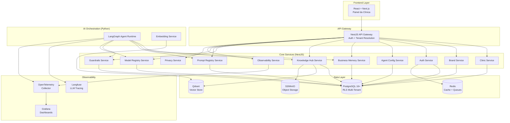
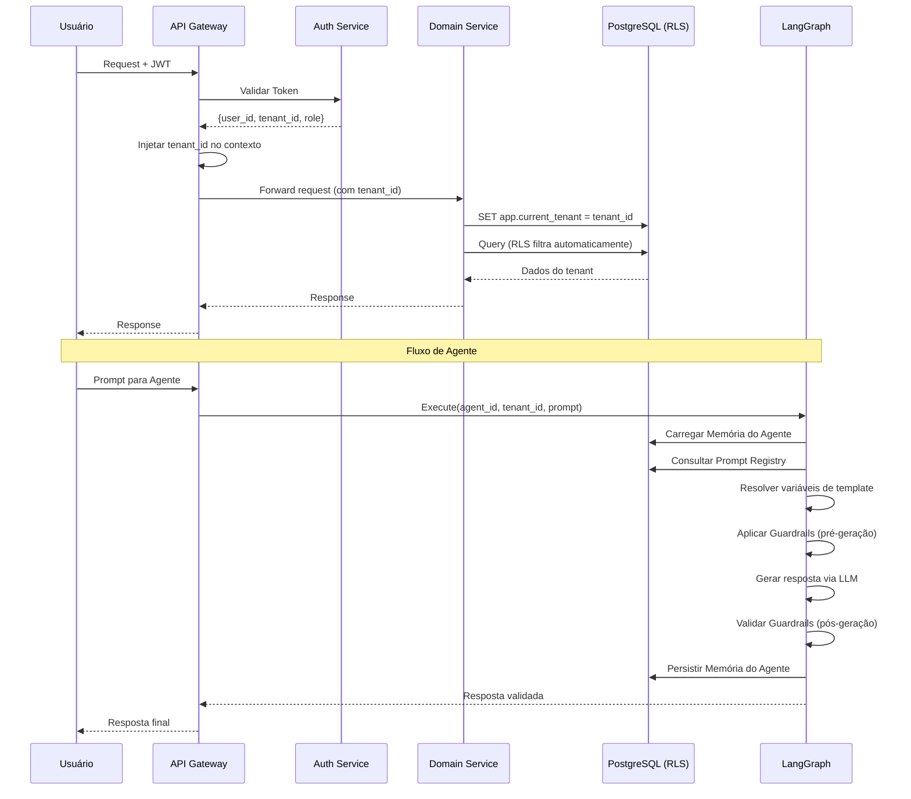
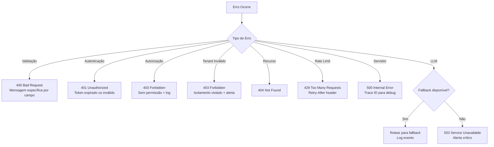

# Design Document — BeautyGrowth AI EPIC 01: Platform Foundation

## Overview

Este documento descreve a arquitetura técnica da fundação da plataforma **BeautyGrowth AI** — um sistema multi-agente de inteligência artificial voltado para clínicas de estética. O EPIC 01 foca exclusivamente na infraestrutura necessária para suportar os agentes de IA que serão adicionados em épicos futuros.

### Decisões Arquiteturais Chave

| Decisão | Escolha | Justificativa |
|---------|---------|---------------|
| Backend Framework | **NestJS (TypeScript)** | Tipagem forte, DI nativa, guards/interceptors para multi-tenancy, ecossistema maduro para SaaS |
| Banco Relacional | **PostgreSQL 16+** com Row-Level Security | Isolamento multi-tenant no nível do banco, sem depender apenas da camada de aplicação |
| Banco Vetorial | **Qdrant** | Performance sub-100ms para busca semântica, payload filtering nativo para multi-tenant, open source |
| Orquestração de Agentes | **LangGraph (Python)** | Grafo de estado explícito, checkpointing, suporte a multi-agent workflows, integração com Langfuse |
| Observabilidade LLM | **Langfuse** (self-hosted) | Open source, tracing de LLM, avaliação de prompts, consumo de tokens, self-hostável para LGPD |
| Observabilidade Infra | **OpenTelemetry + Grafana** | Padrão aberto para traces, métricas e logs distribuídos |
| Autenticação | **Supabase Auth** ou **Keycloak** | JWT-based, suporte a RBAC, MFA futuro, integração com RLS do PostgreSQL |
| Cache / Mensageria | **Redis** | Cache de sessões, pub/sub para eventos, filas de processamento |
| Object Storage | **S3-compatible (MinIO / AWS S3)** | Armazenamento de logotipos, documentos da Knowledge Hub |
| Containerização | **Docker + Docker Compose** (dev) / **Kubernetes** (prod) | Portabilidade, escalabilidade horizontal |

### Princípios de Design

1. **Multi-Tenant First**: Toda operação é filtrada por `tenant_id` desde a camada de banco (RLS) até a aplicação.
2. **AI-DLC (AI Development Lifecycle)**: Governança completa dos artefatos de IA (prompts, modelos, guardrails) como ativos de primeira classe.
3. **Event-Driven**: Eventos de domínio propagam mudanças entre subsistemas (ex: atualização de marca → atualização de memória de negócio).
4. **Open Source First**: Preferência por componentes open source para evitar vendor lock-in e atender LGPD.
5. **Separation of Concerns**: Backend NestJS para API/CRUD, LangGraph (Python) para orquestração de agentes via gRPC/HTTP.

---

## Architecture

### Diagrama de Arquitetura de Alto Nível



### Fluxo de Requisição Típico



### Estratégia Multi-Tenant

A plataforma adota **Row-Level Security (RLS)** do PostgreSQL como camada primária de isolamento:

1. **Toda tabela com dados de tenant** possui coluna `tenant_id UUID NOT NULL`.
2. **Policies RLS** são aplicadas em `SELECT`, `INSERT`, `UPDATE`, `DELETE`.
3. **A variável de sessão** `app.current_tenant` é definida no início de cada conexão/transação.
4. **Guards NestJS** extraem o `tenant_id` do JWT e configuram a sessão antes de qualquer operação.

```sql
-- Exemplo de política RLS
ALTER TABLE clinics ENABLE ROW LEVEL SECURITY;

CREATE POLICY tenant_isolation ON clinics
    USING (tenant_id = current_setting('app.current_tenant')::uuid);

CREATE POLICY tenant_insert ON clinics
    FOR INSERT WITH CHECK (tenant_id = current_setting('app.current_tenant')::uuid);
```

---

## Components and Interfaces

### 1. Auth Module (`@auth`)

Responsável por autenticação, autorização e gerenciamento de convites.

```typescript
// auth/interfaces/auth.interface.ts
interface IAuthService {
  register(dto: RegisterDto): Promise<AuthResponse>;
  login(dto: LoginDto): Promise<TokenPair>;
  verifyEmail(token: string): Promise<void>;
  refreshToken(refreshToken: string): Promise<TokenPair>;
  resetPassword(dto: ResetPasswordDto): Promise<void>;
  inviteMember(dto: InviteMemberDto): Promise<Invitation>;
  resendInvitation(invitationId: string): Promise<Invitation>;
  lockAccount(userId: string, reason: string): Promise<void>;
}

// auth/dto/register.dto.ts
class RegisterDto {
  email: string; // RFC 5322
  password: string; // min 8, 1 upper, 1 lower, 1 number, 1 special
  clinicName: string;
}

// auth/types
type Role = 'admin' | 'operator' | 'viewer';

interface TokenPayload {
  userId: string;
  tenantId: string;
  role: Role;
  iat: number;
  exp: number;
}

interface TokenPair {
  accessToken: string; // JWT, 15min TTL
  refreshToken: string; // opaque, 7d TTL
}
```

### 2. Clinic Module (`@clinic`)

Gerenciamento de cadastro e configuração da clínica.

```typescript
// clinic/interfaces/clinic.interface.ts
interface IClinicService {
  create(dto: CreateClinicDto): Promise<Clinic>;
  update(clinicId: string, dto: UpdateClinicDto): Promise<Clinic>;
  getByTenant(tenantId: string): Promise<Clinic>;
  getSpecialties(): Promise<Specialty[]>;
}

class CreateClinicDto {
  name: string; // max 120 chars
  phone: string; // formato brasileiro, 10-11 dígitos
  email: string; // RFC 5322
  specialties: string[]; // 1-20 seleções
  targetAudience: string;
  address?: AddressDto;
  website?: string;
}

interface Clinic {
  id: string;
  tenantId: string;
  name: string;
  phone: string;
  email: string;
  specialties: Specialty[];
  targetAudience: string;
  address?: Address;
  website?: string;
  createdAt: Date;
  updatedAt: Date;
}
```

### 3. Brand Identity Module (`@brand`)

Gerenciamento da identidade visual e tom de voz.

```typescript
// brand/interfaces/brand.interface.ts
interface IBrandService {
  create(dto: CreateBrandDto): Promise<BrandIdentity>;
  update(brandId: string, dto: UpdateBrandDto): Promise<BrandIdentity>;
  getByTenant(tenantId: string): Promise<BrandIdentity>;
  uploadLogo(file: Express.Multer.File): Promise<LogoUploadResult>;
  suggestOptions(field: string, context: ClinicContext): Promise<string[]>;
}

class CreateBrandDto {
  voiceTone: string; // max 500 chars, obrigatório
  colorPalette: ColorEntry[]; // 1-6, ao menos 1 primária
  targetAudience: string; // max 300 chars, obrigatório
  differentials: string[]; // 1-5, max 200 chars cada
  values: string[]; // 1-5, max 200 chars cada
  logo?: string; // URL do arquivo S3
}

interface ColorEntry {
  hex: string; // #RRGGBB
  name: string;
  isPrimary: boolean;
}

interface LogoUploadResult {
  url: string;
  format: 'png' | 'jpg' | 'svg';
  sizeBytes: number;
  dimensions: { width: number; height: number };
}
```

### 4. Agent Configuration Module (`@agent-config`)

Configuração e gerenciamento dos agentes de IA por tenant.

```typescript
// agent-config/interfaces/agent-config.interface.ts
interface IAgentConfigService {
  provisionDefaults(tenantId: string): Promise<AgentConfig[]>;
  list(tenantId: string): Promise<AgentConfig[]>;
  update(agentId: string, dto: UpdateAgentConfigDto): Promise<AgentConfig>;
  activate(agentId: string): Promise<void>;
  deactivate(agentId: string): Promise<void>;
  resetToDefaults(agentId: string): Promise<AgentConfig>;
  getConfigHistory(agentId: string): Promise<ConfigChange[]>;
}

interface AgentConfig {
  id: string;
  tenantId: string;
  agentType: AgentType;
  status: 'active' | 'inactive' | 'configuring';
  modelId: string; // ref ao Model Registry
  temperature: number; // 0.0 - 2.0
  maxTokens: number;
  systemPromptId: string; // ref ao Prompt Registry
  knowledgeCategories: string[]; // categorias autorizadas
  fallbackModelId?: string;
  lastExecutedAt?: Date;
  createdAt: Date;
  updatedAt: Date;
}

type AgentType = 'content' | 'campaigns' | 'customer_service';

interface ConfigChange {
  id: string;
  agentId: string;
  userId: string;
  field: string;
  previousValue: any;
  newValue: any;
  changedAt: Date;
}
```

### 5. Business Memory Module (`@business-memory`)

Memória organizacional compartilhada entre agentes.

```typescript
// business-memory/interfaces/business-memory.interface.ts
interface IBusinessMemoryService {
  getByTenant(tenantId: string): Promise<BusinessMemory>;
  getByCategory(tenantId: string, category: MemoryCategory): Promise<MemoryEntry[]>;
  syncFromBrand(tenantId: string, brand: BrandIdentity): Promise<void>;
  recordCampaign(tenantId: string, campaign: CampaignMetadata): Promise<void>;
  getSnapshot(tenantId: string): Promise<BusinessMemorySnapshot>;
}

type MemoryCategory = 'brand' | 'audience' | 'campaigns' | 'procedures' | 'preferences';

interface MemoryEntry {
  id: string;
  tenantId: string;
  category: MemoryCategory;
  key: string;
  value: any; // JSONB
  version: number;
  updatedAt: Date;
  updatedBy: string; // 'system' | userId
}

interface BusinessMemorySnapshot {
  tenantId: string;
  brand: BrandSummary;
  audience: AudienceProfile;
  recentCampaigns: CampaignMetadata[];
  procedures: string[];
  lastUpdated: Date;
}
```

### 6. Agent Memory Module (`@agent-memory`)

Memória individual e persistente de cada agente.

```typescript
// agent-memory/interfaces/agent-memory.interface.ts
interface IAgentMemoryService {
  loadContext(agentId: string, tenantId: string): Promise<AgentContext>;
  persistInteraction(agentId: string, interaction: Interaction): Promise<void>;
  promotToLongTerm(agentId: string): Promise<void>;
  clearMemory(agentId: string, options: ClearOptions): Promise<void>;
  getShortTermMemory(agentId: string): Promise<Interaction[]>;
  getLongTermMemory(agentId: string): Promise<LongTermEntry[]>;
}

interface AgentContext {
  shortTerm: Interaction[]; // últimas 50 interações
  longTerm: LongTermEntry[]; // aprendizados consolidados
  metadata: AgentMemoryMetadata;
}

interface Interaction {
  id: string;
  agentId: string;
  tenantId: string;
  role: 'user' | 'assistant' | 'system';
  content: string;
  timestamp: Date;
  metadata?: Record<string, any>;
}

interface LongTermEntry {
  id: string;
  agentId: string;
  tenantId: string;
  type: 'learning' | 'pattern' | 'preference';
  summary: string;
  confidence: number; // 0.0 - 1.0
  createdAt: Date;
  sourceInteractions: string[]; // IDs das interações originais
}

interface ClearOptions {
  type: 'all' | 'short_term' | 'long_term';
  period?: { start: Date; end: Date };
  requireConfirmation: boolean;
}
```

### 7. Knowledge Hub Module (`@knowledge-hub`)

Base de conhecimento com RAG (Retrieval-Augmented Generation).

```typescript
// knowledge-hub/interfaces/knowledge-hub.interface.ts
interface IKnowledgeHubService {
  upload(tenantId: string, file: Express.Multer.File, dto: UploadDocDto): Promise<Document>;
  delete(documentId: string): Promise<void>;
  reprocess(documentId: string): Promise<Document>;
  search(tenantId: string, query: string, options: SearchOptions): Promise<SearchResult[]>;
  listDocuments(tenantId: string, filters?: DocumentFilters): Promise<Document[]>;
  createCategory(tenantId: string, dto: CreateCategoryDto): Promise<Category>;
}

interface Document {
  id: string;
  tenantId: string;
  fileName: string;
  format: 'pdf' | 'docx' | 'txt' | 'md';
  sizeBytes: number;
  category: string;
  status: 'pending' | 'processing' | 'processed' | 'error';
  chunksCount: number;
  uploadedAt: Date;
  processedAt?: Date;
  uploadedBy: string;
}

interface SearchOptions {
  topK: number; // 3-10, default 5
  categories?: string[]; // filtro por categoria
  minScore?: number; // threshold de similaridade
}

interface SearchResult {
  chunkId: string;
  documentId: string;
  content: string;
  score: number; // similaridade coseno
  metadata: { page?: number; section?: string };
}

// Categorias predefinidas
type PredefinedCategory =
  | 'institutional'
  | 'procedures'
  | 'marketing'
  | 'faq'
  | 'compliance'
  | 'clinical_protocols';
```

### 8. Model Registry Module (`@model-registry`)

Catálogo centralizado de modelos de IA.

```typescript
// model-registry/interfaces/model-registry.interface.ts
interface IModelRegistryService {
  list(filters?: ModelFilters): Promise<AIModel[]>;
  getById(modelId: string): Promise<AIModel>;
  getAvailableForTenant(tenantId: string): Promise<AIModel[]>;
  enableForTenant(tenantId: string, modelId: string): Promise<void>;
  disableForTenant(tenantId: string, modelId: string): Promise<void>;
  checkAvailability(modelId: string): Promise<ModelHealth>;
  getFallback(modelId: string): Promise<AIModel | null>;
  trackUsage(tenantId: string, modelId: string, usage: TokenUsage): Promise<void>;
}

interface AIModel {
  id: string;
  provider: ModelProvider;
  name: string;
  version: string;
  capabilities: ModelCapability[];
  costPerInputToken: number; // USD
  costPerOutputToken: number; // USD
  contextWindow: number; // tokens
  status: 'available' | 'deprecated' | 'testing';
  maxTemperature: number;
  maxOutputTokens: number;
}

type ModelProvider = 'openai' | 'anthropic' | 'google' | 'meta' | 'alibaba' | 'deepseek';
type ModelCapability = 'text_generation' | 'vision' | 'embeddings' | 'function_calling';

interface TokenUsage {
  inputTokens: number;
  outputTokens: number;
  modelId: string;
  agentId: string;
  timestamp: Date;
}
```

### 9. Prompt Registry Module (`@prompt-registry`)

Repositório centralizado de prompts versionados.

```typescript
// prompt-registry/interfaces/prompt-registry.interface.ts
interface IPromptRegistryService {
  create(dto: CreatePromptDto): Promise<Prompt>;
  update(promptId: string, dto: UpdatePromptDto): Promise<PromptVersion>;
  getActive(promptId: string): Promise<ResolvedPrompt>;
  rollback(promptId: string, version: string): Promise<void>;
  resolve(promptId: string, tenantId: string): Promise<string>;
  testInSandbox(promptId: string, version: string, context: any): Promise<SandboxResult>;
  listVersions(promptId: string): Promise<PromptVersion[]>;
}

interface Prompt {
  id: string;
  agentType: AgentType;
  function: PromptFunction;
  activeVersion: string; // semver
  createdAt: Date;
}

type PromptFunction = 'system' | 'task' | 'formatting';

interface PromptVersion {
  id: string;
  promptId: string;
  version: string; // semver: major.minor.patch
  content: string; // template com {{variáveis}}
  variables: string[]; // variáveis detectadas
  author: string;
  description: string;
  createdAt: Date;
  isActive: boolean;
}

interface ResolvedPrompt {
  content: string; // variáveis substituídas
  version: string;
  resolvedVariables: Record<string, string>;
  unresolvedVariables: string[]; // variáveis sem valor no tenant
}
```

### 10. Guardrails Module (`@guardrails`)

Regras de segurança de conteúdo para agentes.

```typescript
// guardrails/interfaces/guardrails.interface.ts
interface IGuardrailsService {
  validate(content: string, tenantId: string): Promise<ValidationResult>;
  getSystemGuardrails(): Promise<Guardrail[]>;
  getTenantGuardrails(tenantId: string): Promise<Guardrail[]>;
  createTenantGuardrail(tenantId: string, dto: CreateGuardrailDto): Promise<Guardrail>;
  updateTenantGuardrail(guardrailId: string, dto: UpdateGuardrailDto): Promise<Guardrail>;
  rollback(guardrailId: string, version: number): Promise<Guardrail>;
  getViolationReport(tenantId: string, period: DateRange): Promise<ViolationReport>;
}

interface Guardrail {
  id: string;
  tenantId: string | null; // null = guardrail do sistema
  type: 'system' | 'tenant';
  name: string;
  description: string;
  rule: GuardrailRule;
  version: number;
  isActive: boolean;
  createdAt: Date;
  updatedAt: Date;
}

interface GuardrailRule {
  pattern?: string; // regex ou palavras-chave
  classifier?: string; // modelo de classificação
  categories: string[]; // categorias de violação
  action: 'block' | 'regenerate' | 'warn';
  maxRetries: number; // padrão: 3
}

interface ValidationResult {
  isValid: boolean;
  violations: Violation[];
  checkedGuardrails: number;
}

interface Violation {
  guardrailId: string;
  guardrailName: string;
  severity: 'critical' | 'high' | 'medium';
  description: string;
  matchedContent: string;
}
```

### 11. Privacy Module (`@privacy`)

Conformidade com LGPD e gestão de dados pessoais.

```typescript
// privacy/interfaces/privacy.interface.ts
interface IPrivacyService {
  recordConsent(dto: ConsentDto): Promise<Consent>;
  revokeConsent(consentId: string): Promise<void>;
  checkConsent(subjectId: string, purpose: string): Promise<boolean>;
  handleDeletionRequest(subjectId: string, tenantId: string): Promise<DeletionResult>;
  exportData(subjectId: string, tenantId: string): Promise<DataExport>;
  getRetentionPolicy(tenantId: string): Promise<RetentionPolicy>;
  updateRetentionPolicy(tenantId: string, dto: UpdateRetentionDto): Promise<RetentionPolicy>;
  anonymize(subjectId: string, scope: AnonymizationScope): Promise<void>;
  getROPA(tenantId: string): Promise<ROPARecord[]>;
}

interface Consent {
  id: string;
  tenantId: string;
  subjectId: string;
  purpose: string;
  collectionMethod: string;
  grantedAt: Date;
  expiresAt?: Date;
  revokedAt?: Date;
  status: 'active' | 'revoked' | 'expired';
}

interface RetentionPolicy {
  tenantId: string;
  leadDataMonths: number; // padrão: 12
  financialDataYears: number; // padrão: 5
  auditLogMonths: number; // mínimo: 12
  customRules: RetentionRule[];
}

interface DeletionResult {
  subjectId: string;
  deletedFrom: string[]; // componentes afetados
  completedAt: Date;
  deadline: Date; // 15 dias corridos
  status: 'completed' | 'in_progress' | 'failed';
}
```

### 12. Observability Module (`@observability`)

Auditoria, logs e métricas operacionais.

```typescript
// observability/interfaces/observability.interface.ts
interface IObservabilityService {
  logAgentAction(entry: AgentLogEntry): Promise<void>;
  logUserAction(entry: UserLogEntry): Promise<void>;
  logRAGQuery(entry: RAGLogEntry): Promise<void>;
  queryLogs(filters: LogFilters): Promise<PaginatedLogs>;
  getDashboardMetrics(tenantId: string, period: DateRange): Promise<DashboardMetrics>;
  checkAlertThresholds(tenantId: string): Promise<Alert[]>;
  exportLogs(tenantId: string, filters: LogFilters): Promise<ExportResult>;
}

interface AgentLogEntry {
  traceId: string; // correlação ponta a ponta
  tenantId: string;
  agentId: string;
  actionType: string;
  input: string;
  output: string;
  durationMs: number;
  status: 'success' | 'error';
  tokensUsed?: TokenUsage;
  guardrailViolations?: string[];
  timestamp: Date;
}

interface DashboardMetrics {
  totalExecutions: number;
  avgResponseTimeMs: number;
  errorRate: number; // 0.0 - 1.0
  tokensByModel: Record<string, TokenUsage>;
  tokensByAgent: Record<string, TokenUsage>;
  guardrailViolations: number;
  topErrors: ErrorSummary[];
}

interface LogFilters {
  tenantId: string;
  agentId?: string;
  actionType?: string;
  status?: 'success' | 'error';
  period: DateRange;
  traceId?: string;
}
```

---

## Data Models

### Diagrama ER Principal

```mermaid
erDiagram
    TENANT ||--|| CLINIC : "has"
    TENANT ||--|{ USER : "has members"
    TENANT ||--|{ AGENT_CONFIG : "has agents"
    TENANT ||--|| BUSINESS_MEMORY : "has"
    TENANT ||--|{ DOCUMENT : "has documents"
    TENANT ||--|{ GUARDRAIL : "has custom"

    USER {
        uuid id PK
        uuid tenant_id FK
        string email UK
        string password_hash
        enum role
        boolean email_verified
        int failed_login_attempts
        timestamp locked_until
        timestamp created_at
    }

    TENANT {
        uuid id PK
        string slug UK
        enum status
        jsonb settings
        timestamp created_at
    }

    CLINIC {
        uuid id PK
        uuid tenant_id FK
        string name
        string phone
        string email
        text[] specialties
        string target_audience
        jsonb address
        string website
        timestamp created_at
        timestamp updated_at
    }

    BRAND_IDENTITY {
        uuid id PK
        uuid tenant_id FK
        text voice_tone
        jsonb color_palette
        string logo_url
        text target_audience
        text[] differentials
        text[] values
        timestamp created_at
        timestamp updated_at
    }

    AGENT_CONFIG {
        uuid id PK
        uuid tenant_id FK
        enum agent_type
        enum status
        uuid model_id FK
        float temperature
        int max_tokens
        uuid system_prompt_id FK
        text[] knowledge_categories
        uuid fallback_model_id FK
        timestamp last_executed_at
        timestamp created_at
        timestamp updated_at
    }

    AGENT_MEMORY_SHORT {
        uuid id PK
        uuid agent_id FK
        uuid tenant_id FK
        enum role
        text content
        jsonb metadata
        timestamp created_at
    }

    AGENT_MEMORY_LONG {
        uuid id PK
        uuid agent_id FK
        uuid tenant_id FK
        enum type
        text summary
        float confidence
        uuid[] source_interactions
        timestamp created_at
    }

    BUSINESS_MEMORY_ENTRY {
        uuid id PK
        uuid tenant_id FK
        enum category
        string key
        jsonb value
        int version
        timestamp updated_at
        string updated_by
    }

    DOCUMENT {
        uuid id PK
        uuid tenant_id FK
        string file_name
        enum format
        int size_bytes
        string category
        enum status
        int chunks_count
        string storage_key
        timestamp uploaded_at
        timestamp processed_at
        uuid uploaded_by FK
    }

    AI_MODEL {
        uuid id PK
        enum provider
        string name
        string version
        text[] capabilities
        decimal cost_input_token
        decimal cost_output_token
        int context_window
        enum status
        float max_temperature
        int max_output_tokens
    }

    PROMPT {
        uuid id PK
        enum agent_type
        enum function
        string active_version
        timestamp created_at
    }

    PROMPT_VERSION {
        uuid id PK
        uuid prompt_id FK
        string version
        text content
        text[] variables
        uuid author FK
        text description
        boolean is_active
        timestamp created_at
    }

    GUARDRAIL {
        uuid id PK
        uuid tenant_id FK
        enum type
        string name
        text description
        jsonb rule
        int version
        boolean is_active
        timestamp created_at
        timestamp updated_at
    }

    CONSENT {
        uuid id PK
        uuid tenant_id FK
        string subject_id
        string purpose
        string collection_method
        timestamp granted_at
        timestamp expires_at
        timestamp revoked_at
        enum status
    }

    AUDIT_LOG {
        uuid id PK
        string trace_id
        uuid tenant_id
        uuid agent_id
        uuid user_id
        string action_type
        text input
        text output
        int duration_ms
        enum status
        jsonb metadata
        timestamp created_at
    }

    TOKEN_USAGE {
        uuid id PK
        uuid tenant_id FK
        uuid agent_id FK
        uuid model_id FK
        int input_tokens
        int output_tokens
        timestamp recorded_at
    }

    INVITATION {
        uuid id PK
        uuid tenant_id FK
        string email
        enum role
        string token_hash
        timestamp expires_at
        enum status
        uuid invited_by FK
        timestamp created_at
    }
```



### Índices Críticos

```sql
-- Performance multi-tenant
CREATE INDEX idx_clinic_tenant ON clinics(tenant_id);
CREATE INDEX idx_agent_config_tenant ON agent_configs(tenant_id);
CREATE INDEX idx_business_memory_tenant_category ON business_memory_entries(tenant_id, category);
CREATE INDEX idx_agent_memory_short_agent ON agent_memory_short(agent_id, created_at DESC);
CREATE INDEX idx_agent_memory_long_agent ON agent_memory_long(agent_id, type);
CREATE INDEX idx_documents_tenant_status ON documents(tenant_id, status);
CREATE INDEX idx_audit_log_tenant_time ON audit_logs(tenant_id, created_at DESC);
CREATE INDEX idx_audit_log_trace ON audit_logs(trace_id);
CREATE INDEX idx_token_usage_tenant_model ON token_usage(tenant_id, model_id, recorded_at);
CREATE INDEX idx_consent_subject ON consents(tenant_id, subject_id, status);

-- Logs imutáveis (append-only via trigger)
CREATE TRIGGER audit_log_immutable
    BEFORE UPDATE OR DELETE ON audit_logs
    FOR EACH ROW EXECUTE FUNCTION prevent_modification();
```

### Esquema Qdrant (Vector Store)

```json
{
  "collection": "knowledge_chunks_{tenant_id}",
  "vectors": {
    "size": 1536,
    "distance": "Cosine"
  },
  "payload_schema": {
    "tenant_id": "keyword",
    "document_id": "keyword",
    "category": "keyword",
    "content": "text",
    "page": "integer",
    "section": "keyword",
    "uploaded_at": "datetime"
  }
}
```

**Nota sobre isolamento no Qdrant**: Cada consulta inclui filtro obrigatório por `tenant_id` no payload. Opcionalmente, coleções separadas por tenant podem ser criadas para tenants com grande volume de dados.

---

## Correctness Properties

*A property is a characteristic or behavior that should hold true across all valid executions of a system — essentially, a formal statement about what the system should do. Properties serve as the bridge between human-readable specifications and machine-verifiable correctness guarantees.*

### Property 1: Isolamento Multi-Tenant Completo

*For any* two distinct tenants A and B, and *for any* data operation (read, write, query) executed no contexto do tenant A, o resultado NUNCA deve conter dados pertencentes ao tenant B. Isso se aplica a todas as entidades: clínicas, memórias, documentos, configurações, logs de auditoria e dados pessoais.

**Validates: Requirements 4.1, 4.3, 4.4, 4.5, 4.6, 4.7, 6.6, 7.10, 12.10**

### Property 2: Validação de Dados de Clínica

*For any* input de cadastro de clínica, se o email não segue RFC 5322, OU o telefone tem menos de 10 ou mais de 11 dígitos, OU o nome está vazio, OU especialidades está vazio ou possui mais de 20 itens, a validação DEVE rejeitar o input. Inversamente, se todos os campos obrigatórios são válidos, o cadastro DEVE ser aceito e os dados retornados devem ser idênticos aos submetidos.

**Validates: Requirements 1.1, 1.3, 1.5**

### Property 3: Validação de Identidade da Marca

*For any* input de identidade da marca, se o tom de voz excede 500 caracteres, OU a paleta de cores não contém pelo menos 1 cor primária ou excede 6 cores, OU target_audience excede 300 caracteres, OU diferenciais excedem 5 itens ou qualquer item excede 200 caracteres, a validação DEVE rejeitar. Para logotipos, formatos fora de {PNG, JPG, SVG} OU tamanho > 5MB OU dimensões < 200x200px DEVEM ser rejeitados.

**Validates: Requirements 2.4, 2.6, 2.7**

### Property 4: Validação de Senha

*For any* string candidata a senha, a validação DEVE aceitar se e somente se a string possui: mínimo 8 caracteres, ao menos 1 letra maiúscula, 1 minúscula, 1 número e 1 caractere especial. Strings que não atendem qualquer critério DEVEM ser rejeitadas.

**Validates: Requirements 3.1**

### Property 5: Controle de Acesso por Perfil (RBAC)

*For any* tupla (role, recurso, ação), o sistema DEVE permitir acesso se e somente se a ação está na lista de permissões do perfil. Administrador tem acesso total; Operador pode gerar conteúdo, ver campanhas e agendar; Visualizador tem somente leitura.

**Validates: Requirements 3.3, 3.9**

### Property 6: Validação de Parâmetros de Agente

*For any* configuração de agente com temperatura, max_tokens e modelo, a validação DEVE aceitar se temperatura está em [0.0, 2.0] E max_tokens está dentro do limite do modelo selecionado. Configurações fora desses limites DEVEM ser rejeitadas com indicação dos limites válidos.

**Validates: Requirements 5.4, 5.5**

### Property 7: Reset de Agente Restaura Padrão

*For any* agente com configurações modificadas, ao executar reset, todos os parâmetros DEVEM retornar aos valores padrão da plataforma, E a Memória_do_Agente e Knowledge_Hub DEVEM permanecer inalteradas.

**Validates: Requirements 5.7**

### Property 8: Histórico de Configuração Completo

*For any* sequência de N alterações de configuração de agente, o histórico DEVE conter exatamente N registros, cada um com data, usuário, campo, valor anterior e valor novo corretos.

**Validates: Requirements 5.6**

### Property 9: Memória de Negócio Somente-Leitura para Agentes

*For any* tentativa de escrita na Memória_de_Negócio originada de um Agente_de_IA, o sistema DEVE rejeitar a operação. Apenas atualizações originadas de configurações da Clínica, campanhas ou ações de Usuário_Primário são permitidas.

**Validates: Requirements 6.4**

### Property 10: Memória do Agente — Persistência Round-Trip

*For any* interação gerada por um agente, após persistência, a interação DEVE ser recuperável com conteúdo idêntico ao original. A memória de curto prazo NUNCA deve exceder 50 interações.

**Validates: Requirements 7.3, 7.4, 7.7**

### Property 11: Promoção de Memória Curto → Longo Prazo

*For any* agente cuja memória de curto prazo atinge 50 interações, ao adicionar a 51ª interação, as interações mais antigas DEVEM ser sumarizadas e promovidas para memória de longo prazo, mantendo o tamanho da memória de curto prazo ≤ 50.

**Validates: Requirements 7.4, 7.5**

### Property 12: Isolamento de Memória Entre Agentes

*For any* dois agentes A e B no mesmo tenant, operações de leitura/escrita do agente A NUNCA devem acessar ou modificar a memória do agente B.

**Validates: Requirements 7.6**

### Property 13: Knowledge Hub — Acesso por Categoria

*For any* agente configurado com acesso a um subconjunto de categorias da Knowledge Hub, uma busca semântica executada por esse agente DEVE retornar APENAS chunks de documentos pertencentes às categorias autorizadas.

**Validates: Requirements 8.6**

### Property 14: Knowledge Hub — Exclusão Remove Chunks

*For any* documento excluído da Knowledge Hub, todas as buscas semânticas subsequentes NÃO devem retornar chunks desse documento. O documento e seus embeddings devem ser completamente removidos.

**Validates: Requirements 8.7**

### Property 15: Upload de Documentos — Validação

*For any* arquivo submetido à Knowledge Hub, o upload DEVE ser aceito se e somente se o formato está em {PDF, DOCX, TXT, MD}, o tamanho é ≤ 20MB, e o tenant não excedeu 500 documentos.

**Validates: Requirements 8.1, 8.8**

### Property 16: Model Registry — Fallback Automático

*For any* requisição a um agente cujo modelo primário está indisponível, o sistema DEVE rotear automaticamente para o modelo de fallback configurado E registrar o evento no log de observabilidade.

**Validates: Requirements 9.7**

### Property 17: Rastreamento de Tokens

*For any* execução de agente que consome tokens de um modelo, o sistema DEVE registrar corretamente input_tokens e output_tokens, associados ao tenant e ao modelo corretos.

**Validates: Requirements 9.9**

### Property 18: Resolução de Variáveis de Template em Prompts

*For any* prompt contendo variáveis de template (ex: {{nome_clinica}}) e *for any* contexto de tenant que contém valores para essas variáveis, a resolução DEVE substituir todas as variáveis pelos valores corretos do tenant. Variáveis sem valor no contexto DEVEM ser reportadas como não resolvidas.

**Validates: Requirements 10.5, 10.7**

### Property 19: Prompt Versioning Round-Trip

*For any* sequência de edições em um prompt, cada edição cria uma nova versão no histórico. Um rollback para qualquer versão X DEVE resultar nessa versão X sendo a ativa, E o conteúdo do prompt ativo deve ser idêntico ao da versão X.

**Validates: Requirements 10.2, 10.4**

### Property 20: Guardrails — Validação de Conteúdo

*For any* conteúdo gerado por um agente, se o conteúdo viola ao menos um guardrail (sistema ou tenant), a validação DEVE retornar isValid=false com a lista de violações. Se nenhum guardrail é violado, DEVE retornar isValid=true.

**Validates: Requirements 11.3, 11.4**

### Property 21: Guardrails de Sistema São Imutáveis

*For any* tentativa de desabilitar, editar ou remover um guardrail do tipo 'system', o sistema DEVE rejeitar a operação independentemente do perfil do usuário.

**Validates: Requirements 11.1**

### Property 22: Consentimento Controla Processamento

*For any* operação de processamento de dados pessoais de um titular, o sistema DEVE verificar o estado de consentimento. Se consentimento está 'active', processamento é permitido. Se 'revoked' ou 'expired', processamento DEVE ser bloqueado imediatamente.

**Validates: Requirements 12.1, 12.8, 12.9**

### Property 23: Anonimização Irreversível

*For any* dado pessoal submetido à anonimização, o output NÃO deve conter informações que permitam identificação do titular. A operação é one-way — dados originais não devem ser recuperáveis a partir do resultado anonimizado.

**Validates: Requirements 12.3**

### Property 24: Portabilidade de Dados Round-Trip

*For any* titular de dados com dados pessoais armazenados, a exportação DEVE produzir um arquivo (JSON ou CSV) contendo TODOS os dados pessoais do titular associados ao tenant, sem incluir dados de outros titulares.

**Validates: Requirements 12.6**

### Property 25: Audit Log — Completude e Imutabilidade

*For any* ação executada (por agente ou usuário), um registro de log DEVE ser criado contendo todos os campos obrigatórios (timestamp, tenant_id, agent/user_id, action_type, input, output, duration, status). Após gravação, o registro NÃO pode ser alterado ou excluído.

**Validates: Requirements 13.1, 13.2, 13.3, 13.7**

### Property 26: Correlação de Trace End-to-End

*For any* operação que envolva múltiplos componentes (agente + Knowledge Hub + Prompt Registry + memória + guardrails), TODOS os registros de log gerados DEVEM compartilhar o mesmo trace_id, permitindo rastreamento completo da requisição.

**Validates: Requirements 13.9**

### Property 27: Alerta de Taxa de Erro

*For any* janela de 1 hora onde a taxa de erros de um agente excede 10% das execuções, o sistema DEVE gerar um alerta automático para o Administrador do tenant.

**Validates: Requirements 13.6**

### Property 28: Resiliência da Memória de Negócio

*For any* falha de atualização da Memória_de_Negócio, a versão anterior DEVE permanecer acessível para os Agentes_de_IA até que a atualização seja bem-sucedida.

**Validates: Requirements 6.8**

---

## Error Handling

### Estratégia de Tratamento de Erros

A plataforma adota uma abordagem em camadas para tratamento de erros:



### Categorias de Erro

| Categoria | Código HTTP | Ação do Sistema | Notificação |
|-----------|-------------|-----------------|-------------|
| Validação de Input | 400 | Retornar erros por campo, preservar dados | Nenhuma |
| Token JWT Expirado | 401 | Solicitar refresh | Nenhuma |
| Acesso Cross-Tenant | 403 | Rejeitar + log de segurança | Alerta ao admin |
| Falha de LLM (primário) | - | Fallback automático | Log no Langfuse |
| Falha de LLM (total) | 503 | Informar indisponibilidade | Alerta crítico |
| Persistência de Memória | - | Manter sessão ativa | Notificar admin |
| Upload de Documento | 400 | Rejeitar com motivo + sugestão | Nenhuma |
| Guardrail Violado (≤3x) | - | Regenerar conteúdo | Log |
| Guardrail Violado (>3x) | 422 | Bloquear geração | Log + info usuário |
| Atualização de Memória de Negócio | - | Manter versão anterior | Log de erro |
| Processamento de Documento | - | Marcar como 'error' | Notificar admin |
| Consentimento Revogado | 403 | Bloquear processamento | Notificar admin |
| Conta Bloqueada (5 tentativas) | 423 | Bloqueio 15min | Email ao usuário + admin |

### Padrões de Resiliência

1. **Circuit Breaker**: Para chamadas a provedores de LLM. Abre após 5 falhas consecutivas em 60s.
2. **Retry com Backoff Exponencial**: Para operações de rede (embedding service, Qdrant).
3. **Graceful Degradation**: Agente opera sem memória de longo prazo se persistência falhar.
4. **Dead Letter Queue**: Eventos de atualização de memória de negócio que falharam são re-processados.

### Formato Padrão de Resposta de Erro

```typescript
interface ErrorResponse {
  statusCode: number;
  error: string;
  message: string;
  details?: FieldError[]; // erros de validação por campo
  traceId: string; // para correlação com logs
  timestamp: string;
}

interface FieldError {
  field: string;
  message: string;
  constraint: string; // ex: 'maxLength', 'email', 'required'
}
```

---

## Testing Strategy

### Abordagem Dual: Unit Tests + Property-Based Tests

A estratégia de testes segue uma abordagem dual que combina testes unitários para cenários específicos com testes baseados em propriedades para garantias universais.

### Frameworks e Ferramentas

| Tipo | Ferramenta | Uso |
|------|-----------|-----|
| Unit Tests | **Jest** (NestJS) / **pytest** (Python) | Exemplos específicos, mocks, edge cases |
| Property Tests | **fast-check** (TypeScript) | Propriedades universais, 100+ iterações |
| Integration Tests | **Jest + Supertest** | API endpoints, fluxos end-to-end |
| Database Tests | **pg-mem** ou **testcontainers** | RLS policies, triggers |
| Vector DB Tests | **Qdrant testcontainers** | Busca semântica, isolamento |
| E2E Tests | **Playwright** | Fluxos de UI críticos |
| LLM Tests | **Langfuse Evaluations** | Qualidade de output, guardrails |

### Testes Baseados em Propriedades (PBT)

**Biblioteca**: `fast-check` para TypeScript/NestJS

**Configuração**: Mínimo 100 iterações por propriedade

**Tagging**: Cada teste referencia a propriedade do design document:

```typescript
// Exemplo de tag
// Feature: beautygrowth-ai-mvp, Property 1: Isolamento Multi-Tenant Completo
```

**Propriedades a serem implementadas como PBT** (referenciando as Correctness Properties acima):

1. **Property 1** — Isolamento Multi-Tenant: Gerar operações em tenants distintos, verificar separação
2. **Property 2** — Validação de Clínica: Gerar dados válidos/inválidos, verificar aceitação/rejeição
3. **Property 3** — Validação de Marca: Gerar identidades com limites, verificar constraints
4. **Property 4** — Validação de Senha: Gerar strings aleatórias, verificar regras
5. **Property 5** — RBAC: Gerar tuplas (role, recurso, ação), verificar permissões
6. **Property 6** — Validação de Agente: Gerar parâmetros, verificar limites
7. **Property 7** — Reset de Agente: Modificar + resetar, verificar padrão
8. **Property 8** — Histórico: Gerar N alterações, verificar N registros
9. **Property 9** — Memória Read-Only: Gerar escritas de agente, verificar rejeição
10. **Property 10** — Memória Round-Trip: Persistir + recuperar, verificar igualdade
11. **Property 11** — Promoção de Memória: Inserir > 50, verificar promoção
12. **Property 12** — Isolamento de Agentes: Acessar memória alheia, verificar bloqueio
13. **Property 13** — Acesso por Categoria: Buscar com restrição, verificar filtro
14. **Property 14** — Exclusão de Documento: Deletar, buscar, verificar ausência
15. **Property 15** — Validação de Upload: Gerar arquivos, verificar formato/tamanho
16. **Property 16** — Fallback: Simular falha, verificar roteamento
17. **Property 17** — Tokens: Executar, verificar contagem
18. **Property 18** — Template Variables: Gerar prompts + contexto, verificar substituição
19. **Property 19** — Prompt Versioning: Editar + rollback, verificar versão ativa
20. **Property 20** — Guardrails: Gerar conteúdo válido/inválido, verificar detecção
21. **Property 21** — Guardrails Imutáveis: Tentar desabilitar sistema, verificar rejeição
22. **Property 22** — Consentimento: Processar com/sem consentimento, verificar controle
23. **Property 23** — Anonimização: Anonimizar, verificar irreversibilidade
24. **Property 24** — Portabilidade: Exportar, verificar completude
25. **Property 25** — Audit Log: Executar ações, verificar logs completos e imutáveis
26. **Property 26** — Trace ID: Operação multi-componente, verificar correlação
27. **Property 27** — Alerta: Gerar erros variados, verificar threshold
28. **Property 28** — Resiliência: Simular falha, verificar versão anterior mantida

### Testes Unitários (Exemplos Específicos)

Foco em cenários concretos que complementam as propriedades:

- **Provisionamento de Tenant**: Verificar que todos os componentes são criados
- **Convite de Membro**: Fluxo completo de convite → aceitação
- **Bloqueio de Conta**: 5 tentativas → bloqueio de 15min
- **3 Violações de Guardrail**: Interrupção de geração após 3 falhas
- **Indisponibilidade Total de Modelos**: Mensagem ao usuário + alerta crítico
- **Sumarização de Memória**: Verificar qualidade da sumarização

### Testes de Integração

- Pipeline de RAG end-to-end (upload → chunking → embedding → busca)
- Fluxo de autenticação completo (registro → verificação → login → refresh)
- Ciclo de vida de agente (config → execução → memória → observabilidade)
- Propagação de alterações de marca → memória de negócio (60s SLA)
- Exportação de dados do tenant (completude e exclusividade)

### Cobertura Mínima

| Camada | Cobertura Alvo | Foco |
|--------|---------------|------|
| Validação/Domain | 95% | Properties + edge cases |
| Services | 85% | Lógica de negócio |
| Controllers | 80% | Input/output handling |
| Guards/Interceptors | 90% | Segurança multi-tenant |
| Database (RLS) | 100% | Isolamento entre tenants |
