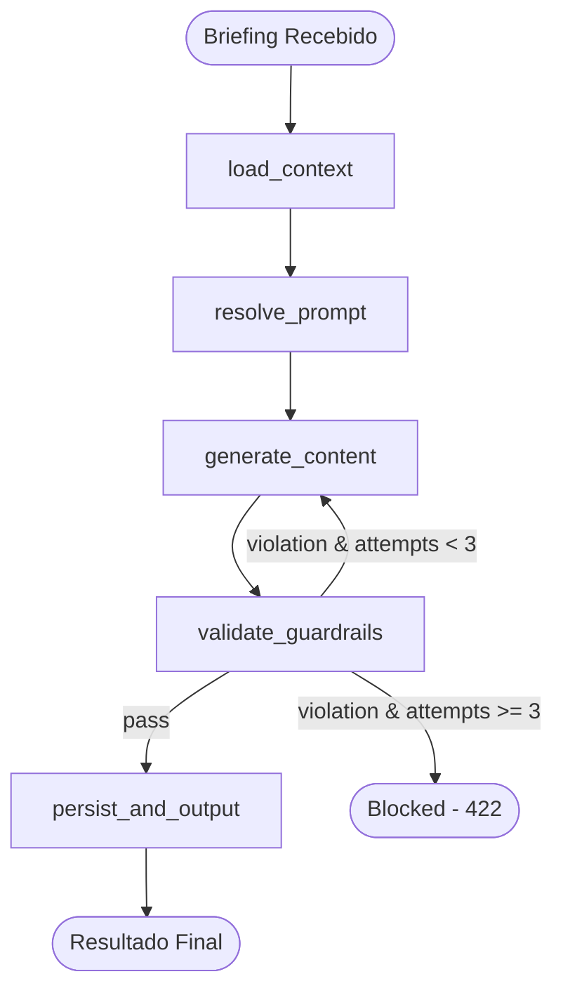
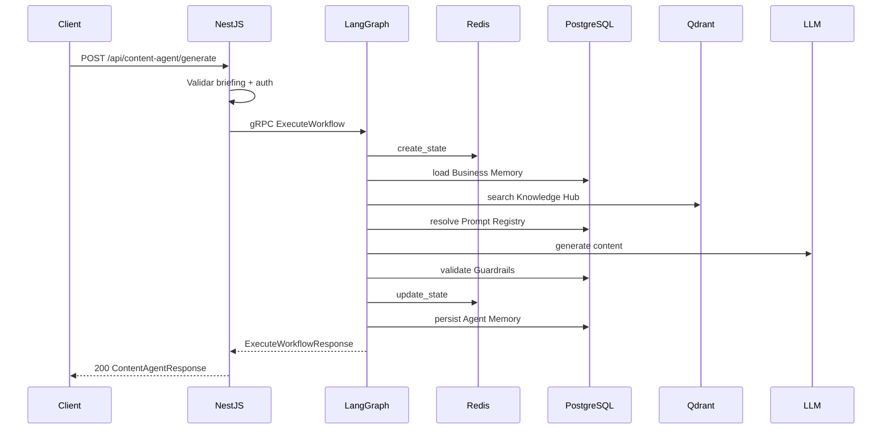

# Design Document: Content Agent MVP

## Overview

O Content Agent MVP é o primeiro workflow funcional executado no LangGraph Service, responsável por gerar conteúdo textual para redes sociais (Instagram, Facebook, TikTok) a partir de um briefing do profissional de marketing da clínica. O workflow é um DAG de 5 nós principais que carrega contexto da clínica, resolve prompts, gera conteúdo via LLM, valida contra guardrails regulatórios e persiste a interação.

A API REST exposta pelo NestJS recebe o briefing, valida campos obrigatórios, e delega a execução ao LangGraph Service via gRPC. O resultado é retornado com legendas adaptadas por rede, hashtags, sugestão visual e metadados de execução.

Fluxo macro:
1. Usuário submete briefing → NestJS valida e envia via gRPC → LangGraph executa workflow → NestJS retorna resultado
2. Refinamento: mesmo fluxo, mas carrega contexto da execução original

---

## Architecture

### Diagrama do Workflow DAG



### Camadas de Responsabilidade

| Camada | Tecnologia | Responsabilidade |
|--------|-----------|-----------------|
| API Gateway | NestJS (TypeScript) | Validação do briefing, autenticação, roteamento gRPC |
| Workflow Engine | LangGraph (Python) | Execução do DAG, controle de fluxo, retry de guardrails |
| State Management | Redis | Estado em voo durante execução |
| Persistence | PostgreSQL (RLS) | Histórico de execuções, Agent Memory |
| Vector Search | Qdrant | Busca semântica na Knowledge Hub |

### Comunicação entre Serviços



---

## Components and Interfaces

### 1. NestJS Controller — `ContentAgentController`

Responsável por expor os endpoints REST e delegar ao LangGraph via gRPC.

```typescript
// src/modules/content-agent/content-agent.controller.ts

interface GenerateBriefingDto {
  tema: string;               // obrigatório, max 500 chars
  procedimento?: string;      // opcional, ref Knowledge Hub
  publicoAlvoOverride?: string; // opcional, max 300 chars
  redesSociais: RedeSocial[]; // obrigatório, min 1
  idioma?: string;            // padrão "pt-BR"
}

interface RefineBriefingDto {
  executionId: string;        // ref execução original
  instrucoes: string;         // max 500 chars
}

type RedeSocial = 'instagram' | 'facebook' | 'tiktok';

// Endpoints:
// POST /api/content-agent/generate → gera conteúdo
// POST /api/content-agent/refine  → refina conteúdo existente
```

### 2. NestJS Service — `ContentAgentService`

Orquestra a validação local e chamada gRPC.

```typescript
// src/modules/content-agent/services/content-agent.service.ts

interface ContentAgentResponse {
  executionId: string;
  status: 'draft' | 'guardrail_blocked' | 'error';
  version: number;
  legendas: Record<RedeSocial, string>;
  hashtags: string[];
  sugestoesVisuais: Record<RedeSocial, SugestaoVisual>;
  modeloUtilizado: string;
  usouFallback: boolean;
  tokensConsumidos: { input: number; output: number };
  duracaoMs: number;
}

interface SugestaoVisual {
  formato: string;          // "1:1", "4:5", "1.91:1", "9:16"
  descricao: string;        // max 200 chars
}
```

### 3. LangGraph Workflow — `content_agent_workflow.py`

Define o DAG com 5 nós e a lógica de retry no guardrail.

```python
# langgraph-service/src/workflows/content_agent.py

from typing import TypedDict, Optional
from langgraph.graph import StateGraph, END

class ContentAgentState(TypedDict):
    """State schema do Content Agent workflow."""
    # Input
    tenant_id: str
    user_id: str
    trace_id: str
    execution_id: str
    briefing: dict            # {tema, procedimento, publico_alvo_override, redes_sociais, idioma}
    is_refinement: bool
    original_execution_id: Optional[str]
    refinement_instructions: Optional[str]
    version: int

    # Context (populated by load_context)
    brand_identity: dict       # {tom_de_voz, valores, paleta_cores}
    publico_alvo: str
    especialidades: list[str]
    diferenciais: list[str]
    knowledge_chunks: list[dict]

    # Prompt (populated by resolve_prompt)
    system_prompt: str
    task_prompt: str

    # Generation (populated by generate_content)
    legendas: dict[str, str]   # rede -> texto
    hashtags: list[str]
    sugestoes_visuais: dict[str, dict]
    model_id: str
    used_fallback: bool

    # Validation
    guardrail_attempt: int
    guardrail_violations: list[str]
    blocked_reason: Optional[str]

    # Execution metadata
    steps: list[dict]
    tokens_input: int
    tokens_output: int
    output: str                # JSON serializado da resposta final
```

### 4. Node Implementations

#### Node: `load_context`

Carrega dados do tenant via chamadas ao NestJS (Business Memory + Knowledge Hub).

```python
async def load_context(state: ContentAgentState) -> dict:
    """
    Carrega contexto da clínica:
    1. Business Memory: identidade da marca, público-alvo, especialidades
    2. Knowledge Hub: busca semântica com tema + procedimento
    3. Se refinamento: carrega execução original da Agent Memory
    
    Integração: gRPC callback ou HTTP interno ao NestJS para acessar
    Business Memory e Knowledge Hub (respeitando tenant_id via RLS).
    
    Erro: Se Business Memory não tiver tom_de_voz → retorna erro 412
    """
    ...
```

#### Node: `resolve_prompt`

Resolve o template de prompt do Prompt Registry.

```python
async def resolve_prompt(state: ContentAgentState) -> dict:
    """
    1. Busca prompt template para agent_type='content' no Prompt Registry
    2. Substitui variáveis: {{nome_clinica}}, {{tom_de_voz}}, {{especialidades}},
       {{publico_alvo}}, {{tema}}, {{procedimento}}, {{redes_sociais}},
       {{knowledge_context}}, {{idioma}}
    3. Monta system_prompt + task_prompt
    
    Integração: Prompt Registry (PostgreSQL via gRPC callback ou acesso direto)
    """
    ...
```

#### Node: `generate_content`

Chama o LLM via Model Registry para gerar conteúdo.

```python
async def generate_content(state: ContentAgentState) -> dict:
    """
    1. Seleciona modelo via Model Registry (primário ou fallback)
    2. Chama LLM com system_prompt + task_prompt
    3. Parseia resposta: legendas por rede, hashtags, sugestões visuais
    4. Registra token usage (input + output)
    
    Integração: Model Registry (seleção), LLM API (geração)
    
    Se LLM indisponível e sem fallback → erro 503
    """
    ...
```

#### Node: `validate_guardrails`

Valida conteúdo contra regras regulatórias.

```python
async def validate_guardrails(state: ContentAgentState) -> dict:
    """
    1. Valida cada legenda contra guardrails (system + tenant)
    2. Se violação detectada e attempts < 3:
       - Registra violação na Observabilidade
       - Retorna sinal para retry (conditional edge → generate_content)
    3. Se violação e attempts >= 3:
       - Marca como blocked
       - Registra bloqueio na Observabilidade
    4. Se valid: prossegue para persist_and_output
    
    Integração: Guardrails module (system rules + tenant rules via PostgreSQL)
    """
    ...
```

#### Node: `persist_and_output`

Persiste resultado e prepara resposta final.

```python
async def persist_and_output(state: ContentAgentState) -> dict:
    """
    1. Persiste na Agent Memory (short-term): briefing, contexto, conteúdo
    2. Registra na Observabilidade: trace_id, execution_id, duration, tokens, status
    3. Serializa resposta final em JSON para o campo output
    
    Integração: Agent Memory, Observability module
    
    Se persistência falhar → retorna conteúdo normalmente + warning log
    """
    ...
```

### 5. Conditional Edge — Guardrail Retry Logic

```python
def should_retry_or_output(state: ContentAgentState) -> str:
    """
    Decide o próximo nó após validate_guardrails:
    - Se sem violação → "persist_and_output"
    - Se violação e attempt < 3 → "generate_content" (retry)
    - Se violação e attempt >= 3 → END (blocked)
    """
    if not state.get("guardrail_violations") or len(state["guardrail_violations"]) == 0:
        return "persist_and_output"
    if state["guardrail_attempt"] < 3:
        return "generate_content"
    return "__end__"  # blocked
```

### 6. Workflow Graph Construction

```python
def build_content_agent_graph() -> CompiledStateGraph:
    graph = StateGraph(ContentAgentState)
    
    graph.add_node("load_context", load_context)
    graph.add_node("resolve_prompt", resolve_prompt)
    graph.add_node("generate_content", generate_content)
    graph.add_node("validate_guardrails", validate_guardrails)
    graph.add_node("persist_and_output", persist_and_output)
    
    graph.set_entry_point("load_context")
    graph.add_edge("load_context", "resolve_prompt")
    graph.add_edge("resolve_prompt", "generate_content")
    graph.add_edge("generate_content", "validate_guardrails")
    graph.add_conditional_edges(
        "validate_guardrails",
        should_retry_or_output,
        {
            "persist_and_output": "persist_and_output",
            "generate_content": "generate_content",
            "__end__": END,
        }
    )
    graph.add_edge("persist_and_output", END)
    
    return graph.compile()
```

---

## Data Models

### Briefing Input (API Request)

```typescript
interface GenerateBriefingDto {
  tema: string;                // obrigatório, 1-500 chars
  procedimento?: string;       // UUID ref knowledge_hub_documents
  publicoAlvoOverride?: string; // 0-300 chars
  redesSociais: RedeSocial[];  // min 1, subset of ['instagram','facebook','tiktok']
  idioma?: string;             // default 'pt-BR'
}
```

### ContentAgentState (LangGraph)

Detalhado na seção Components. Campos chave para persistência:

| Campo | Tipo | Persistido em |
|-------|------|---------------|
| execution_id | UUID | Redis (em voo), PostgreSQL (final) |
| tenant_id | UUID | Todos |
| briefing | JSON | Agent Memory |
| legendas | JSON | Agent Memory, response |
| hashtags | string[] | Agent Memory, response |
| guardrail_violations | string[] | Observability |
| tokens_input/output | int | workflow_executions |
| version | int | workflow_executions |

### Limites por Rede Social

| Rede | Max Legenda | Formato Visual | Max Hashtags |
|------|-------------|----------------|-------------|
| Instagram | 2200 chars | 1:1 ou 4:5 | 30 (usamos 5-15) |
| Facebook | 63206 chars | 1.91:1 | sem limite |
| TikTok | 2200 chars | 9:16 | 30 (usamos 5-15) |

### Refinement Tracking

```typescript
interface RefinementState {
  originalExecutionId: string;
  currentVersion: number;      // max 5
  refinementHistory: Array<{
    version: number;
    instructions: string;
    timestamp: Date;
  }>;
}
```

---

## Correctness Properties

*A property is a characteristic or behavior that should hold true across all valid executions of a system — essentially, a formal statement about what the system should do. Properties serve as the bridge between human-readable specifications and machine-verifiable correctness guarantees.*

### Property 1: Validação de briefing rejeita entradas inválidas

*For any* briefing onde o campo `tema` é vazio/whitespace-only ou excede 500 caracteres, OU onde `redesSociais` é uma lista vazia, OU onde `publicoAlvoOverride` excede 300 caracteres, a validação SHALL rejeitar a requisição com código 422 indicando os campos inválidos, e nenhuma execução de workflow SHALL ser iniciada.

**Validates: Requirements 1.2, 1.3**

### Property 2: Estrutura do output respeita invariantes por rede

*For any* execução bem-sucedida do Content Agent, o resultado SHALL conter: (a) uma legenda para cada rede social selecionada no briefing, onde cada legenda respeita o limite da rede (Instagram ≤ 2200, Facebook ≤ 63206, TikTok ≤ 2200 caracteres); (b) entre 5 e 15 hashtags (inclusive); (c) uma sugestão visual por rede com formato válido (Instagram: "1:1" ou "4:5", Facebook: "1.91:1", TikTok: "9:16") e descrição ≤ 200 caracteres; (d) execution_id, modelo utilizado e tokens consumidos.

**Validates: Requirements 3.1, 3.2, 3.3, 3.7**

### Property 3: Guardrail retry é limitado a 3 tentativas

*For any* execução do Content Agent onde uma Guardrail_Violation é detectada repetidamente, o número total de tentativas de regeneração SHALL ser ≤ 3. Se a violação persistir após a 3ª tentativa, o workflow SHALL interromper com status `guardrail_blocked` e código 422.

**Validates: Requirements 4.2, 4.3**

### Property 4: Refinamento preserva execution_id e incrementa version monotonicamente

*For any* refinamento processado com sucesso sobre um execution_id existente do mesmo tenant, o execution_id retornado SHALL ser idêntico ao original E o campo version SHALL ser igual à version anterior + 1.

**Validates: Requirements 5.1, 5.4**

### Property 5: Limite de 5 refinamentos por execução

*For any* execution_id, o sistema SHALL aceitar no máximo 5 refinamentos. A partir da 6ª tentativa de refinamento, o sistema SHALL rejeitar com código 429, independentemente do conteúdo da solicitação.

**Validates: Requirements 5.2**

### Property 6: Isolamento de tenant no acesso a dados

*For any* par de tenants distintos (A, B), uma execução para o tenant A SHALL nunca carregar, acessar ou retornar dados da Business Memory, Knowledge Hub ou Agent Memory do tenant B. Requisições de refinamento referenciando um execution_id de outro tenant SHALL retornar 404.

**Validates: Requirements 2.1, 2.2, 5.5**

### Property 7: Toda execução registra observabilidade completa

*For any* execução do Content Agent — independentemente do resultado (sucesso, guardrail_blocked, ou erro) — SHALL existir um registro de observabilidade contendo todos os campos obrigatórios: trace_id, execution_id, tenant_id, user_id, duração em ms, tokens consumidos (input + output), modelo utilizado, quantidade de violações de guardrail, e status final.

**Validates: Requirements 4.4, 6.2**

### Property 8: Precondição de identidade da marca (tom_de_voz)

*For any* tenant cuja Business Memory não possui tom_de_voz configurado, a execução do Content Agent SHALL ser rejeitada com código 412 antes de qualquer tentativa de geração de conteúdo, e NENHUM token de LLM SHALL ser consumido.

**Validates: Requirements 2.4**

---

## Error Handling

### Estratégia por Camada

| Cenário | Camada | Comportamento | Código HTTP |
|---------|--------|--------------|-------------|
| Briefing inválido | NestJS | Rejeitar com detalhes dos campos | 422 |
| Business Memory sem tom_de_voz | LangGraph | Abortar workflow, retornar erro | 412 |
| Knowledge Hub indisponível | LangGraph | Abortar workflow | 503 |
| Business Memory indisponível | LangGraph | Abortar workflow | 503 |
| LLM primário indisponível | LangGraph | Tentar fallback | — |
| LLM primário + fallback indisponíveis | LangGraph | Abortar workflow | 503 |
| Guardrail violation (attempts < 3) | LangGraph | Regenerar automaticamente | — |
| Guardrail violation (attempts = 3) | LangGraph | Bloquear e retornar | 422 |
| Refinamento > 5 por execution_id | NestJS | Rejeitar | 429 |
| execution_id inexistente | NestJS | Retornar 404 (sem leak) | 404 |
| gRPC timeout | NestJS | Circuit breaker → fallback | 504 |
| Persistência Agent Memory falha | LangGraph | Retornar conteúdo + warning log | 200 |

### Retry Policy

| Operação | Max Retries | Backoff | Timeout |
|----------|-------------|---------|---------|
| gRPC call (NestJS → LangGraph) | 0 (circuit breaker cuida) | — | 30s |
| Geração LLM (dentro do workflow) | 3 (guardrail-driven) | — | 60s |
| Persistência PostgreSQL | 3 | exponential (1s, 2s, 4s) | 5s |
| Busca Qdrant | 1 | — | 10s |
| Redis state update | 0 | — | 2s |

### Circuit Breaker Integration

O `ContentAgentService` no NestJS utiliza o `CircuitBreakerService` existente. Se o LangGraph Service estiver indisponível (circuit open), o fallback handler responde com erro 503 sem tentar chamada local de geração — o Content Agent não tem fallback simplificado como o pipeline genérico.

---

## Testing Strategy

### Abordagem Dual: Unit Tests + Property Tests

#### Property-Based Tests (Hypothesis - Python / fast-check - TypeScript)

Cada propriedade da seção Correctness Properties será implementada como um teste property-based com mínimo de 100 iterações.

**Python (LangGraph workflow) — `hypothesis`:**
- Property 2: Output structure invariants (legendas, hashtags, visual) → testa lógica do node generate_content + post-processing
- Property 3: Guardrail retry bounded → testa conditional edge + state machine
- Property 5: Refinement limit → testa counter logic
- Property 7: Observability completeness → testa node persist_and_output
- Property 8: Precondição tom_de_voz → testa node load_context

**TypeScript (NestJS) — `fast-check`:**
- Property 1: Briefing validation → testa DTO validation layer
- Property 4: Refinement state continuity → testa ContentAgentService
- Property 6: Tenant isolation → testa guards + gRPC metadata propagation

**Configuração:**
```python
# Python: pytest + hypothesis
@settings(max_examples=100)
@given(...)
def test_property_N(...):
    # Feature: content-agent-mvp, Property N: <description>
    ...
```

```typescript
// TypeScript: jest + fast-check
it('Property N: <description>', () => {
  // Feature: content-agent-mvp, Property N: <description>
  fc.assert(fc.property(...), { numRuns: 100 });
});
```

**Tagging:** Cada teste DEVE conter um comentário no formato:
`Feature: content-agent-mvp, Property {N}: {texto da propriedade}`

#### Unit Tests (exemplos específicos + edge cases)

| Componente | Cenário | Tipo |
|-----------|---------|------|
| GenerateBriefingDto | Tema vazio, redes vazia, tema 501 chars | Edge case |
| load_context | Business Memory sem tom_de_voz → 412 | Example |
| load_context | Knowledge Hub retorna 0 chunks → prossegue sem chunks | Example |
| load_context | Override de público-alvo substitui Business Memory | Example |
| generate_content | LLM retorna resposta malformada → erro tratado | Example |
| generate_content | LLM primário indisponível, fallback funciona → usedFallback=true | Example |
| validate_guardrails | Conteúdo com "resultado garantido" → violation detectada | Example |
| should_retry_or_output | Attempt=3 e violation → status blocked | Example |
| resolve_prompt | Variáveis de template substituídas corretamente | Example |
| RefineBriefingDto | execution_id de outro tenant → 404 sem leak | Example |
| ContentAgentService | gRPC timeout → circuit breaker ativado | Integration |
| ContentAgentService | LLM + fallback indisponíveis → 503 + alerta crítico | Example |
| persist_and_output | Agent Memory falha → conteúdo retornado + warning log | Example |

#### Integration Tests

| Fluxo | Descrição |
|-------|-----------|
| Happy path completo | Briefing válido → geração → resposta draft com todos campos |
| Guardrail + retry | Conteúdo viola → regenera → sucesso na 2ª tentativa |
| Guardrail blocked | Conteúdo viola 3x → status guardrail_blocked, 422 |
| Refinamento e2e | Gera → refina → version incrementa → refina 5x → 429 |
| Multi-tenant isolation | Tenant A não acessa dados de Tenant B |
| Fallback model | Primary indisponível → fallback → usedFallback=true |

### Mocking Strategy

Para property tests, mockar os seguintes componentes para manter custo de 100+ iterações viável:

| Componente | Mock Strategy |
|-----------|--------------|
| LLM API | Gerar conteúdo determinístico baseado no input (template-based) |
| Knowledge Hub search | Retornar chunks fictícios com score controlável |
| Business Memory | Retornar snapshot parametrizável (com/sem tom_de_voz) |
| Guardrails | Regras regex parametrizáveis (ativar/desativar violações) |
| Agent Memory | In-memory store para verificar persistência |
| Observability | In-memory collector para verificar completude dos logs |

Generators (Hypothesis/fast-check):
- `briefing_gen`: gera briefings com campos válidos/inválidos, temas de comprimento variável
- `rede_social_gen`: gera subsets de ['instagram', 'facebook', 'tiktok']
- `tenant_context_gen`: gera snapshots de Business Memory com/sem campos obrigatórios
- `guardrail_outcome_gen`: gera sequências de pass/fail para simular retry logic
