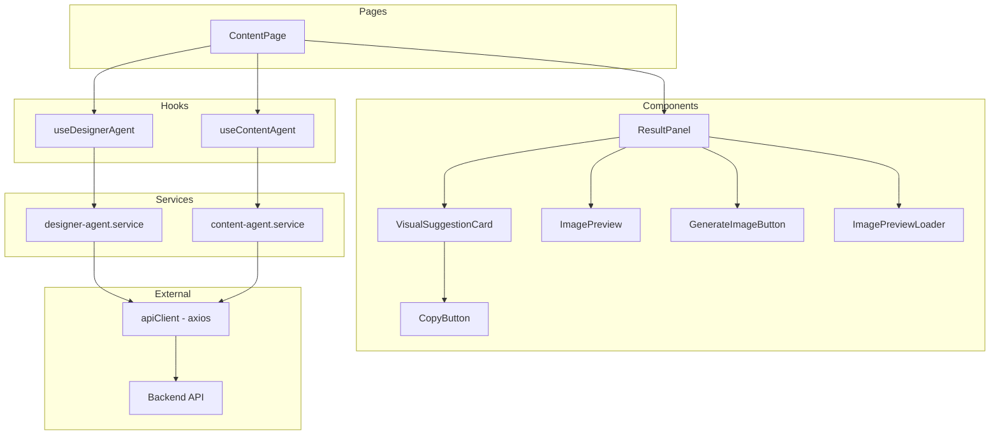
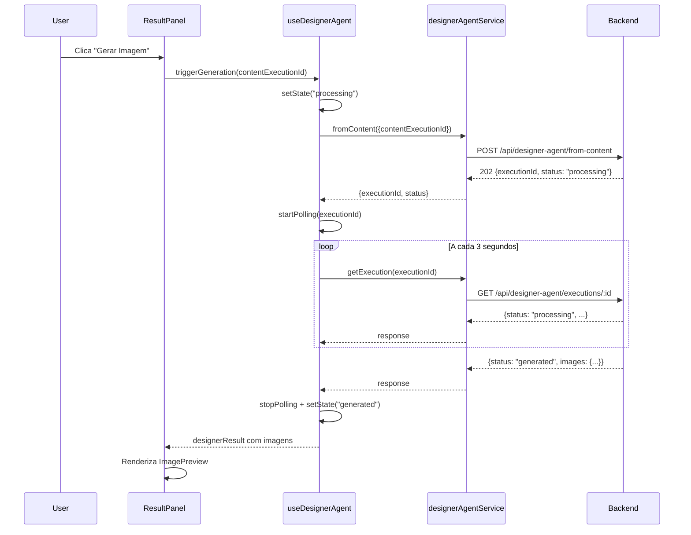
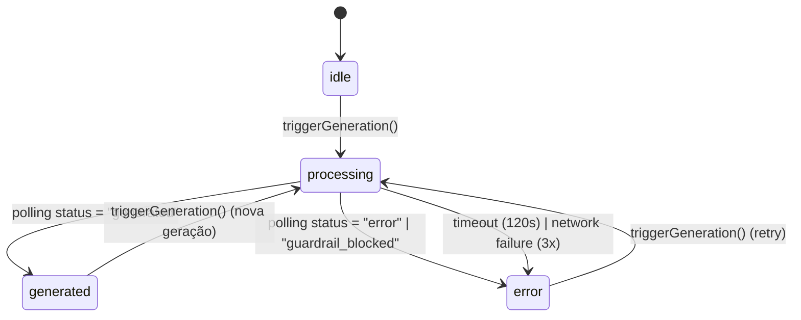

# Design Document: Designer Agent Frontend

## Overview

Integração do Designer Agent na interface frontend React da plataforma BeautyGrowth AI. O design adiciona um fluxo assíncrono de geração de imagens ao painel de resultados existente (`ResultPanel`), utilizando polling para acompanhar o progresso e exibir previews das imagens geradas. Também adiciona funcionalidade de copiar descrição visual ao `VisualSuggestionCard`.

**Fluxo principal:**
1. Usuário gera conteúdo via Content Agent → resultado exibido no `ResultPanel`
2. Botão "Gerar Imagem" aparece na seção de sugestões visuais
3. Clique aciona POST `/api/designer-agent/from-content` com `contentExecutionId`
4. API retorna 202 com `executionId` → hook inicia polling a cada 3s
5. Polling via GET `/api/designer-agent/executions/:id` até status terminal
6. Status "generated" → exibe `ImagePreview` com thumbnails por rede social
7. Usuário pode visualizar em tamanho completo (dialog) ou fazer download

**Decisões de design:**
- Hook `useDesignerAgent` implementa uma máquina de estados finita (idle → processing → generated | error)
- Polling usa `setInterval` com cleanup no unmount para evitar vazamento de memória
- Estado da última geração é mantido em memória (useState) — não persiste entre sessões
- Serviço `designer-agent.service.ts` segue o mesmo padrão de `content-agent.service.ts` (object literal com métodos)
- Componentes utilizam shadcn/ui (Card, Dialog, Button, Badge) e lucide-react para ícones
- Tipos centralizados em `types/designer-agent.ts` seguindo convenção existente

---

## Architecture

### Diagrama de Componentes



### Diagrama de Sequência — Geração de Imagem



### Diagrama de Estados — useDesignerAgent



---

## Components and Interfaces

### 1. `GenerateImageButton`

Botão que aciona a geração de imagem. Responsável apenas pela renderização e delegação do clique ao hook.

```typescript
// src/components/GenerateImageButton.tsx

interface GenerateImageButtonProps {
  onClick: () => void;
  isLoading: boolean;       // true enquanto POST está em andamento
  isProcessing: boolean;    // true durante polling
  hasResult: boolean;       // true se já existe resultado gerado
  disabled?: boolean;
}
```

**Comportamento:**
- Estado idle + sem resultado: "Gerar Imagem" (habilitado, cor primária)
- Estado idle + com resultado: "Gerar Nova Imagem" (habilitado, cor primária)
- isLoading: "Gerando..." + spinner (desabilitado)
- isProcessing: "Gerando..." (desabilitado)

### 2. `ImagePreview`

Exibe thumbnail da imagem gerada com ações de visualizar e download.

```typescript
// src/components/ImagePreview.tsx

interface ImagePreviewProps {
  images: Record<RedeSocial, ImageResult>;
  warnings?: string[];
}
```

**Comportamento:**
- Renderiza um card por rede social com thumbnail (`urlThumbnail`)
- Legenda: nome da rede social (capitalizado) + aspect ratio
- Clique no thumbnail → abre Dialog com imagem em resolução completa (`url`)
- Botão "Download" → inicia download da imagem original
- `onError` da `` → exibe placeholder com ícone de imagem quebrada
- Badges de warnings abaixo dos cards quando presentes

### 3. `ImagePreviewLoader`

Skeleton loader exibido durante o polling.

```typescript
// src/components/ImagePreviewLoader.tsx
// Sem props — componente de apresentação pura
```

**Comportamento:**
- Exibe skeleton cards com animação de pulso
- Texto "Gerando imagem..." centralizado
- Mantém layout consistente com `ImagePreview` para evitar layout shift

### 4. `CopyButton`

Botão de copiar texto para clipboard com feedback visual.

```typescript
// src/components/CopyButton.tsx

interface CopyButtonProps {
  text: string;              // texto a copiar
  ariaLabel: string;         // aria-label descritivo
}
```

**Comportamento:**
- Ícone padrão: `Copy` (lucide-react)
- Ao clicar: copia `text` via `navigator.clipboard.writeText()`
- Sucesso: ícone muda para `Check` por 2 segundos + toast de confirmação
- Falha: toast de erro sugerindo cópia manual
- Acessibilidade: `aria-label`, foco visível, ativação por Enter/Space

### 5. Modificações no `VisualSuggestionCard`

Adiciona `CopyButton` em cada card de sugestão visual.

```typescript
// Modificação em src/components/VisualSuggestionCard.tsx
// Nova prop não necessária — CopyButton usa dados internos do card
```

**Mudança:**
- Cada card recebe um `CopyButton` no header, ao lado do título
- `aria-label`: "Copiar descrição visual para {rede social}"
- Texto copiado: campo `descricao` da sugestão correspondente

### 6. Modificações no `ResultPanel`

Adiciona seção de Designer Agent entre sugestões visuais e metadados.

```typescript
// Modificação em src/components/ResultPanel.tsx
// Novas props:

interface ResultPanelProps {
  result: ContentAgentResult | null;
  isLoading: boolean;
  // Novas props para Designer Agent
  designerState: DesignerAgentState;
  designerResult: DesignerAgentExecution | null;
  onGenerateImage: () => void;
  isGenerating: boolean;
}
```

**Nova seção no layout:**
- Após "Sugestões Visuais": `GenerateImageButton`
- Se `designerState === 'processing'`: `ImagePreviewLoader`
- Se `designerState === 'generated'` e `designerResult`: `ImagePreview`
- Se `designerState === 'error'`: mensagem de erro inline

---

## Data Models

### TypeScript Types — `types/designer-agent.ts`

```typescript
import type { RedeSocial } from '@/types/content-agent';

// === Status Types ===

export type DesignerAgentStatus = 'processing' | 'generated' | 'guardrail_blocked' | 'error';

export type DesignerAgentState = 'idle' | 'processing' | 'generated' | 'error';

// === Request Types ===

export interface GenerateFromContentRequest {
  contentExecutionId: string;
  aplicarLogoOverlay?: boolean;
  estiloVisualAdicional?: string;
}

// === Response Types ===

export interface GenerateAcceptedResponse {
  executionId: string;
  status: 'processing';
}

export interface ImageResult {
  url: string;
  urlThumbnail: string;
  urlSemOverlay?: string;
  redeSocial: RedeSocial;
  aspectoRatio: string;
  tamanhoBytes: number;
  status: 'generated' | 'error';
  erroDetalhe?: string;
}

export interface DesignerAgentExecution {
  executionId: string;
  status: DesignerAgentStatus;
  contentExecutionId?: string;
  images: Record<RedeSocial, ImageResult>;
  modeloUtilizado: string;
  usouFallback: boolean;
  tokensConsumidos: number;
  duracaoMs: number;
  version: number;
  logoOverlayAplicado: boolean;
  warnings: string[];
}

// === Hook Return Type ===

export interface UseDesignerAgentReturn {
  state: DesignerAgentState;
  result: DesignerAgentExecution | null;
  triggerGeneration: (contentExecutionId: string) => void;
  isGenerating: boolean;
  error: string | null;
  reset: () => void;
}
```

### Mapeamento de estados do hook

| Estado interno | `state` | `isGenerating` | `result` | Ação possível |
|---|---|---|---|---|
| Nenhuma geração | `'idle'` | `false` | `null` | `triggerGeneration()` |
| POST em andamento | `'processing'` | `true` | `null` | — |
| Polling ativo | `'processing'` | `true` | `null` | — |
| Geração concluída | `'generated'` | `false` | `DesignerAgentExecution` | `triggerGeneration()` |
| Erro/blocked/timeout | `'error'` | `false` | `null` | `triggerGeneration()` |

---

## Service Layer — `designer-agent.service.ts`

```typescript
// src/services/designer-agent.service.ts

import apiClient from '@/services/api';
import type {
  GenerateFromContentRequest,
  GenerateAcceptedResponse,
  DesignerAgentExecution,
} from '@/types/designer-agent';

export const designerAgentService = {
  fromContent: (data: GenerateFromContentRequest): Promise<GenerateAcceptedResponse> =>
    apiClient.post('/api/designer-agent/from-content', data).then(r => r.data),

  getExecution: (executionId: string): Promise<DesignerAgentExecution> =>
    apiClient.get(`/api/designer-agent/executions/${executionId}`).then(r => r.data),
};
```

**Padrão seguido:** Mesmo estilo de `content-agent.service.ts` — object literal exportado, métodos extraem `.data` da response axios, sem classe.

---

## Custom Hook — `useDesignerAgent`

```typescript
// src/hooks/useDesignerAgent.ts

import { useState, useRef, useCallback, useEffect } from 'react';
import { toast } from 'sonner';
import { designerAgentService } from '@/services/designer-agent.service';
import { showErrorToast } from '@/lib/toast-utils';
import type {
  DesignerAgentState,
  DesignerAgentExecution,
  UseDesignerAgentReturn,
} from '@/types/designer-agent';

const POLLING_INTERVAL_MS = 3_000;
const MAX_POLLING_ATTEMPTS = 40; // 40 * 3s = 120s
const MAX_NETWORK_RETRIES = 3;
```

### Lógica interna

1. **`triggerGeneration(contentExecutionId)`**
   - Valida que `state !== 'processing'` (idempotente)
   - Seta `state = 'processing'`
   - Chama `designerAgentService.fromContent({ contentExecutionId })`
   - Sucesso: armazena `executionId`, inicia polling
   - Erro: seta `state = 'error'`, exibe toast via `showErrorToast`

2. **Polling (via `setInterval`)**
   - Referência ao interval armazenada em `useRef<ReturnType<typeof setInterval>>`
   - Contador de tentativas em `useRef<number>`
   - Contador de erros de rede consecutivos em `useRef<number>`
   - A cada tick:
     - Chama `designerAgentService.getExecution(executionId)`
     - Status `"generated"`: para polling, seta `state = 'generated'`, armazena resultado
     - Status `"guardrail_blocked"`: para polling, seta `state = 'error'`, toast de conformidade
     - Status `"error"`: para polling, seta `state = 'error'`, toast genérico
     - Status `"processing"`: incrementa contador, verifica timeout
     - Erro de rede: incrementa retry counter, se >= 3 → para polling + toast
   - Timeout: se tentativas >= 40 → para polling + toast com sugestão de retry

3. **Cleanup (`useEffect` return)**
   - Limpa interval no unmount para evitar vazamento de memória
   - Garante que polling para se componente é desmontado durante processamento

4. **`reset()`**
   - Para polling se ativo
   - Reseta `state = 'idle'`, `result = null`, `error = null`

---

## Error Handling

### Tabela de cenários de erro

| Cenário | Origem | Tratamento | Feedback ao usuário |
|---|---|---|---|
| POST `/from-content` falha (4xx/5xx) | API | `showErrorToast(error)` | Toast com mensagem da API |
| Polling GET falha (rede) | Rede | Retry até 3x consecutivas | Toast "Erro de conectividade" |
| Polling timeout (120s) | Lógica | Para polling | Toast "Tempo limite esgotado" |
| Status "guardrail_blocked" | API | Para polling | Toast "Não gerada por conformidade" |
| Status "error" | API | Para polling | Toast "Falha na geração" |
| Thumbnail URL quebrada | Navegador | `onError` no `` | Placeholder com ícone |
| Clipboard API indisponível | Navegador | Catch no `writeText` | Toast "Copie manualmente" |
| Clipboard permissão negada | Navegador | Catch no `writeText` | Toast "Copie manualmente" |

### Padrões aplicados

- **Reutilização de `showErrorToast`**: mesma função já usada globalmente para erros de API
- **Graceful degradation**: imagem com URL expirada mostra placeholder, não quebra o layout
- **Isolamento de falha**: erro no Designer Agent não afeta o resultado do Content Agent exibido
- **Idempotência**: clicar "Gerar Imagem" durante processing é no-op

---

## Correctness Properties

*A property is a characteristic or behavior that should hold true across all valid executions of a system — essentially, a formal statement about what the system should do. Properties serve as the bridge between human-readable specifications and machine-verifiable correctness guarantees.*

### Property 1: Service method request mapping

*For any* valid `contentExecutionId` string and optional parameters (`aplicarLogoOverlay`, `estiloVisualAdicional`), calling `designerAgentService.fromContent()` SHALL produce a POST request to `/api/designer-agent/from-content` with a JSON body containing exactly those fields; and *for any* valid `executionId` string, calling `designerAgentService.getExecution()` SHALL produce a GET request to `/api/designer-agent/executions/{executionId}`.

**Validates: Requirements 5.2, 5.3**

### Property 2: Hook state machine correctness

*For any* sequence of API responses (202 followed by N "processing" responses followed by a terminal status), the `useDesignerAgent` hook SHALL transition through states in the correct order: `idle → processing → {generated | error}`, and the final `result` SHALL equal the full `DesignerAgentExecution` response when terminal status is "generated", or be `null` when terminal status is "error" or "guardrail_blocked".

**Validates: Requirements 5.4, 1.4, 2.2**

### Property 3: Polling interval and termination

*For any* number of consecutive "processing" responses (1 to N, where N < 40), the polling mechanism SHALL make exactly N+1 GET requests spaced at 3-second intervals; and *for any* terminal status response at position K (K ≤ 40), polling SHALL stop immediately after receiving that response with no further requests made.

**Validates: Requirements 2.1**

### Property 4: ImagePreview rendering completeness

*For any* `DesignerAgentExecution` with status "generated" containing K images (1 ≤ K ≤ 3) across different redes sociais, the `ImagePreview` component SHALL render exactly K preview cards, each displaying the correct `urlThumbnail`, the capitalized rede social name, and the `aspectoRatio` string; and *for any* non-empty `warnings` array of length W, exactly W badge elements SHALL be rendered.

**Validates: Requirements 3.1, 3.2, 3.6**

### Property 5: Clipboard copy correctness

*For any* `SugestaoVisual` with a non-empty `descricao` field for a given `redeSocial`, clicking the copy button SHALL invoke `navigator.clipboard.writeText()` with the exact `descricao` string as argument, and the button's `aria-label` SHALL equal `"Copiar descrição visual para {redeSocial}"`.

**Validates: Requirements 4.2, 4.5**

### Property 6: Polling cleanup on unmount

*For any* active polling session (state = "processing" with interval running), unmounting the hook's host component SHALL clear the polling interval such that no further GET requests are made to the backend after unmount.

**Validates: Requirements 6.5**

---

## Testing Strategy

### Approach

**Dual testing:** Unit tests (example-based, vitest + testing-library) + property-based tests (vitest + fast-check).

O projeto já utiliza `vitest` como test runner e `@testing-library/react` para testes de componentes. Para property-based testing, será adicionado `fast-check` como dependência de desenvolvimento.

### Property-Based Tests (fast-check)

Cada correctness property acima será implementada como um test case com `fc.assert` e mínimo de **100 iterações**.

**Configuração:**
```typescript
import fc from 'fast-check';
// Cada test: fc.assert(fc.property(...), { numRuns: 100 })
```

**Tag format em cada test:**
```typescript
// Feature: designer-agent-frontend, Property 1: Service method request mapping
```

**Testes PBT planejados:**
1. Service methods produzem requests corretos para qualquer input válido
2. Hook state machine segue transições corretas para qualquer sequência de respostas
3. Polling faz número correto de requests para qualquer N responses
4. ImagePreview renderiza cards corretos para qualquer combinação de imagens/warnings
5. CopyButton copia texto exato e tem aria-label correto para qualquer rede social
6. Cleanup cancela polling para qualquer estado de processing ativo

### Unit Tests (example-based)

| Cenário | Tipo | Componente |
|---|---|---|
| Botão oculto sem resultado | Example | ResultPanel |
| Botão visível com resultado | Example | ResultPanel |
| Spinner durante POST | Example | GenerateImageButton |
| Skeleton durante polling | Example | ImagePreviewLoader |
| Dialog abre ao clicar thumbnail | Example | ImagePreview |
| Download inicia no botão | Example | ImagePreview |
| Placeholder em imagem quebrada | Edge case | ImagePreview |
| Toast em erro de clipboard | Edge case | CopyButton |
| Toast em guardrail_blocked | Example | useDesignerAgent |
| Timeout após 120s | Edge case | useDesignerAgent |
| Retry 3x em erro de rede | Edge case | useDesignerAgent |
| Toast em erro POST | Edge case | useDesignerAgent |
| Feedback visual "check" por 2s | Example | CopyButton |
| Estado preservado após geração | Example | useDesignerAgent |

### Dependência a adicionar

```json
{
  "devDependencies": {
    "fast-check": "^3.22.0"
  }
}
```
