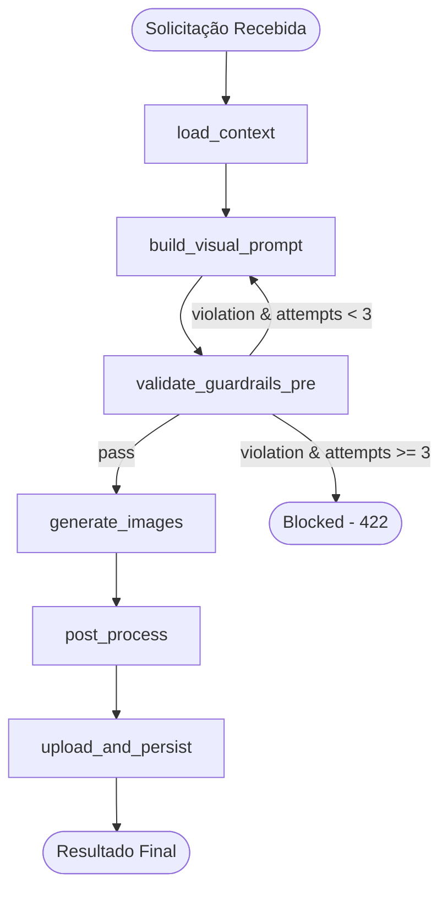
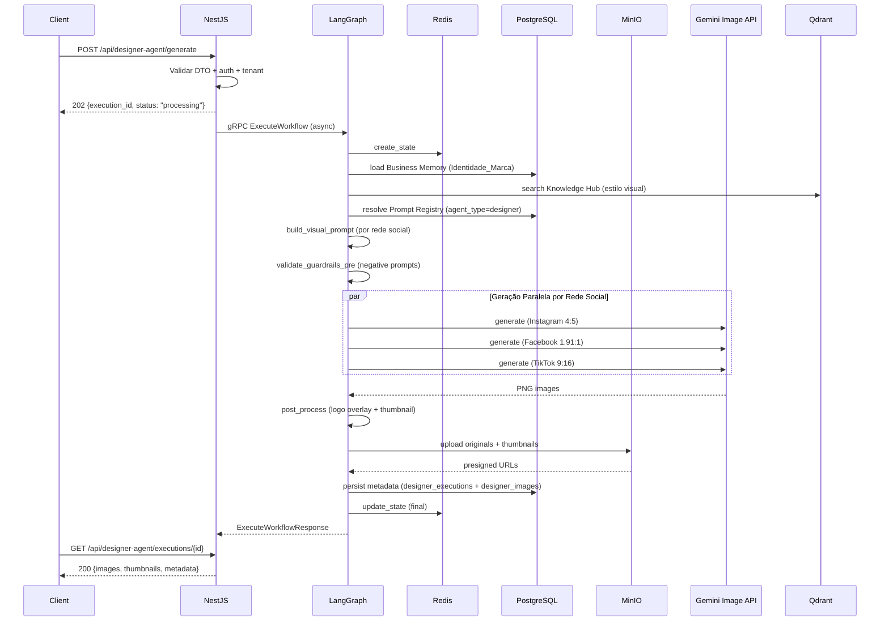
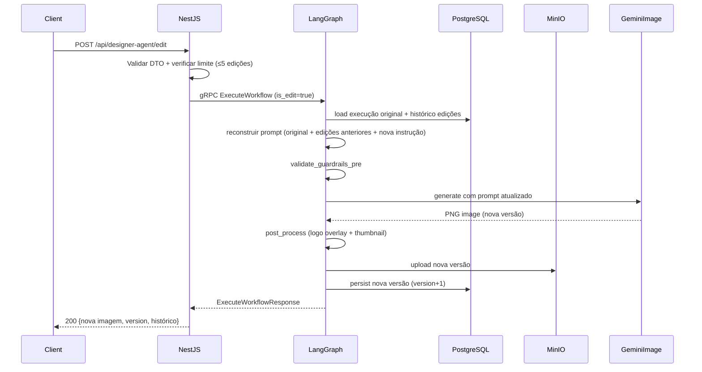
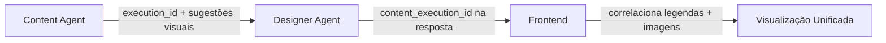

# Design Document: Designer Agent

## Overview

O Designer Agent é um novo workflow LangGraph dedicado à geração de imagens para redes sociais, evoluindo o Content Agent MVP da plataforma BeautyGrowth AI. Enquanto o Content Agent gera conteúdo textual (legendas, hashtags e sugestões visuais textuais), o Designer Agent transforma essas sugestões — ou descrições visuais fornecidas diretamente pelo usuário — em imagens reais prontas para publicação.

O workflow é um DAG de 7 nós principais que: valida a solicitação, carrega contexto da clínica (identidade de marca), constrói o prompt visual automaticamente, gera imagens via modelo `gemini-3.1-flash-image` com dimensões específicas por rede social, aplica overlay de logo (quando solicitado), valida guardrails regulatórios e persiste os resultados no MinIO com metadados no PostgreSQL.

**Fluxo macro:**
1. Usuário submete solicitação → NestJS valida e envia via gRPC → LangGraph executa workflow Designer Agent
2. Imagens geradas são armazenadas no MinIO com URL pré-assinada (7 dias)
3. Thumbnails (400px, JPEG 80%) são gerados para preview no frontend
4. Edição iterativa: mesmo fluxo, mas carrega contexto da execução original (máximo 5 edições por rede)
5. Integração: Content Agent pode invocar Designer Agent automaticamente após gerar conteúdo textual

**Decisões de design:**
- Geração paralela por rede social (até 3 simultâneas) para reduzir latência
- Pós-processamento de logo via Pillow (Python) — não depende do modelo de IA
- Thumbnails gerados localmente via Pillow antes do upload ao MinIO
- Guardrails aplicados no prompt (pre-generation) via negative prompts, não pós-geração via análise de imagem
- Fallback de modelo configurável via Model Registry existente


---

## Architecture

### Diagrama do Workflow DAG



### Diagrama de Sequência Principal




### Diagrama de Edição Iterativa



### Camadas de Responsabilidade

| Camada | Tecnologia | Responsabilidade |
|--------|-----------|-----------------|
| API Gateway | NestJS (TypeScript) | Validação DTO, autenticação, resposta 202/polling, limite de edições |
| Workflow Engine | LangGraph (Python) | Execução do DAG, geração paralela, retry de guardrails |
| Image Generation | Gemini 3.1 Flash Image API | Geração de imagens a partir de prompts textuais |
| Post-Processing | Pillow (Python) | Logo overlay, geração de thumbnails, redimensionamento |
| State Management | Redis | Estado em voo durante execução |
| Object Storage | MinIO (S3-compatible) | Armazenamento de imagens originais + thumbnails |
| Persistence | PostgreSQL (RLS) | Metadados de execuções, histórico de versões |
| Vector Search | Qdrant | Busca semântica para contexto visual na Knowledge Hub |

---

## Components and Interfaces

### 1. NestJS Controller — `DesignerAgentController`

```typescript
// src/modules/designer-agent/designer-agent.controller.ts

@Controller('designer-agent')
@UseGuards(TenantGuard)
export class DesignerAgentController {
  constructor(private readonly designerAgentService: DesignerAgentService) {}

  // POST /api/designer-agent/generate → inicia geração de imagens
  // POST /api/designer-agent/edit → edição iterativa
  // GET /api/designer-agent/executions/:id → consulta resultado
  // GET /api/designer-agent/executions/:id/images/:imageId/download → URL download
  // POST /api/designer-agent/from-content → geração a partir do Content Agent
}
```


### 2. DTOs de Entrada

```typescript
// src/modules/designer-agent/dto/generate-image.dto.ts

type RedeSocial = 'instagram' | 'facebook' | 'tiktok';

interface GenerateImageDto {
  descricaoVisual: string;           // obrigatório, 10-1000 chars (após trim)
  redesSociais: RedeSocial[];        // obrigatório, 1-3 valores
  contentExecutionId?: string;       // opcional, UUID do Content Agent
  aplicarLogoOverlay?: boolean;      // opcional, default false
  estiloVisualAdicional?: string;    // opcional, max 300 chars
}

interface EditImageDto {
  executionId: string;               // obrigatório, UUID da execução original
  redeSocial: RedeSocial;            // obrigatório, rede para editar
  instrucaoEdicao: string;           // obrigatório, max 500 chars
}

interface FromContentDto {
  contentExecutionId: string;        // obrigatório, UUID do Content Agent
  aplicarLogoOverlay?: boolean;      // opcional, default false
  estiloVisualAdicional?: string;    // opcional, max 300 chars
}
```

### 3. DTOs de Saída

```typescript
// src/modules/designer-agent/dto/designer-agent-response.dto.ts

interface DesignerAgentResponse {
  executionId: string;
  status: 'processing' | 'generated' | 'guardrail_blocked' | 'error';
  contentExecutionId?: string;          // se vinculado ao Content Agent
  images: Record<RedeSocial, ImageResult>;
  modeloUtilizado: string;
  usouFallback: boolean;
  tokensConsumidos: number;
  duracaoMs: number;
  version: number;
  logoOverlayAplicado: boolean;
  warnings: string[];
}

interface ImageResult {
  url: string;                          // URL pré-assinada (7 dias)
  urlThumbnail: string;                 // thumbnail 400px JPEG
  urlSemOverlay?: string;               // se overlay aplicado
  redeSocial: RedeSocial;
  aspectoRatio: string;                 // "4:5", "1.91:1", "9:16"
  tamanhoBytes: number;
  status: 'generated' | 'error';
  erroDetalhe?: string;                 // se status=error
}

// Resposta do POST /generate (assíncrono)
interface GenerateAcceptedResponse {
  executionId: string;
  status: 'processing';
}
```

### 4. NestJS Service — `DesignerAgentService`

```typescript
// src/modules/designer-agent/services/designer-agent.service.ts

@Injectable()
export class DesignerAgentService {
  private static readonly DESIGNER_AGENT_ID = 'designer-agent';
  private static readonly MAX_EDITS_PER_SOCIAL = 5;

  constructor(
    private readonly langGraphClient: LangGraphClientService,
    private readonly circuitBreaker: CircuitBreakerService,
    private readonly agentMemoryService: AgentMemoryService,
    private readonly observabilityService: ObservabilityService,
  ) {}

  async generate(dto: GenerateImageDto, tenantId: string, userId: string): Promise<GenerateAcceptedResponse>;
  async edit(dto: EditImageDto, tenantId: string, userId: string): Promise<DesignerAgentResponse>;
  async fromContent(dto: FromContentDto, tenantId: string, userId: string): Promise<GenerateAcceptedResponse>;
  async getExecution(executionId: string, tenantId: string): Promise<DesignerAgentResponse>;
  async getDownloadUrl(executionId: string, imageId: string, tenantId: string): Promise<string>;
}
```


### 5. LangGraph Workflow — `designer_agent_workflow.py`

```python
# langgraph-service/src/workflows/designer_agent.py

from typing import TypedDict, Optional
from langgraph.graph import StateGraph, END

class DesignerAgentState(TypedDict):
    """State schema do Designer Agent workflow."""
    # Input
    tenant_id: str
    user_id: str
    trace_id: str
    execution_id: str
    request: dict                       # {descricao_visual, redes_sociais, content_execution_id, ...}
    is_edit: bool
    original_execution_id: Optional[str]
    edit_instruction: Optional[str]
    target_social: Optional[str]        # rede social alvo da edição
    version: int

    # Context (populated by load_context)
    brand_identity: dict                # {paleta_cores, estilo_visual, valores, elementos_recorrentes}
    brand_identity_defaults_used: bool  # flag se usou defaults
    clinic_logo_url: Optional[str]      # URL do logo no MinIO
    content_agent_data: Optional[dict]  # dados do Content Agent se vinculado
    knowledge_chunks: list[dict]        # contexto visual da Knowledge Hub
    edit_history: list[dict]            # histórico de edições anteriores

    # Prompt (populated by build_visual_prompt)
    visual_prompts: dict[str, str]      # rede_social -> prompt completo
    negative_prompts: list[str]         # instruções negativas (guardrails)

    # Guardrails
    guardrail_attempt: int
    guardrail_violations: list[dict]    # {regra, trecho, tentativa}

    # Generation (populated by generate_images)
    generated_images: dict[str, dict]   # rede_social -> {bytes, format, model_id}
    generation_errors: dict[str, str]   # rede_social -> erro (se parcial)
    model_id: str
    used_fallback: bool

    # Post-processing (populated by post_process)
    processed_images: dict[str, dict]   # rede_social -> {original_bytes, thumbnail_bytes, overlay_bytes}
    logo_overlay_applied: bool
    logo_overlay_warnings: list[str]

    # Upload (populated by upload_and_persist)
    image_urls: dict[str, dict]         # rede_social -> {url, url_thumbnail, url_sem_overlay}
    image_metadata: list[dict]          # metadados persistidos

    # Execution metadata
    steps: list[dict]
    tokens_consumed: int
    duration_ms: int
    warnings: list[str]
    output: str                         # JSON serializado da resposta final
```

### 6. Node Implementations

#### Node: `load_context`

```python
async def load_context(state: DesignerAgentState) -> dict:
    """
    Carrega contexto necessário para construir o prompt visual:
    1. Business Memory: Identidade_Marca (paleta_cores, estilo_visual, valores, elementos)
    2. Logo da clínica (URL no MinIO) se overlay solicitado
    3. Knowledge Hub: busca semântica com tema visual
    4. Se vinculado ao Content Agent: carrega sugestões visuais e contexto
    5. Se edição: carrega execução original + histórico cumulativo de edições

    Se paleta de cores ausente → usa defaults (branco, cinza, dourado)
    Se Content Agent referenciado → valida existência e pertencimento ao tenant
    """
    ...
```

#### Node: `build_visual_prompt`

```python
async def build_visual_prompt(state: DesignerAgentState) -> dict:
    """
    Constrói o prompt visual para cada rede social selecionada:
    1. Resolve template do Prompt Registry (agent_type='designer')
    2. Substitui variáveis: {{descricao_visual}}, {{paleta_cores}}, {{estilo_visual}},
       {{aspecto_ratio}}, {{nome_clinica}}, {{elementos_recorrentes}}
    3. Adiciona estilo visual adicional (se informado)
    4. Adiciona contexto do Content Agent (se vinculado)
    5. Se edição: incorpora histórico cumulativo + nova instrução
    6. Gera negative_prompts (guardrails embutidos no prompt)

    Output: visual_prompts[rede_social] = prompt completo por rede
    """
    ...
```


#### Node: `validate_guardrails_pre`

```python
async def validate_guardrails_pre(state: DesignerAgentState) -> dict:
    """
    Valida o prompt visual contra guardrails antes da geração:
    1. Aplica guardrails padrão da plataforma (ANVISA/CFM)
    2. Aplica guardrails personalizados do tenant (se disponíveis)
    3. Verifica presença de termos proibidos no prompt
    4. Timeout: 10s para validação completa

    Se violação detectada e attempts < 3:
      → Registra violação na Observabilidade
      → Remove elementos violadores do prompt
      → Retorna sinal para retry (conditional edge → build_visual_prompt)
    Se violação e attempts >= 3:
      → Marca como blocked, registra e termina

    Se guardrails personalizados indisponíveis:
      → Aplica apenas guardrails padrão + warning
    """
    ...
```

#### Node: `generate_images`

```python
async def generate_images(state: DesignerAgentState) -> dict:
    """
    Gera imagens para todas as redes sociais selecionadas:
    1. Seleciona modelo via Model Registry (primário: gemini-3.1-flash-image)
    2. Para cada rede social em paralelo (asyncio.gather):
       - Invoca modelo com prompt + aspecto_ratio correspondente
       - Instagram: 4:5 (1080x1350px)
       - Facebook: 1.91:1 (1200x628px)
       - TikTok: 9:16 (1080x1920px)
    3. Timeout: 60s por imagem
    4. Se modelo primário falha → tenta fallback do Model Registry
    5. Registra tokens consumidos

    Tratamento de falha parcial:
    - Se ao menos uma imagem gerada com sucesso → continua com parciais
    - Se todas falharem → erro 503

    Output: generated_images[rede_social] = {bytes, format='PNG', model_id}
    """
    ...
```

#### Node: `post_process`

```python
async def post_process(state: DesignerAgentState) -> dict:
    """
    Pós-processamento das imagens geradas via Pillow:
    1. Para cada imagem gerada:
       a. Gera thumbnail: JPEG 80%, largura 400px, mantém aspect ratio, max 200KB
       b. Se logo overlay solicitado E logo disponível:
          - Carrega logo do MinIO
          - Redimensiona para max 15% da largura da imagem
          - Posiciona: canto inferior direito, margem 3%, opacidade 80%
          - Salva versão com overlay (principal) e sem overlay (variante)
       c. Se logo overlay solicitado mas logo não disponível:
          - Gera warning, retorna imagem sem overlay

    Se processamento do logo falha (formato incompatível, corrompido):
      → Retorna imagem sem overlay + warning

    Output: processed_images[rede_social] = {original_bytes, thumbnail_bytes, overlay_bytes?}
    """
    ...
```

#### Node: `upload_and_persist`

```python
async def upload_and_persist(state: DesignerAgentState) -> dict:
    """
    Upload ao MinIO e persistência de metadados:
    1. Para cada imagem processada:
       a. Upload original: {tenant_id}/designer/{execution_id}/{rede}_{timestamp}.png
       b. Upload thumbnail: {tenant_id}/designer/{execution_id}/{rede}_{timestamp}_thumb.jpg
       c. Upload overlay (se existir): {tenant_id}/designer/{execution_id}/{rede}_{timestamp}_overlay.png
       d. Gera URL pré-assinada (7 dias) para cada arquivo
    2. Persiste metadados na tabela designer_images
    3. Persiste execução na tabela designer_executions
    4. Persiste na Agent Memory (short-term, 30 dias)
    5. Registra na Observabilidade

    Retry: até 3 tentativas com backoff exponencial (1s, 2s, 4s) para upload
    Se upload falha após retries → erro 503
    Se tamanho > 10MB → rejeita com erro 413

    Output: image_urls, image_metadata, output (JSON final)
    """
    ...
```

### 7. Conditional Edge — Guardrail Pre-validation Logic

```python
def should_rebuild_or_generate(state: DesignerAgentState) -> str:
    """
    Decide próximo nó após validate_guardrails_pre:
    - Se sem violação → "generate_images"
    - Se violação e attempt < 3 → "build_visual_prompt" (rebuild)
    - Se violação e attempt >= 3 → END (blocked)
    """
    if not state.get("guardrail_violations") or len(state["guardrail_violations"]) == 0:
        return "generate_images"
    if state["guardrail_attempt"] < 3:
        return "build_visual_prompt"
    return "__end__"  # blocked
```


### 8. Workflow Graph Construction

```python
def build_designer_agent_graph() -> CompiledStateGraph:
    graph = StateGraph(DesignerAgentState)

    graph.add_node("load_context", load_context)
    graph.add_node("build_visual_prompt", build_visual_prompt)
    graph.add_node("validate_guardrails_pre", validate_guardrails_pre)
    graph.add_node("generate_images", generate_images)
    graph.add_node("post_process", post_process)
    graph.add_node("upload_and_persist", upload_and_persist)

    graph.set_entry_point("load_context")
    graph.add_edge("load_context", "build_visual_prompt")
    graph.add_edge("build_visual_prompt", "validate_guardrails_pre")
    graph.add_conditional_edges(
        "validate_guardrails_pre",
        should_rebuild_or_generate,
        {
            "generate_images": "generate_images",
            "build_visual_prompt": "build_visual_prompt",
            "__end__": END,
        }
    )
    graph.add_edge("generate_images", "post_process")
    graph.add_edge("post_process", "upload_and_persist")
    graph.add_edge("upload_and_persist", END)

    return graph.compile()
```

### 9. Integração com Content Agent



O Designer Agent pode ser invocado de 3 formas:
1. **Direta**: usuário fornece descrição visual manualmente
2. **Vinculada**: referencia um `execution_id` do Content Agent (carrega sugestões visuais)
3. **Automática (from-content)**: endpoint dedicado que extrai automaticamente as redes sociais e descrições visuais da execução do Content Agent

---

## Data Models

### Tabela: `designer_executions`

```sql
CREATE TABLE designer_executions (
    id UUID PRIMARY KEY DEFAULT gen_random_uuid(),
    execution_id UUID NOT NULL UNIQUE,
    tenant_id UUID NOT NULL,
    user_id UUID NOT NULL,
    content_execution_id UUID,                -- ref Content Agent (opcional)
    status VARCHAR(50) NOT NULL DEFAULT 'processing',
    descricao_visual TEXT NOT NULL,
    redes_sociais TEXT[] NOT NULL,
    estilo_visual_adicional TEXT,
    aplicar_logo_overlay BOOLEAN DEFAULT false,
    logo_overlay_aplicado BOOLEAN DEFAULT false,
    version INTEGER NOT NULL DEFAULT 1,
    modelo_utilizado VARCHAR(255),
    usou_fallback BOOLEAN DEFAULT false,
    tokens_consumidos INTEGER DEFAULT 0,
    duracao_ms INTEGER,
    guardrail_violations JSONB DEFAULT '[]',
    warnings TEXT[] DEFAULT '{}',
    brand_identity_defaults_used BOOLEAN DEFAULT false,
    trace_id UUID,
    created_at TIMESTAMP WITH TIME ZONE DEFAULT NOW(),
    updated_at TIMESTAMP WITH TIME ZONE DEFAULT NOW(),
    completed_at TIMESTAMP WITH TIME ZONE
);

-- RLS Policy
ALTER TABLE designer_executions ENABLE ROW LEVEL SECURITY;
CREATE POLICY tenant_isolation ON designer_executions
    USING (tenant_id = current_setting('app.current_tenant')::UUID);

-- Índices
CREATE INDEX idx_designer_exec_tenant ON designer_executions(tenant_id);
CREATE INDEX idx_designer_exec_status ON designer_executions(tenant_id, status);
CREATE INDEX idx_designer_exec_content ON designer_executions(content_execution_id);
CREATE INDEX idx_designer_exec_created ON designer_executions(tenant_id, created_at DESC);
```


### Tabela: `designer_images`

```sql
CREATE TABLE designer_images (
    id UUID PRIMARY KEY DEFAULT gen_random_uuid(),
    execution_id UUID NOT NULL REFERENCES designer_executions(execution_id),
    tenant_id UUID NOT NULL,
    rede_social VARCHAR(20) NOT NULL,
    aspecto_ratio VARCHAR(10) NOT NULL,       -- "4:5", "1.91:1", "9:16"
    largura_px INTEGER NOT NULL,
    altura_px INTEGER NOT NULL,
    tamanho_bytes INTEGER NOT NULL,
    formato VARCHAR(10) NOT NULL DEFAULT 'PNG',
    minio_path TEXT NOT NULL,
    minio_path_thumbnail TEXT NOT NULL,
    minio_path_sem_overlay TEXT,              -- se overlay aplicado
    url_presigned TEXT,                       -- URL pré-assinada (regenerável)
    url_presigned_thumbnail TEXT,
    url_presigned_sem_overlay TEXT,
    url_presigned_expires_at TIMESTAMP WITH TIME ZONE,
    modelo_utilizado VARCHAR(255) NOT NULL,
    version INTEGER NOT NULL DEFAULT 1,
    is_latest BOOLEAN DEFAULT true,           -- marca versão mais recente
    created_at TIMESTAMP WITH TIME ZONE DEFAULT NOW()
);

-- RLS Policy
ALTER TABLE designer_images ENABLE ROW LEVEL SECURITY;
CREATE POLICY tenant_isolation ON designer_images
    USING (tenant_id = current_setting('app.current_tenant')::UUID);

-- Índices
CREATE INDEX idx_designer_img_execution ON designer_images(execution_id);
CREATE INDEX idx_designer_img_tenant ON designer_images(tenant_id);
CREATE INDEX idx_designer_img_latest ON designer_images(execution_id, rede_social, is_latest)
    WHERE is_latest = true;
CREATE INDEX idx_designer_img_expired ON designer_images(url_presigned_expires_at)
    WHERE url_presigned_expires_at IS NOT NULL;
```

### Tabela: `designer_edit_history`

```sql
CREATE TABLE designer_edit_history (
    id UUID PRIMARY KEY DEFAULT gen_random_uuid(),
    execution_id UUID NOT NULL REFERENCES designer_executions(execution_id),
    tenant_id UUID NOT NULL,
    rede_social VARCHAR(20) NOT NULL,
    version INTEGER NOT NULL,
    instrucao_edicao TEXT NOT NULL,
    prompt_visual_utilizado TEXT NOT NULL,
    created_at TIMESTAMP WITH TIME ZONE DEFAULT NOW(),
    UNIQUE(execution_id, rede_social, version)
);

-- RLS Policy
ALTER TABLE designer_edit_history ENABLE ROW LEVEL SECURITY;
CREATE POLICY tenant_isolation ON designer_edit_history
    USING (tenant_id = current_setting('app.current_tenant')::UUID);

-- Índice
CREATE INDEX idx_designer_edit_exec ON designer_edit_history(execution_id, rede_social);
```

### Aspecto Ratios por Rede Social

| Rede Social | Aspect Ratio | Resolução (px) | Uso |
|-------------|-------------|----------------|-----|
| Instagram | 4:5 | 1080×1350 | Feed post |
| Facebook | 1.91:1 | 1200×628 | Link post / feed |
| TikTok | 9:16 | 1080×1920 | Vídeo vertical / capa |

### Estrutura MinIO (Object Storage)

```
bucket: beautygrowth-assets
├── {tenant_id}/
│   └── designer/
│       └── {execution_id}/
│           ├── instagram_20260715143052123.png          (original)
│           ├── instagram_20260715143052123_thumb.jpg    (thumbnail 400px)
│           ├── instagram_20260715143052123_overlay.png  (com overlay)
│           ├── facebook_20260715143052456.png
│           ├── facebook_20260715143052456_thumb.jpg
│           ├── tiktok_20260715143052789.png
│           └── tiktok_20260715143052789_thumb.jpg
```


### API Contracts

#### POST `/api/designer-agent/generate`

**Request:**
```json
{
  "descricaoVisual": "Imagem elegante de procedimento de harmonização facial...",
  "redesSociais": ["instagram", "facebook"],
  "contentExecutionId": "uuid-optional",
  "aplicarLogoOverlay": true,
  "estiloVisualAdicional": "minimalista, tons pastéis"
}
```

**Response (202 Accepted):**
```json
{
  "executionId": "uuid-v4",
  "status": "processing"
}
```

#### GET `/api/designer-agent/executions/:id`

**Response (200 OK — geração concluída):**
```json
{
  "executionId": "uuid-v4",
  "status": "generated",
  "contentExecutionId": "uuid-content-agent",
  "images": {
    "instagram": {
      "url": "https://minio.../presigned-original.png",
      "urlThumbnail": "https://minio.../presigned-thumb.jpg",
      "urlSemOverlay": "https://minio.../presigned-no-overlay.png",
      "redeSocial": "instagram",
      "aspectoRatio": "4:5",
      "tamanhoBytes": 2048576,
      "status": "generated"
    },
    "facebook": { "..." }
  },
  "modeloUtilizado": "gemini-3.1-flash-image",
  "usouFallback": false,
  "tokensConsumidos": 1250,
  "duracaoMs": 12500,
  "version": 1,
  "logoOverlayAplicado": true,
  "warnings": []
}
```

#### POST `/api/designer-agent/edit`

**Request:**
```json
{
  "executionId": "uuid-v4",
  "redeSocial": "instagram",
  "instrucaoEdicao": "Aumentar destaque para o rosto da modelo e adicionar mais luz"
}
```

**Response (200 OK):**
```json
{
  "executionId": "uuid-v4",
  "status": "generated",
  "images": {
    "instagram": {
      "url": "https://minio.../nova-versao.png",
      "urlThumbnail": "https://minio.../nova-versao-thumb.jpg",
      "redeSocial": "instagram",
      "aspectoRatio": "4:5",
      "tamanhoBytes": 2100000,
      "status": "generated"
    }
  },
  "version": 2,
  "logoOverlayAplicado": true,
  "warnings": []
}
```

#### POST `/api/designer-agent/from-content`

**Request:**
```json
{
  "contentExecutionId": "uuid-content-agent",
  "aplicarLogoOverlay": false,
  "estiloVisualAdicional": "foto realista"
}
```

**Response (202 Accepted):**
```json
{
  "executionId": "uuid-designer-v4",
  "status": "processing"
}
```
