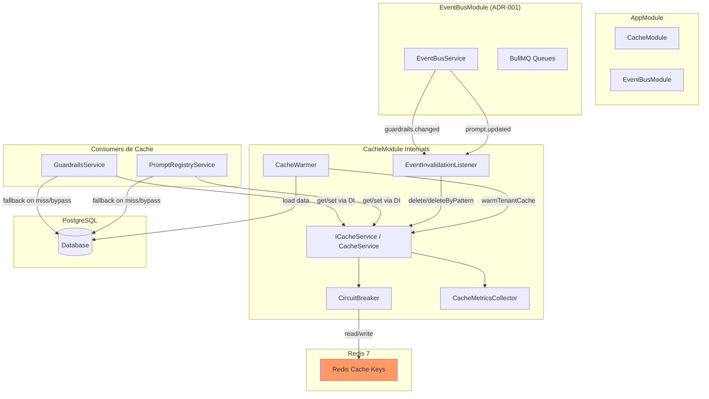
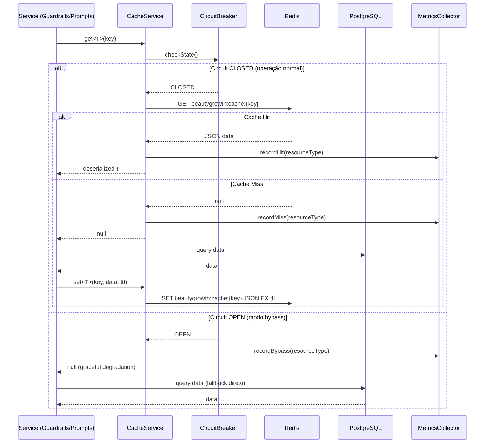
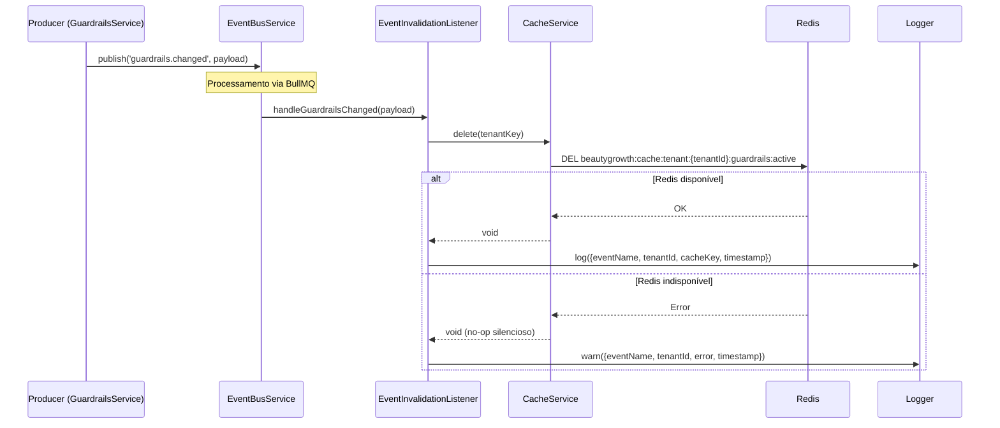
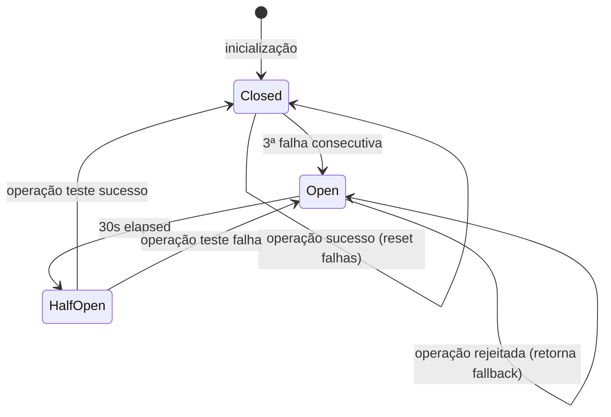

# Design Document: Distributed Cache

## Overview

O módulo **CacheModule** implementa uma camada de cache distribuído baseada em **Redis 7** para a plataforma BeautyGrowth AI. A solução substitui o cache in-memory do `GuardrailsService` (`Map<string, Guardrail[]>` com TTL de 60s por instância) e adiciona cache ao `PromptRegistryService` (que atualmente faz queries diretas ao PostgreSQL sem cache).

### Objetivos Principais

- **Consistência**: Cache compartilhado entre réplicas via Redis, eliminando inconsistências do cache in-memory
- **Performance**: Redução de latência em leituras frequentes de guardrails e prompts
- **Resiliência**: Circuit breaker com graceful degradation — sistema opera sem cache se Redis falha
- **Invalidação Precisa**: Eventos do EventBusModule acionam invalidação cross-réplica em tempo real
- **Observabilidade**: Métricas de hit/miss, latência e health endpoint para monitoramento

### Decisões de Design

| Decisão | Escolha | Justificativa |
|---------|---------|---------------|
| Cliente Redis | ioredis | Mesmo padrão do EventBusModule (ADR-001), conexão compartilhável |
| Serialização | JSON (nativo) | Simplicidade, compatibilidade com tipos TypeScript |
| Invalidação | Event-driven (BullMQ) | Reutiliza EventBusModule existente para propagação cross-réplica |
| Resiliência | Circuit breaker (3 falhas) | Evita cascading failures sem complexidade de libs externas |
| Namespace | `beautygrowth:cache:` | Isolamento do `beautygrowth:events:` usado pelo event bus |
| TTL Strategy | Por tipo de recurso + override | Flexibilidade sem complexidade excessiva |
| Testes PBT | fast-check | Já configurado no projeto (v3.19) |

## Architecture

### Diagrama de Integração com Módulos Existentes



### Diagrama de Fluxo: Cache-Aside com Circuit Breaker



### Diagrama de Fluxo: Invalidação por Eventos



## Components and Interfaces

### CacheModule (Módulo Dinâmico)

```typescript
@Module({})
export class CacheModule {
  /**
   * Registro global do módulo com configuração completa.
   * Cria a conexão Redis e registra todos os serviços internos.
   */
  static forRoot(options?: CacheModuleOptions): DynamicModule;

  /**
   * Registro em feature modules que precisam de configuração de TTL
   * específica para seu domínio (ex: guardrails, prompts).
   */
  static forFeature(config: CacheFeatureConfig): DynamicModule;
}

export interface CacheModuleOptions {
  /** Configuração de conexão Redis (host, port) */
  redis?: {
    host?: string;   // default: process.env.REDIS_HOST || 'localhost'
    port?: number;   // default: process.env.REDIS_PORT || 6379
  };
  /** Prefixo global para todas as chaves (default: 'beautygrowth:cache:') */
  prefix?: string;
  /** TTL padrão em segundos (default: 300) */
  defaultTtl?: number;
  /** Configuração de TTL por tipo de recurso */
  ttlConfig?: CacheTtlConfig;
  /** Configuração do circuit breaker */
  circuitBreaker?: CircuitBreakerConfig;
}

export interface CacheFeatureConfig {
  /** Nome do recurso para namespace (ex: 'guardrails', 'prompts') */
  resourceName: string;
  /** TTL específico para este recurso (override do default) */
  ttl?: number;
}

export interface CacheTtlConfig {
  guardrails_tenant?: number;  // default: 300 (5 min)
  guardrails_system?: number;  // default: 600 (10 min)
  prompts?: number;            // default: 600 (10 min)
  default?: number;            // default: 300 (5 min)
}

export interface CircuitBreakerConfig {
  /** Número de falhas consecutivas para abrir o circuito (default: 3) */
  failureThreshold?: number;
  /** Intervalo em ms para tentar reconexão quando aberto (default: 30000) */
  recoveryTimeout?: number;
}
```

### ICacheService (Interface Principal)

```typescript
/** DI Token para injeção do CacheService */
export const CACHE_SERVICE = Symbol('CACHE_SERVICE');

/**
 * Contrato principal do serviço de cache distribuído.
 * Todas as operações são tenant-aware e resilientes a falhas de Redis.
 */
export interface ICacheService {
  /**
   * Recupera um valor do cache.
   * Retorna null em caso de miss OU quando em modo bypass (circuit open).
   */
  get<T>(key: string): Promise<T | null>;

  /**
   * Armazena um valor no cache com TTL.
   * No-op silencioso quando em modo bypass.
   * @param ttlSeconds - Override de TTL; se não fornecido, usa config por recurso ou default
   */
  set<T>(key: string, value: T, ttlSeconds?: number): Promise<void>;

  /**
   * Remove uma chave específica do cache.
   * Idempotente: não gera erro se a chave não existe.
   */
  delete(key: string): Promise<void>;

  /**
   * Remove todas as chaves que correspondem ao padrão glob.
   * Usa SCAN internamente para não bloquear o Redis.
   * Idempotente: não gera erro se nenhuma chave corresponde.
   */
  deleteByPattern(pattern: string): Promise<number>;

  /**
   * Verifica se uma chave existe no cache.
   * Retorna false quando em modo bypass.
   */
  exists(key: string): Promise<boolean>;

  /**
   * Retorna métricas agregadas do cache.
   */
  getMetrics(): CacheMetrics;

  /**
   * Retorna status de saúde do cache.
   */
  getHealth(): CacheHealth;
}
```

### Tenant-Aware Key Builder

```typescript
/**
 * Utilitário para construção de chaves Redis com namespace de tenant.
 * Garante consistência de formato em todo o módulo.
 */
export class CacheKeyBuilder {
  private readonly prefix: string; // 'beautygrowth:cache:'

  constructor(prefix?: string);

  /**
   * Constrói chave tenant-scoped.
   * Formato: beautygrowth:cache:tenant:{tenantId}:{resource}:{identifier}
   * @throws InvalidTenantIdError se tenantId não é UUID válido
   */
  tenantKey(tenantId: string, resource: string, identifier: string): string;

  /**
   * Constrói chave global (não-tenant-scoped).
   * Formato: beautygrowth:cache:global:{resource}:{identifier}
   */
  globalKey(resource: string, identifier: string): string;

  /**
   * Constrói padrão glob para invalidação por tenant.
   * Formato: beautygrowth:cache:tenant:{tenantId}:*
   */
  tenantPattern(tenantId: string): string;

  /**
   * Constrói padrão glob para invalidação por recurso de tenant.
   * Formato: beautygrowth:cache:tenant:{tenantId}:{resource}:*
   */
  tenantResourcePattern(tenantId: string, resource: string): string;

  /**
   * Valida que o tenantId é UUID v4 válido.
   * @throws InvalidTenantIdError com mensagem descritiva
   */
  validateTenantId(tenantId: string): void;
}
```

### CircuitBreaker

```typescript
/**
 * Circuit breaker para proteção contra falhas de conexão Redis.
 * Estados: CLOSED (normal) → OPEN (bypass) → HALF_OPEN (tentando reconexão)
 */
export enum CircuitState {
  CLOSED = 'closed',
  OPEN = 'open',
  HALF_OPEN = 'half-open',
}

export interface ICircuitBreaker {
  /** Estado atual do circuito */
  getState(): CircuitState;

  /**
   * Executa operação protegida pelo circuit breaker.
   * - CLOSED: executa normalmente, conta falhas
   * - OPEN: rejeita imediatamente (retorna fallback)
   * - HALF_OPEN: permite uma tentativa de teste
   */
  execute<T>(operation: () => Promise<T>, fallback: T): Promise<T>;

  /** Registra sucesso — reseta contador de falhas */
  recordSuccess(): void;

  /** Registra falha — incrementa contador, pode abrir circuito */
  recordFailure(): void;

  /** Reseta o circuit breaker para CLOSED */
  reset(): void;
}

export class CircuitBreaker implements ICircuitBreaker {
  private state: CircuitState = CircuitState.CLOSED;
  private consecutiveFailures = 0;
  private lastFailureTime: number = 0;

  constructor(
    private readonly failureThreshold: number = 3,
    private readonly recoveryTimeoutMs: number = 30_000,
  ) {}

  getState(): CircuitState {
    if (this.state === CircuitState.OPEN) {
      const elapsed = Date.now() - this.lastFailureTime;
      if (elapsed >= this.recoveryTimeoutMs) {
        this.state = CircuitState.HALF_OPEN;
      }
    }
    return this.state;
  }

  async execute<T>(operation: () => Promise<T>, fallback: T): Promise<T> {
    const state = this.getState();

    if (state === CircuitState.OPEN) {
      return fallback;
    }

    try {
      const result = await operation();
      this.recordSuccess();
      return result;
    } catch (error) {
      this.recordFailure();
      return fallback;
    }
  }

  recordSuccess(): void {
    this.consecutiveFailures = 0;
    this.state = CircuitState.CLOSED;
  }

  recordFailure(): void {
    this.consecutiveFailures++;
    this.lastFailureTime = Date.now();
    if (this.consecutiveFailures >= this.failureThreshold) {
      this.state = CircuitState.OPEN;
    }
  }

  reset(): void {
    this.state = CircuitState.CLOSED;
    this.consecutiveFailures = 0;
  }
}
```

### CacheMetricsCollector

```typescript
export interface CacheMetrics {
  /** Hits por tipo de recurso */
  hits: Record<string, number>;
  /** Misses por tipo de recurso */
  misses: Record<string, number>;
  /** Invalidações por tipo de recurso */
  invalidations: Record<string, number>;
  /** Latência média de get em ms por tipo */
  avgGetLatencyMs: Record<string, number>;
  /** Latência média de set em ms por tipo */
  avgSetLatencyMs: Record<string, number>;
  /** Total de erros de conexão */
  connectionErrors: number;
  /** Hit rate por tipo (%) */
  hitRate: Record<string, number>;
}

export interface CacheHealth {
  /** Status da conexão Redis */
  redis: 'up' | 'down' | 'circuit-open';
  /** Estado do circuit breaker */
  circuitState: CircuitState;
  /** Métricas agregadas */
  metrics: CacheMetrics;
  /** Configuração de TTL ativa */
  ttlConfig: CacheTtlConfig;
  /** Uptime do módulo em ms */
  uptimeMs: number;
}

export class CacheMetricsCollector {
  private hits: Map<string, number> = new Map();
  private misses: Map<string, number> = new Map();
  private invalidations: Map<string, number> = new Map();
  private getLatencies: Map<string, number[]> = new Map();
  private setLatencies: Map<string, number[]> = new Map();
  private connectionErrors = 0;

  /** Registra hit para um tipo de recurso */
  recordHit(resourceType: string): void;

  /** Registra miss para um tipo de recurso */
  recordMiss(resourceType: string): void;

  /** Registra bypass (circuit open) para um tipo de recurso */
  recordBypass(resourceType: string): void;

  /** Registra invalidação para um tipo de recurso */
  recordInvalidation(resourceType: string): void;

  /** Registra latência de operação GET */
  recordGetLatency(resourceType: string, ms: number): void;

  /** Registra latência de operação SET */
  recordSetLatency(resourceType: string, ms: number): void;

  /** Registra erro de conexão */
  recordConnectionError(): void;

  /**
   * Calcula hit rate para um recurso: hits / (hits + misses) * 100
   * Retorna 0 se não há operações registradas.
   */
  getHitRate(resourceType: string): number;

  /** Retorna métricas agregadas */
  getMetrics(): CacheMetrics;

  /** Reseta todas as métricas */
  reset(): void;
}
```

### CacheWarmer (Pré-carregamento)

```typescript
/**
 * Serviço responsável pelo aquecimento do cache durante inicialização
 * e sob demanda. Implementa OnApplicationBootstrap do NestJS.
 */
@Injectable()
export class CacheWarmer implements OnApplicationBootstrap {
  constructor(
    @Inject(CACHE_SERVICE) private readonly cache: ICacheService,
    private readonly guardrailsRepository: Repository<Guardrail>,
    private readonly promptRepository: Repository<Prompt>,
    private readonly keyBuilder: CacheKeyBuilder,
    private readonly logger: Logger,
  ) {}

  /**
   * Hook de lifecycle NestJS: executa warming assíncrono na inicialização.
   * Não bloqueia o startup da aplicação.
   */
  async onApplicationBootstrap(): Promise<void>;

  /**
   * Aquece o cache de guardrails de sistema (tenant_id NULL).
   * Carrega do banco e armazena em global:guardrails:system.
   */
  async warmSystemGuardrails(): Promise<void>;

  /**
   * Aquece o cache de um tenant específico: guardrails + prompts ativos.
   */
  async warmTenantCache(tenantId: string): Promise<void>;

  /**
   * Aquece cache de todos os tenants ativos.
   * Processa em lotes de 10 para não sobrecarregar o banco.
   */
  async warmAll(): Promise<void>;
}
```

### EventInvalidationListener

```typescript
/**
 * Listener de eventos do EventBusModule que aciona invalidações de cache.
 * Subscreve a eventos 'guardrails.changed' e 'prompt.updated'.
 */
@Injectable()
export class EventInvalidationListener {
  constructor(
    @Inject(CACHE_SERVICE) private readonly cache: ICacheService,
    private readonly keyBuilder: CacheKeyBuilder,
    private readonly logger: Logger,
  ) {}

  /**
   * Handler para evento 'guardrails.changed'.
   * Invalida cache de guardrails do tenant especificado.
   */
  @OnDistributedEvent('guardrails.changed')
  async handleGuardrailsChanged(payload: GuardrailsChangedPayload): Promise<void>;

  /**
   * Handler para evento 'prompt.updated'.
   * Invalida cache do prompt específico.
   */
  @OnDistributedEvent('prompt.updated')
  async handlePromptUpdated(payload: PromptUpdatedPayload): Promise<void>;
}

/** Payload do evento prompt.updated (novo evento a ser registrado) */
export interface PromptUpdatedPayload {
  tenantId: string;
  promptId: string;
  action: 'updated' | 'rollback';
  version: string;
  timestamp?: Date;
  correlationId?: string;
}
```

### CacheHealthController

```typescript
/**
 * Controller HTTP para exposição de métricas e saúde do cache.
 * Endpoint: GET /cache/metrics
 */
@Controller('cache')
export class CacheHealthController {
  constructor(
    @Inject(CACHE_SERVICE) private readonly cache: ICacheService,
  ) {}

  @Get('metrics')
  getMetrics(): CacheHealth;
}
```

## Data Models

### Estrutura de Chaves Redis

```
beautygrowth:cache:tenant:{tenantId}:guardrails:active  → JSON array de guardrails ativos
beautygrowth:cache:global:guardrails:system             → JSON array de guardrails de sistema
beautygrowth:cache:global:prompts:{promptId}:active     → JSON do prompt template ativo
```

**Exemplos concretos:**
```
beautygrowth:cache:tenant:550e8400-e29b-41d4-a716-446655440000:guardrails:active
  → [{"id":"...","name":"no-health-promises","rule":{...}}, ...]
  → TTL: 300s

beautygrowth:cache:global:guardrails:system
  → [{"id":"...","name":"no-health-promises","type":"system",...}, ...]
  → TTL: 600s

beautygrowth:cache:global:prompts:a1b2c3d4-e5f6-7890-abcd-ef1234567890:active
  → {"content":"Você é um assistente de {{agentType}}...","version":"1.2.0","variables":["agentType"]}
  → TTL: 600s
```

### Formato do Valor Cacheado (JSON)

```typescript
/**
 * Envelope interno para dados cacheados.
 * Permite versionamento do formato sem breaking changes.
 */
interface CachedValue<T> {
  /** Versão do schema de cache (para migrations futuras) */
  v: 1;
  /** Dados serializados */
  data: T;
  /** Timestamp de armazenamento (ISO 8601) */
  storedAt: string;
  /** Tipo de recurso (para métricas) */
  resourceType: string;
}
```

### Configuração de TTL por Tipo

| Recurso | Chave Redis | TTL Padrão | Env Override |
|---------|-------------|-----------|-------------|
| Guardrails (tenant) | `tenant:{id}:guardrails:active` | 300s (5 min) | `CACHE_TTL_GUARDRAILS_TENANT` |
| Guardrails (sistema) | `global:guardrails:system` | 600s (10 min) | `CACHE_TTL_GUARDRAILS_SYSTEM` |
| Prompts | `global:prompts:{id}:active` | 600s (10 min) | `CACHE_TTL_PROMPTS` |
| Default (outros) | — | 300s (5 min) | `CACHE_TTL_DEFAULT` |

## Error Handling

### Estratégia por Camada

| Camada | Tipo de Erro | Tratamento |
|--------|-------------|------------|
| Leitura (`get`) | Redis timeout/indisponível | Retorna `null` (cache miss), conta como falha no circuit breaker |
| Escrita (`set`) | Redis timeout/indisponível | No-op silencioso, conta como falha no circuit breaker |
| Deleção (`delete`) | Redis timeout/indisponível | No-op silencioso, log WARN |
| Deleção (`deleteByPattern`) | Redis timeout/indisponível | No-op silencioso, log WARN, retorna 0 |
| Invalidação (evento) | Redis indisponível | Log WARN, não propaga erro ao event handler |
| Warming | Redis indisponível | Log WARN, permite startup continuar |
| Warming | Erro de banco de dados | Log WARN, cache permanece frio |
| Serialização | JSON.stringify falha (circular ref) | Log ERROR, retorna null/no-op |
| Validação | tenantId inválido (não-UUID) | Throw `InvalidTenantIdError` com mensagem descritiva |
| Métricas | Hit rate < 50% por 5 min | Log WARN com resourceType e taxa atual |

### Circuit Breaker — Diagrama de Estados



### Comportamento por Estado do Circuit Breaker

```
Estado: CLOSED (operação normal)
  → get(key) → consulta Redis → retorna dado ou null
  → set(key, value, ttl) → armazena no Redis
  → delete(key) → remove do Redis
  → Falha Redis → incrementa falhas, retorna fallback
  → 3ª falha consecutiva → transição para OPEN

Estado: OPEN (modo bypass)
  → get(key) → retorna null imediatamente (sem I/O Redis)
  → set(key, value, ttl) → no-op silencioso
  → delete(key) → no-op silencioso
  → Após 30s → transição para HALF_OPEN

Estado: HALF_OPEN (tentando reconexão)
  → Primeira operação → tenta Redis como teste
  → Sucesso → transição para CLOSED
  → Falha → transição para OPEN (reset timer de 30s)
```

## Testing Strategy

### Abordagem Dual

A estratégia combina testes unitários para cenários específicos e testes baseados em propriedades (PBT) para validação universal de comportamentos:

#### Testes Unitários (Jest)
- Integração CacheModule.forRoot/forFeature com NestJS DI
- Cache-aside pattern no GuardrailsService (hit/miss/set)
- Cache-aside pattern no PromptRegistryService (hit/miss/set)
- TTL configurado corretamente por tipo de recurso
- Event handlers de invalidação com logs estruturados
- Cache warming na inicialização (OnApplicationBootstrap)
- Endpoint HTTP `/cache/metrics` retorna formato correto
- Variáveis de ambiente override de TTL
- Remoção do cache in-memory legado (compilação sem erros)

#### Testes de Integração
- Conexão real com Redis (docker-compose)
- SCAN para deleteByPattern com volume de chaves
- Reconexão automática após falha Redis
- Invalidação cross-réplica via EventBusModule real
- Warming de múltiplos tenants com throttling

#### Testes Baseados em Propriedades (fast-check)

**Biblioteca**: `fast-check` v3.19 (já instalada)
**Configuração**: mínimo 100 iterações por propriedade
**Tag format**: `Feature: distributed-cache, Property {N}: {título}`

| # | Propriedade | Requisitos | Tipo de Gerador |
|---|-------------|-----------|-----------------|
| 1 | Round-trip serialização JSON | 1.5 | Objetos JSON arbitrários |
| 2 | Prefixo de namespace correto | 1.4, 2.1, 2.2 | chaves, tenantIds, recursos aleatórios |
| 3 | Isolamento tenant na invalidação | 2.3 | múltiplos tenants com chaves |
| 4 | Validação de tenantId UUID | 2.4 | strings aleatórias (válidas/inválidas) |
| 5 | deleteByPattern remove apenas matching | 1.6 | conjuntos de chaves com/sem match |
| 6 | Invalidação idempotente | 5.3 | chaves existentes e inexistentes |
| 7 | TTL override prevalece sobre config | 6.3 | TTLs aleatórios |
| 8 | Circuit breaker abre em 3 falhas | 8.4 | sequências de sucesso/falha |
| 9 | Graceful degradation em bypass | 8.1, 8.6 | operações com circuit open |
| 10 | Métricas refletem operações reais | 9.1, 9.3 | sequências de hits/misses |
| 11 | warmAll throttle (max 10 concorrentes) | 7.5 | N tenants aleatórios |
| 12 | Prompt cacheado preserva template | 4.5 | prompts com variáveis |

## Correctness Properties

*Uma propriedade é uma característica ou comportamento que deve ser verdadeiro em todas as execuções válidas de um sistema — essencialmente, uma declaração formal sobre o que o sistema deve fazer. Propriedades servem como ponte entre especificações legíveis por humanos e garantias de corretude verificáveis por máquina.*

### Property 1: Round-trip de serialização JSON

*Para qualquer* valor T que é serializável em JSON (objetos, arrays, strings, números, booleans, nulls, estruturas aninhadas), executar `set(key, value)` seguido de `get(key)` deve retornar um valor deep-equal ao original, preservando estrutura e tipos compatíveis com JSON.

**Validates: Requirements 1.5**

### Property 2: Prefixo de namespace consistente

*Para qualquer* operação de cache (get, set, delete, exists) com qualquer combinação de tenantId (UUID válido), recurso e identificador, a chave Redis resultante deve começar com `beautygrowth:cache:` e seguir o formato `beautygrowth:cache:tenant:{tenantId}:{recurso}:{identificador}` para chaves tenant-scoped ou `beautygrowth:cache:global:{recurso}:{identificador}` para chaves globais.

**Validates: Requirements 1.4, 2.1, 2.2**

### Property 3: Isolamento de tenant na invalidação

*Para quaisquer* dois tenants A e B com entradas de cache independentes, invalidar o cache do tenant A (via `deleteByPattern` com padrão do tenant A) deve remover todas as chaves do tenant A sem alterar nenhuma chave do tenant B, e vice-versa.

**Validates: Requirements 2.3**

### Property 4: Validação de tenantId como UUID

*Para qualquer* string que não é um UUID v4 válido fornecida como tenantId em operações tenant-scoped, o CacheKeyBuilder deve lançar `InvalidTenantIdError` com mensagem descritiva. *Para qualquer* UUID v4 válido, a operação deve prosseguir sem erro.

**Validates: Requirements 2.4**

### Property 5: deleteByPattern remove apenas chaves correspondentes

*Para qualquer* conjunto de N chaves armazenadas no cache onde M chaves correspondem a um padrão glob e (N-M) não correspondem, `deleteByPattern(pattern)` deve remover exatamente as M chaves correspondentes, retornar M como contagem, e manter todas as (N-M) chaves não-correspondentes intactas.

**Validates: Requirements 1.6**

### Property 6: Invalidação idempotente

*Para qualquer* chave de cache (existente ou inexistente), chamar `delete(key)` deve completar sem erro independentemente do estado atual da chave. Chamar `delete(key)` duas vezes consecutivas na mesma chave deve ter o mesmo efeito observável que chamá-lo uma vez.

**Validates: Requirements 5.3**

### Property 7: TTL override prevalece sobre configuração global

*Para qualquer* valor de TTL passado como parâmetro em `set(key, value, ttlSeconds)`, o TTL efetivo aplicado à chave Redis deve ser exatamente o valor fornecido, independentemente da configuração global ou por recurso. Quando nenhum TTL é fornecido, o TTL do tipo de recurso (ou default) deve ser aplicado.

**Validates: Requirements 6.3**

### Property 8: Circuit breaker abre em exatamente N falhas consecutivas

*Para qualquer* sequência de operações onde as últimas N operações consecutivas (N = failureThreshold, default 3) resultam em falha de conexão Redis, o circuit breaker deve transicionar para estado OPEN. Para sequências com menos de N falhas consecutivas (intercaladas com sucessos), o circuit deve permanecer CLOSED.

**Validates: Requirements 8.4**

### Property 9: Graceful degradation em modo bypass

*Para qualquer* operação de cache quando o circuit breaker está em estado OPEN: `get()` deve retornar `null`, `set()` deve ser no-op (não lança exceção), `delete()` deve ser no-op (não lança exceção), e `exists()` deve retornar `false`. Nenhuma tentativa de I/O com Redis deve ocorrer.

**Validates: Requirements 8.1, 8.6**

### Property 10: Métricas refletem operações reais

*Para qualquer* sequência de operações de cache contendo H hits, M misses e I invalidações para um tipo de recurso, as métricas reportadas por `getMetrics()` devem refletir exatamente H hits, M misses e I invalidações para esse tipo. A hit rate calculada deve ser exatamente `H / (H + M) * 100` (ou 0 quando H + M = 0).

**Validates: Requirements 9.1, 9.3**

### Property 11: warmAll processa em lotes limitados

*Para qualquer* conjunto de N tenants ativos (N > 10), `warmAll()` deve processar no máximo 10 tenants simultaneamente, garantindo que em nenhum momento mais de 10 operações de warming estejam executando em paralelo contra o banco de dados.

**Validates: Requirements 7.5**

### Property 12: Prompt cacheado preserva template com variáveis

*Para qualquer* prompt que contém variáveis no formato `{{variableName}}`, o valor armazenado no cache deve manter os placeholders de variáveis intactos (não resolvidos), permitindo que a resolução de variáveis continue ocorrendo em runtime após recuperação do cache.

**Validates: Requirements 4.5**

## Performance Considerations

### Operações Redis e Complexidade

| Operação | Comando Redis | Complexidade | Notas |
|----------|--------------|-------------|-------|
| `get(key)` | `GET` | O(1) | Leitura direta por chave |
| `set(key, value, ttl)` | `SET EX` | O(1) | Escrita com expiração atômica |
| `delete(key)` | `DEL` | O(1) | Remoção direta |
| `exists(key)` | `EXISTS` | O(1) | Verificação de existência |
| `deleteByPattern(pattern)` | `SCAN` + `DEL` | O(N) iterativo | Usa SCAN com cursor para não bloquear |

### SCAN para Pattern Deletion

```typescript
/**
 * Implementação de deleteByPattern usando SCAN iterativo.
 * COUNT=100 por iteração para balancear throughput vs latência.
 */
async deleteByPattern(pattern: string): Promise<number> {
  const fullPattern = `${this.prefix}${pattern}`;
  let cursor = '0';
  let deletedCount = 0;

  do {
    const [nextCursor, keys] = await this.redis.scan(
      cursor,
      'MATCH', fullPattern,
      'COUNT', 100,
    );
    cursor = nextCursor;

    if (keys.length > 0) {
      await this.redis.del(...keys);
      deletedCount += keys.length;
    }
  } while (cursor !== '0');

  return deletedCount;
}
```

### Impacto no Throughput

- **GuardrailsService**: Redução estimada de ~80% das queries ao PostgreSQL (hit rate esperado >90% após warming)
- **PromptRegistryService**: Redução estimada de ~70% das queries (prompts mudam pouco)
- **Latência Redis GET**: ~0.5ms (local) vs ~5-15ms (PostgreSQL query)
- **Overhead de serialização JSON**: Negligível para payloads < 100KB

## Security Considerations

### Isolamento de Dados

- **Namespace por tenant**: Todas as chaves incluem `tenantId` no path, impossibilitando acesso cross-tenant via operações do cache
- **Validação UUID**: `CacheKeyBuilder.validateTenantId()` rejeita strings malformadas antes de construir chaves
- **Sem dados sensíveis no cache**: Guardrails e prompts não contêm PII ou credenciais
- **Redis sem autenticação em dev**: Aceitável para ambiente local; em produção, usar `requirepass` via env var

### Serialização Segura

- **JSON.parse/stringify**: Não executa código, seguro contra injection
- **Sem `eval` ou desserialização de classes**: Apenas dados primitivos e objetos simples
- **Validação de schema no CachedValue envelope**: Versão `v: 1` permite rejeitar formatos incompatíveis

## Dependencies

| Dependência | Versão | Uso | Status |
|-------------|--------|-----|--------|
| `ioredis` | ^5.x | Cliente Redis | Já instalada (EventBusModule) |
| `@nestjs/common` | ^10.x | DI, lifecycle hooks | Já instalada |
| `@nestjs/config` | ^3.x | Variáveis de ambiente | Já instalada |
| `class-validator` | ^0.14 | Validação UUID | Já instalada |
| `uuid` | ^9.x | Geração/validação UUID | Já instalada |
| `fast-check` | ^3.19 | Testes PBT | Já instalada |
| `EventBusModule` | (interno) | Eventos de invalidação | Já implementado (ADR-001) |

## Estrutura de Diretórios

```
src/modules/cache/
├── cache.module.ts
├── index.ts
├── interfaces/
│   ├── cache-service.interface.ts
│   ├── cache-config.interface.ts
│   ├── cache-metrics.interface.ts
│   └── index.ts
├── services/
│   ├── cache.service.ts
│   ├── cache.service.spec.ts
│   ├── circuit-breaker.service.ts
│   ├── circuit-breaker.service.spec.ts
│   ├── cache-metrics-collector.service.ts
│   ├── cache-warmer.service.ts
│   └── cache-key-builder.service.ts
├── listeners/
│   └── event-invalidation.listener.ts
├── controllers/
│   └── cache-health.controller.ts
├── config/
│   └── cache.constants.ts
├── errors/
│   └── invalid-tenant-id.error.ts
└── tests/
    ├── json-roundtrip.property.spec.ts
    ├── namespace-prefix.property.spec.ts
    ├── tenant-isolation.property.spec.ts
    ├── tenant-id-validation.property.spec.ts
    ├── delete-by-pattern.property.spec.ts
    ├── idempotent-invalidation.property.spec.ts
    ├── ttl-override.property.spec.ts
    ├── circuit-breaker.property.spec.ts
    ├── graceful-degradation.property.spec.ts
    ├── metrics-accuracy.property.spec.ts
    ├── warm-all-throttle.property.spec.ts
    ├── prompt-template-preserved.property.spec.ts
    └── cache.integration.spec.ts
```

### Integração nos Módulos Existentes

```
src/modules/guardrails/
├── services/
│   └── guardrails.service.ts        ← Modificado: remove Map cache, injeta ICacheService
└── guardrails.module.ts             ← Modificado: importa CacheModule.forFeature

src/modules/prompt-registry/
├── services/
│   └── prompt-registry.service.ts   ← Modificado: injeta ICacheService para cache-aside
└── prompt-registry.module.ts        ← Modificado: importa CacheModule.forFeature

src/app.module.ts                     ← Modificado: importa CacheModule.forRoot()
.env.example                          ← Modificado: adiciona CACHE_TTL_* vars
```
