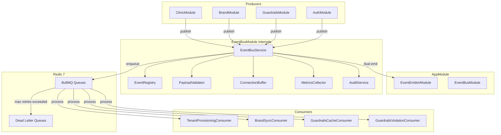
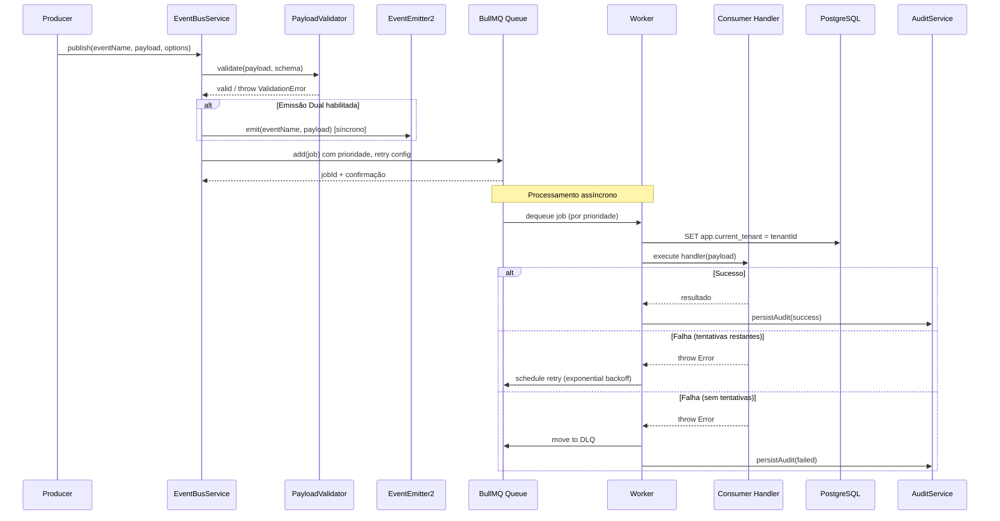
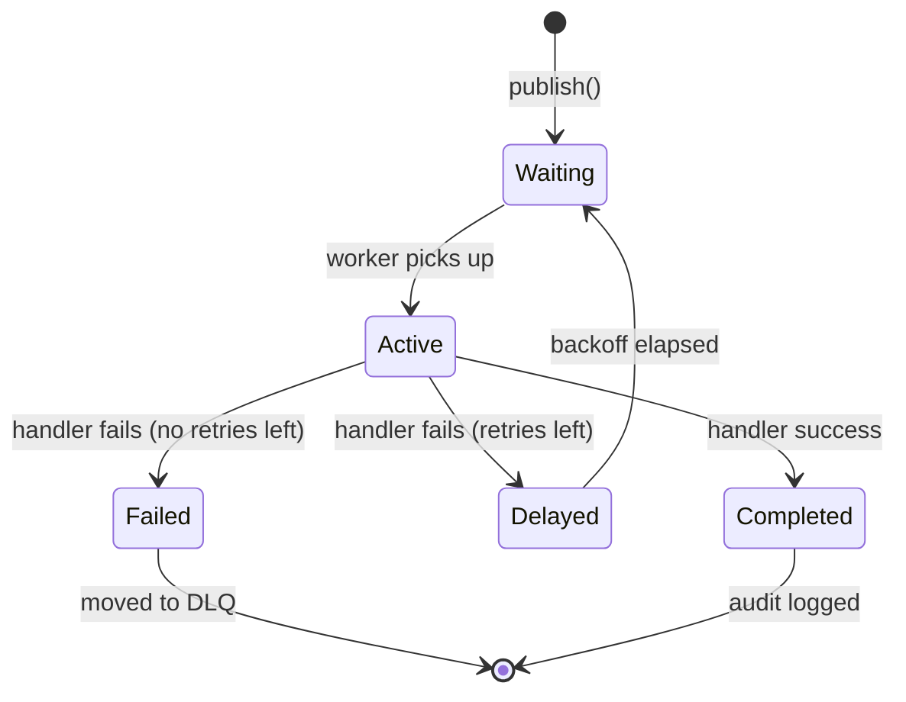
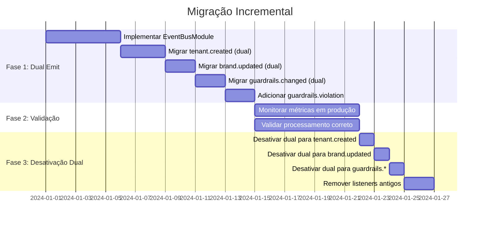

# Design Document: Distributed Event Bus

## Overview

O módulo **EventBusModule** introduz um barramento de eventos distribuído baseado em **BullMQ** (Redis) na plataforma BeautyGrowth AI. A solução substitui progressivamente o `EventEmitter2` para eventos críticos de domínio, mantendo-o ativo para eventos intra-módulo não-críticos.

### Objetivos Principais

- **Persistência**: Eventos sobrevivem a crashes da aplicação
- **Escalabilidade**: Suporte a múltiplas instâncias (competing consumers)
- **Resiliência**: Retry com exponential backoff + dead-letter queues
- **Observabilidade**: Métricas, logs estruturados e auditoria completa
- **Isolamento**: Multi-tenancy com limites de concorrência por tenant

### Decisões de Design

| Decisão | Escolha | Justificativa |
|---------|---------|---------------|
| Transporte | BullMQ | Já utiliza Redis 7, suporte nativo a prioridades, DLQ, retry |
| Conexão Redis | ioredis (existente) | Já instalado e configurado no projeto |
| Migração | Dual-emit incremental | Permite migração gradual sem downtime |
| Validação | class-validator | Consistente com o padrão NestJS do projeto |
| Testes PBT | fast-check | Já configurado no projeto (v3.19) |

## Architecture

### Diagrama de Integração com Módulos Existentes



### Diagrama de Fluxo: Publicação e Consumo



## Components and Interfaces

### EventBusModule

```typescript
@Module({
  imports: [ConfigModule, TypeOrmModule.forFeature([EventAuditLog])],
  providers: [
    EventBusService,
    EventRegistry,
    PayloadValidator,
    ConnectionBuffer,
    MetricsCollector,
    AuditService,
    ...workerProviders, // registrados dinamicamente
  ],
  exports: [EventBusService, EventRegistry],
})
export class EventBusModule {
  static forRoot(options?: EventBusModuleOptions): DynamicModule;
}
```

### EventBusService (Interface Principal)

```typescript
export interface IEventBusService {
  /**
   * Publica um evento de domínio no barramento distribuído.
   * Persiste no Redis antes de retornar confirmação.
   */
  publish<T extends DomainEventPayload>(
    eventName: string,
    payload: T,
    options?: PublishOptions,
  ): Promise<PublishResult>;

  /**
   * Registra um consumer para um evento específico (uso programático).
   * Preferir @OnDistributedEvent() para registro declarativo.
   */
  subscribe(
    eventName: string,
    handler: EventHandler,
    options?: SubscribeOptions,
  ): void;

  /** Reprocessa um evento específico da Dead Letter Queue */
  reprocessFromDLQ(eventName: string, jobId: string): Promise<void>;

  /** Lista eventos na DLQ com paginação */
  listDLQ(eventName: string, pagination: PaginationOptions): Promise<PaginatedDLQResult>;

  /** Republica eventos históricos filtrados */
  replay(eventName: string, filters: ReplayFilters): Promise<ReplayResult>;

  /** Retorna métricas agregadas do event bus */
  getMetrics(): Promise<EventBusMetrics>;

  /** Retorna status de saúde */
  getHealth(): Promise<EventBusHealth>;
}
```

### Tipos e Interfaces Auxiliares

```typescript
/** Payload base obrigatório para todos os eventos de domínio */
export interface DomainEventPayload {
  tenantId: string;
  timestamp?: Date;       // Gerado automaticamente se não fornecido
  correlationId?: string; // UUID v4 gerado automaticamente se não fornecido
}

export interface PublishOptions {
  priority?: EventPriority;   // Override da prioridade padrão
  delay?: number;             // Delay em ms antes de disponibilizar para consumo
  correlationId?: string;     // Permite rastreamento externo
}

export interface PublishResult {
  jobId: string;
  correlationId: string;
  queueName: string;
}

export type EventPriority = 1 | 5 | 10; // alta | média | baixa

export interface PaginationOptions {
  page: number;
  pageSize: number;
}

export interface PaginatedDLQResult {
  items: DLQItem[];
  total: number;
  page: number;
  pageSize: number;
}

export interface DLQItem {
  jobId: string;
  eventName: string;
  payload: Record<string, any>;
  failedAt: Date;
  attempts: number;
  errors: Array<{ attempt: number; error: string; timestamp: Date }>;
}

export interface ReplayFilters {
  tenantId?: string;
  startDate?: Date;
  endDate?: Date;
  status?: 'success' | 'failed';
}

export interface ReplayResult {
  replayed: number;
  correlationIds: string[];
}

export type EventHandler<T = any> = (payload: T) => Promise<void>;
```

### Decorator @OnDistributedEvent

```typescript
/**
 * Decorator que registra um método como consumer de evento distribuído.
 * Equivalente distribuído ao @OnEvent() do EventEmitter2.
 *
 * Exemplo de uso:
 *   @OnDistributedEvent('tenant.created')
 *   async handleTenantCreated(payload: TenantCreatedPayload) { ... }
 */
export function OnDistributedEvent(
  eventName: string,
  options?: ConsumerOptions,
): MethodDecorator;

export interface ConsumerOptions {
  concurrency?: number;     // Workers paralelos para este handler
  groupByTenant?: boolean;  // Ativa rate limiting por tenant (default: true)
}
```

### EventRegistry (Configuração Declarativa)

```typescript
/**
 * Registro centralizado de todos os eventos de domínio distribuídos.
 * Novos eventos são adicionados aqui sem alteração do core do módulo.
 */
export interface EventConfig {
  name: string;
  priority: EventPriority;
  maxRetries: number;
  ttl?: number;                // TTL do job em ms (default: 24h)
  concurrency: number;         // Workers simultâneos
  dualEmit: boolean;           // Emitir também via EventEmitter2
  payloadSchema: Type<any>;    // Classe class-validator para validação
}

export const EVENT_REGISTRY: EventConfig[] = [
  {
    name: 'tenant.created',
    priority: 1,
    maxRetries: 5,
    concurrency: 3,
    dualEmit: true,
    payloadSchema: TenantCreatedPayloadDto,
  },
  {
    name: 'brand.updated',
    priority: 5,
    maxRetries: 3,
    concurrency: 3,
    dualEmit: true,
    payloadSchema: BrandUpdatedPayloadDto,
  },
  {
    name: 'guardrails.changed',
    priority: 5,
    maxRetries: 3,
    concurrency: 2,
    dualEmit: true,
    payloadSchema: GuardrailsChangedPayloadDto,
  },
  {
    name: 'guardrails.violation',
    priority: 10,
    maxRetries: 1,
    concurrency: 5,
    dualEmit: false,
    payloadSchema: GuardrailsViolationPayloadDto,
  },
];
```

### ConnectionBuffer (Resiliência de Conexão)

```typescript
/**
 * Buffer local que armazena eventos quando a conexão Redis é perdida.
 * Drena automaticamente quando a conexão é restaurada.
 */
export class ConnectionBuffer {
  private buffer: BufferedEvent[] = [];
  private readonly maxBufferDurationMs = 30_000;
  private reconnectAttempt = 0;

  /** Calcula delay de reconexão: 1000 * 2^(attempt-1), max 16s */
  getReconnectDelay(): number {
    return Math.min(1000 * Math.pow(2, this.reconnectAttempt), 16_000);
  }

  /** Armazena evento no buffer local */
  bufferEvent(event: BufferedEvent): void;

  /** Drena buffer enviando eventos para Redis */
  async flush(queue: Queue): Promise<void>;

  /** Remove eventos que excederam o TTL de 30s */
  pruneExpired(): void;
}
```

### MetricsCollector

```typescript
export interface EventBusMetrics {
  published: Record<string, number>;        // total por tipo
  processed: Record<string, number>;        // sucesso por tipo
  failed: Record<string, number>;           // falha por tipo
  avgLatencyMs: Record<string, number>;     // latência média por tipo
  queueSizes: Record<string, QueueSizeInfo>;
}

export interface QueueSizeInfo {
  waiting: number;
  active: number;
  delayed: number;
  failed: number;
}

export interface EventBusHealth {
  redis: 'up' | 'down';
  queuesActive: number;
  workersActive: number;
  metrics5min: EventBusMetrics;
}
```

### Consumers Migrados

```typescript
/**
 * Substitui TenantProvisioningListener (EventEmitter2).
 * Durante o período de transição, o listener antigo coexiste via dual-emit.
 */
@Injectable()
export class TenantProvisioningConsumer {
  @OnDistributedEvent('tenant.created')
  async handleKnowledgeHubInit(payload: TenantCreatedPayload): Promise<void>;

  @OnDistributedEvent('tenant.created')
  async handleBusinessMemoryInit(payload: TenantCreatedPayload): Promise<void>;
}

/**
 * Substitui BrandSyncListener (EventEmitter2).
 */
@Injectable()
export class BrandSyncConsumer {
  @OnDistributedEvent('brand.updated')
  async handleBrandSync(payload: BrandUpdatedPayload): Promise<void>;
}

/**
 * Novo consumer para invalidação de cache de guardrails.
 */
@Injectable()
export class GuardrailsCacheConsumer {
  @OnDistributedEvent('guardrails.changed')
  async handleCacheInvalidation(payload: GuardrailsChangedPayload): Promise<void>;
}

/**
 * Novo consumer para processamento assíncrono de violações.
 */
@Injectable()
export class GuardrailsViolationConsumer {
  @OnDistributedEvent('guardrails.violation')
  async handleViolationLogging(payload: GuardrailsViolationPayload): Promise<void>;
}
```

## Data Models

### Estrutura de Chaves Redis

```
beautygrowth:events:{eventName}          → BullMQ Queue (waiting jobs)
beautygrowth:events:{eventName}:delayed  → BullMQ delayed jobs (retry)
beautygrowth:events:{eventName}:active   → BullMQ active jobs
beautygrowth:events:{eventName}:failed   → Dead Letter Queue
beautygrowth:events:{eventName}:completed → completed jobs (auto-cleanup)
beautygrowth:events:metrics:{eventName}  → Hash com contadores
```

**Exemplo concreto:**
```
beautygrowth:events:tenant.created         → Queue
beautygrowth:events:tenant.created:delayed → Retry jobs
beautygrowth:events:brand.updated:failed   → DLQ
beautygrowth:events:metrics:tenant.created → { published: 42, processed: 40, failed: 2 }
```

### Configuração BullMQ por Fila

| Fila | Prioridade | Max Retries | Concorrência | TTL | Dual Emit |
|------|-----------|-------------|--------------|-----|-----------|
| `tenant.created` | 1 (alta) | 5 | 3 | 24h | sim |
| `brand.updated` | 5 (média) | 3 | 3 | 24h | sim |
| `guardrails.changed` | 5 (média) | 3 | 2 | 24h | sim |
| `guardrails.violation` | 10 (baixa) | 1 | 5 | 12h | não |

### Entidade EventAuditLog (PostgreSQL)

```typescript
@Entity('event_audit_logs')
export class EventAuditLog {
  @PrimaryGeneratedColumn('uuid')
  id: string;

  @Column()
  eventName: string;

  @Column('jsonb')
  payload: Record<string, any>;

  @Column('uuid')
  tenantId: string;

  @Column('uuid')
  correlationId: string;

  @Column('timestamp with time zone')
  publishedAt: Date;

  @Column('timestamp with time zone', { nullable: true })
  processedAt: Date;

  @Column('integer')
  durationMs: number;

  @Column({ type: 'varchar', length: 20 })
  status: 'success' | 'failed' | 'replayed';

  @Column('integer', { default: 1 })
  attempts: number;

  @Column('jsonb', { nullable: true })
  errors: Array<{ attempt: number; error: string; timestamp: string }>;

  @Column('boolean', { default: false })
  isReplay: boolean;

  @Column('timestamp with time zone', { default: () => 'NOW()' })
  createdAt: Date;

  @Index()
  @Column('uuid')
  tenantIdIdx: string; // Para queries filtradas por tenant
}
```

### Payload DTOs (Validação com class-validator)

```typescript
export class TenantCreatedPayloadDto implements DomainEventPayload {
  @IsUUID()
  tenantId: string;

  @IsOptional()
  @IsDate()
  timestamp?: Date;

  @IsOptional()
  @IsUUID('4')
  correlationId?: string;
}

export class BrandUpdatedPayloadDto implements DomainEventPayload {
  @IsUUID()
  tenantId: string;

  @IsUUID()
  brandId: string;

  @IsIn(['created', 'updated'])
  action: 'created' | 'updated';

  @IsOptional()
  @IsDate()
  timestamp?: Date;

  @IsOptional()
  @IsUUID('4')
  correlationId?: string;
}

export class GuardrailsChangedPayloadDto implements DomainEventPayload {
  @IsUUID()
  tenantId: string;

  @IsUUID()
  guardrailId: string;

  @IsIn(['created', 'updated', 'deleted'])
  action: 'created' | 'updated' | 'deleted';

  @IsOptional()
  @IsDate()
  timestamp?: Date;

  @IsOptional()
  @IsUUID('4')
  correlationId?: string;
}

export class GuardrailsViolationPayloadDto implements DomainEventPayload {
  @IsUUID()
  tenantId: string;

  @IsUUID()
  agentId: string;

  @IsString()
  guardrailName: string;

  @IsString()
  violationType: string;

  @IsOptional()
  @IsDate()
  timestamp?: Date;

  @IsOptional()
  @IsUUID('4')
  correlationId?: string;
}
```

## Correctness Properties

*Uma propriedade é uma característica ou comportamento que deve ser verdadeiro em todas as execuções válidas de um sistema — essencialmente, uma declaração formal sobre o que o sistema deve fazer. Propriedades servem como ponte entre especificações legíveis por humanos e garantias de corretude verificáveis por máquina.*

### Property 1: Persistência com namespace correto

*Para qualquer* evento de domínio válido publicado via `EventBusService.publish()`, o job resultante na fila BullMQ deve existir no Redis com chave prefixada por `beautygrowth:events:` e deve ser confirmado ao producer antes que qualquer consumer processe o evento.

**Validates: Requirements 1.2, 1.7**

### Property 2: Processamento único (competing consumers)

*Para qualquer* evento publicado e qualquer número N de workers ativos (N ≥ 1), o evento deve ser processado por exatamente um worker, resultando em exatamente um registro de auditoria de sucesso ou uma movimentação para DLQ após esgotar retries.

**Validates: Requirements 1.5**

### Property 3: Fórmula de exponential backoff

*Para qualquer* tentativa de número `n` (onde 1 ≤ n ≤ maxRetries), o delay de retry calculado deve ser exatamente `1000 * 2^(n-1)` milissegundos, com valores resultantes na sequência 1000, 2000, 4000, 8000, 16000ms.

**Validates: Requirements 1.6, 3.1**

### Property 4: Emissão dual com semânticas corretas

*Para qualquer* evento configurado com `dualEmit: true`, a publicação via `publish()` deve resultar em: (a) emissão síncrona no EventEmitter2 local e (b) persistência assíncrona na fila BullMQ, sem que a operação BullMQ bloqueie o retorno da emissão EventEmitter2.

**Validates: Requirements 2.5, 8.5**

### Property 5: Retry configurado por tipo com preservação em DLQ

*Para qualquer* evento que falha em todas as tentativas configuradas (5 para `tenant.created`, 3 para `brand.updated`, 3 para `guardrails.changed`, 1 para `guardrails.violation`), o evento deve ser movido para a Dead Letter Queue correspondente preservando o payload original e o histórico de erros de cada tentativa com timestamp.

**Validates: Requirements 3.2, 3.3**

### Property 6: Round-trip da Dead Letter Queue

*Para qualquer* evento presente na Dead Letter Queue, chamar `reprocessFromDLQ(eventName, jobId)` com um handler que retorna sucesso deve: (a) processar o evento com o payload original preservado, (b) remover o evento da DLQ e (c) registrar o reprocessamento no log de auditoria.

**Validates: Requirements 3.4, 3.6**

### Property 7: Paginação e ordenação na DLQ

*Para qualquer* conjunto de N eventos na Dead Letter Queue e qualquer configuração de paginação (page, pageSize), `listDLQ()` deve retornar exatamente `min(pageSize, N - (page-1)*pageSize)` itens, ordenados do mais recente ao mais antigo pelo timestamp de falha, com `total` refletindo o número real de eventos na DLQ.

**Validates: Requirements 3.5**

### Property 8: Processamento por prioridade com override

*Para qualquer* conjunto de eventos pendentes com prioridades distintas na mesma fila, o BullMQ deve processar primeiro os eventos com menor valor de prioridade. Adicionalmente, *para qualquer* prioridade válida (1, 5, 10) passada como override em `publish()`, o job deve usar a prioridade fornecida ao invés da prioridade padrão do registro.

**Validates: Requirements 4.3, 4.4**

### Property 9: Validação de tenantId obrigatório

*Para qualquer* payload de evento que não contém o campo `tenantId` (ou contém valor inválido), `publish()` deve rejeitar a publicação com erro descritivo de validação sem persistir o evento no Redis.

**Validates: Requirements 5.1**

### Property 10: Isolamento de falha por tenant

*Para qualquer* cenário onde um consumer falha ao processar um evento do tenant A, os eventos de quaisquer outros tenants (B, C, ...) na mesma fila devem continuar sendo processados normalmente sem bloqueio ou atraso causado pelo retry do tenant A.

**Validates: Requirements 5.3**

### Property 11: Concorrência limitada por tenant

*Para qualquer* tenant com mais de 5 jobs pendentes, no máximo 5 jobs desse tenant devem estar em estado `active` simultaneamente, enquanto jobs de outros tenants continuam sendo processados conforme sua própria cota de concorrência.

**Validates: Requirements 5.5**

### Property 12: Registro de auditoria completo

*Para qualquer* evento de domínio processado (sucesso ou falha definitiva), deve existir exatamente um registro `EventAuditLog` contendo: eventName, payload completo, tenantId, correlationId, timestamps de publicação e processamento, duração, status final e (em caso de falha) o histórico de erros de cada tentativa.

**Validates: Requirements 6.1, 6.2**

### Property 13: Replay com filtros e marcação isReplay

*Para qualquer* combinação de filtros (tenantId, intervalo de datas, status), `replay()` deve republicar exatamente os eventos do histórico de auditoria que atendem todos os filtros, e cada evento republicado deve ter o metadado `isReplay: true` no job BullMQ.

**Validates: Requirements 6.4, 6.5**

### Property 14: CorrelationId único UUID v4

*Para quaisquer* dois eventos publicados pelo EventBusService, os correlationIds gerados devem ser UUIDs v4 válidos e distintos entre si (unicidade global).

**Validates: Requirements 6.6**

### Property 15: Alerta de latência excedida

*Para qualquer* evento processado cuja duração exceda 2x o SLA configurado para seu tipo, o sistema deve emitir um log estruturado nível WARN contendo o eventName, a latência média atual e o SLA configurado.

**Validates: Requirements 7.2**

### Property 16: Log estruturado por evento processado

*Para qualquer* evento processado pelo worker (sucesso, falha ou retrying), o log estruturado JSON emitido deve conter todos os campos obrigatórios: eventName, tenantId, correlationId, durationMs, status, attempt e workerInstance.

**Validates: Requirements 7.5**

### Property 17: Decorator @OnDistributedEvent registra consumer

*Para qualquer* método decorado com `@OnDistributedEvent(eventName)`, o módulo deve registrar automaticamente um worker BullMQ correspondente ao eventName, de forma que eventos publicados nessa fila sejam roteados para o handler decorado.

**Validates: Requirements 8.2, 8.3**

### Property 18: Configuração declarativa cria fila com parâmetros corretos

*Para qualquer* evento adicionado ao `EVENT_REGISTRY` com configuração (prioridade, maxRetries, TTL, concorrência, dualEmit), na inicialização do módulo a fila BullMQ correspondente deve ser criada com exatamente esses parâmetros, sem necessidade de código adicional.

**Validates: Requirements 9.1, 9.2**

### Property 19: Validação de payload contra schema

*Para qualquer* payload que não satisfaz as constraints do schema class-validator definido para o tipo de evento, `publish()` deve rejeitar com erro descritivo listando os campos inválidos. *Para qualquer* payload que satisfaz todas as constraints, `publish()` deve aceitar e persistir o evento.

**Validates: Requirements 9.3**

### Property 20: Modo fallback sem Redis

*Para qualquer* evento publicado quando `EVENT_BUS_ENABLED=false`, a publicação deve ocorrer exclusivamente via EventEmitter2, sem tentativa de conexão ao Redis, e todos os consumers decorados com `@OnDistributedEvent()` devem receber o evento via EventEmitter2 como fallback.

**Validates: Requirements 9.5**

## Error Handling

### Estratégia por Camada

| Camada | Tipo de Erro | Tratamento |
|--------|-------------|------------|
| Publicação | Payload inválido | Rejeição síncrona com `ValidationError` descritivo |
| Publicação | Redis indisponível | Buffer local por 30s + reconexão com backoff |
| Publicação | Buffer cheio (>30s offline) | Throw `EventBusUnavailableException` ao producer |
| Consumo | Handler throw | Retry automático com exponential backoff |
| Consumo | Max retries atingido | Move para DLQ + registro de auditoria (failed) |
| Consumo | Timeout de handler | Treated como falha, conta como tentativa |
| DLQ | Reprocessamento falha | Retorna à DLQ, não conta tentativas originais |
| Sistema | Falha no AuditService | Log de erro, não bloqueia processamento do evento |

### ConnectionBuffer — Comportamento Detalhado

```
Estado: CONNECTED
  → publish() → enqueue no BullMQ diretamente

Estado: DISCONNECTED (< 30s)
  → publish() → armazena no buffer local
  → reconexão automática com backoff: 1s, 2s, 4s, 8s, 16s
  → ao reconectar → flush do buffer (FIFO)

Estado: DISCONNECTED (> 30s)
  → publish() → throw EventBusUnavailableException
  → eventos no buffer que excederam 30s → descartados com log WARN
  → continua tentando reconexão
```

### Circuito de Retry por Job



## Testing Strategy

### Abordagem Dual

A estratégia combina testes unitários para cenários específicos e testes baseados em propriedades (PBT) para validação universal de comportamentos:

#### Testes Unitários (Jest)
- Cenários específicos de integração entre módulos
- Verificação de payloads concretos dos eventos de domínio (2.1, 2.2, 2.3, 2.4)
- Configuração de prioridades default (4.1, 4.2)
- Endpoint `/events/health` (7.4)
- Modo fallback ativação/desativação (9.5 — cenário específico)

#### Testes de Integração
- Configuração de contexto de tenant RLS (5.2)
- SLA de 60s do brand.updated (2.2)
- tenantId em logs e métricas (5.4)
- Inicialização automática de filas (1.4)

#### Testes Baseados em Propriedades (fast-check)

**Biblioteca**: `fast-check` v3.19 (já instalada)
**Configuração**: mínimo 100 iterações por propriedade
**Tag format**: `Feature: distributed-event-bus, Property {N}: {título}`

| # | Propriedade | Requisitos | Tipo de Gerador |
|---|-------------|-----------|-----------------|
| 1 | Persistência com namespace | 1.2, 1.7 | eventName + payload arbitrários |
| 2 | Processamento único | 1.5 | N workers, M eventos |
| 3 | Fórmula backoff | 1.6, 3.1 | número de tentativa (1-5) |
| 4 | Emissão dual | 2.5, 8.5 | eventos com dualEmit=true |
| 5 | Retry + DLQ | 3.2, 3.3 | tipo de evento + payloads |
| 6 | Round-trip DLQ | 3.4, 3.6 | eventos na DLQ |
| 7 | Paginação DLQ | 3.5 | N itens, page, pageSize |
| 8 | Prioridade | 4.3, 4.4 | prioridades aleatórias |
| 9 | tenantId obrigatório | 5.1 | payloads com/sem tenantId |
| 10 | Isolamento tenant | 5.3 | multi-tenant com falhas |
| 11 | Concorrência tenant | 5.5 | N jobs por tenant |
| 12 | Auditoria completa | 6.1, 6.2 | eventos sucesso/falha |
| 13 | Replay com filtros | 6.4, 6.5 | filtros aleatórios |
| 14 | CorrelationId único | 6.6 | N publicações |
| 15 | Alerta latência | 7.2 | durações aleatórias |
| 16 | Log estruturado | 7.5 | eventos processados |
| 17 | Decorator registra consumer | 8.2, 8.3 | eventNames variados |
| 18 | Config declarativa → fila | 9.1, 9.2 | configs variadas |
| 19 | Validação de payload | 9.3 | payloads válidos/inválidos |
| 20 | Modo fallback | 9.5 | eventos com ENV=false |

### Estratégia de Migração: EventEmitter2 → Distributed Bus



### Estrutura de Diretórios

```
src/modules/event-bus/
├── event-bus.module.ts
├── index.ts
├── interfaces/
│   ├── event-bus.interface.ts
│   ├── event-config.interface.ts
│   └── index.ts
├── services/
│   ├── event-bus.service.ts
│   ├── event-bus.service.spec.ts
│   ├── audit.service.ts
│   ├── metrics-collector.service.ts
│   └── connection-buffer.service.ts
├── decorators/
│   └── on-distributed-event.decorator.ts
├── dto/
│   ├── tenant-created-payload.dto.ts
│   ├── brand-updated-payload.dto.ts
│   ├── guardrails-changed-payload.dto.ts
│   └── guardrails-violation-payload.dto.ts
├── entities/
│   └── event-audit-log.entity.ts
├── consumers/
│   ├── tenant-provisioning.consumer.ts
│   ├── brand-sync.consumer.ts
│   ├── guardrails-cache.consumer.ts
│   └── guardrails-violation.consumer.ts
├── config/
│   ├── event-registry.ts
│   └── event-bus.constants.ts
├── controllers/
│   └── event-bus-health.controller.ts
└── tests/
    ├── backoff-formula.property.spec.ts
    ├── payload-validation.property.spec.ts
    ├── correlation-id.property.spec.ts
    ├── dlq-pagination.property.spec.ts
    ├── priority-ordering.property.spec.ts
    ├── dual-emit.property.spec.ts
    ├── tenant-isolation.property.spec.ts
    └── event-bus.integration.spec.ts
```
