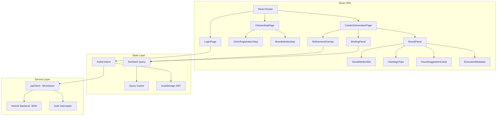
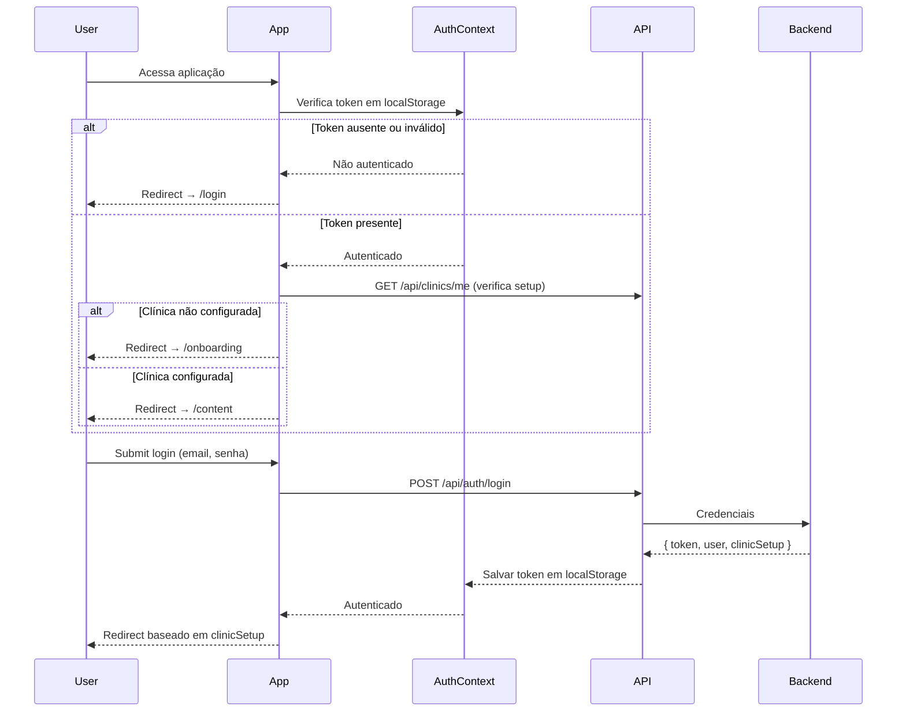

# Design Document: Frontend MVP

## Overview

O Frontend MVP é uma SPA React que serve como interface de demonstração do BeautyGrowth AI Content Agent. A arquitetura segue o padrão moderno de SPAs com separação clara entre camadas de apresentação (pages/components), lógica de estado (hooks + TanStack Query), e comunicação com o backend (services). O roteamento é gerenciado pelo React Router com guards de autenticação, e o estado do servidor é gerenciado pelo TanStack Query para caching, invalidação e loading states automáticos.

Fluxo macro do usuário:
1. Login → autenticação JWT
2. Onboarding (se primeira vez) → cadastro da clínica + identidade da marca
3. Geração de Conteúdo → briefing + resultado multi-rede
4. Refinamento → ajustes iterativos (até 5x)

---

## Architecture

### Diagrama de Componentes



### Stack e Responsabilidades

| Camada | Tecnologia | Responsabilidade |
|--------|-----------|-----------------|
| Build & Dev Server | Vite | HMR, bundling, env vars |
| UI Framework | React 18 | Componentes, hooks, state |
| Tipagem | TypeScript | Type safety end-to-end |
| Estilização | Tailwind CSS | Utility-first styling, responsividade |
| Componentes UI | shadcn/ui | Form elements, toast, tabs, cards |
| Roteamento | React Router v6 | SPA routing, protected routes, redirects |
| Estado do Servidor | TanStack Query v5 | Cache, mutations, loading/error states |
| HTTP Client | Axios | Interceptors, base URL, error handling |

### Fluxo de Autenticação



---

## Components and Interfaces

### 1. API Client — `src/services/api.ts`

Cliente HTTP centralizado com interceptor de autenticação.

```typescript
// src/services/api.ts
import axios, { AxiosInstance, InternalAxiosRequestConfig, AxiosError } from 'axios';

const API_BASE_URL = import.meta.env.VITE_API_URL || 'http://localhost:3000';

const apiClient: AxiosInstance = axios.create({
  baseURL: API_BASE_URL,
  headers: { 'Content-Type': 'application/json' },
});

// Request interceptor: adiciona Bearer token
apiClient.interceptors.request.use((config: InternalAxiosRequestConfig) => {
  const token = localStorage.getItem('auth_token');
  if (token) {
    config.headers.Authorization = `Bearer ${token}`;
  }
  return config;
});

// Response interceptor: trata 401 globalmente
apiClient.interceptors.response.use(
  (response) => response,
  (error: AxiosError) => {
    if (error.response?.status === 401) {
      localStorage.removeItem('auth_token');
      window.location.href = '/login';
    }
    return Promise.reject(error);
  }
);

export default apiClient;
```

### 2. Auth Service — `src/services/auth.service.ts`

```typescript
// src/services/auth.service.ts
interface LoginRequest {
  email: string;
  password: string;
}

interface LoginResponse {
  token: string;
  user: {
    id: string;
    email: string;
    name: string;
    role: string;
  };
  clinicSetup: boolean; // true se clínica já configurada
}

export const authService = {
  login: (data: LoginRequest): Promise<LoginResponse> =>
    apiClient.post('/api/auth/login', data).then(r => r.data),
  
  logout: (): void => {
    localStorage.removeItem('auth_token');
    window.location.href = '/login';
  },
};
```

### 3. Clinic Service — `src/services/clinic.service.ts`

```typescript
// src/services/clinic.service.ts
interface CreateClinicRequest {
  nome: string;
  telefone: string;
  email: string;
  especialidades: string[];
  publicoAlvo: string;
}

interface CreateBrandRequest {
  tomDeVoz: string;
  paletaDeCores: string[];    // hex colors
  logotipo?: File;
  publicoAlvo: string;
  diferenciais: string[];
  valores: string[];
}

export const clinicService = {
  create: (data: CreateClinicRequest): Promise<{ id: string }> =>
    apiClient.post('/api/clinics', data).then(r => r.data),

  createBrand: (data: CreateBrandRequest): Promise<{ id: string }> => {
    const formData = new FormData();
    formData.append('tomDeVoz', data.tomDeVoz);
    formData.append('paletaDeCores', JSON.stringify(data.paletaDeCores));
    formData.append('publicoAlvo', data.publicoAlvo);
    formData.append('diferenciais', JSON.stringify(data.diferenciais));
    formData.append('valores', JSON.stringify(data.valores));
    if (data.logotipo) formData.append('logotipo', data.logotipo);
    return apiClient.post('/api/brands', formData, {
      headers: { 'Content-Type': 'multipart/form-data' },
    }).then(r => r.data);
  },

  getStatus: (): Promise<{ clinicSetup: boolean }> =>
    apiClient.get('/api/clinics/me/status').then(r => r.data),
};
```

### 4. Content Agent Service — `src/services/content-agent.service.ts`

```typescript
// src/services/content-agent.service.ts
interface GenerateRequest {
  tema: string;
  procedimento?: string;
  redesSociais: ('instagram' | 'facebook' | 'tiktok')[];
  publicoAlvoOverride?: string;
  idioma?: string;
}

interface RefineRequest {
  executionId: string;
  instrucoes: string;
}

interface ContentAgentResponse {
  executionId: string;
  status: 'draft' | 'guardrail_blocked' | 'error';
  version: number;
  legendas: Record<string, string>;
  hashtags: string[];
  sugestoesVisuais: Record<string, {
    formato: string;
    descricao: string;
  }>;
  modeloUtilizado: string;
  usouFallback: boolean;
  tokensConsumidos: { input: number; output: number };
  duracaoMs: number;
}

export const contentAgentService = {
  generate: (data: GenerateRequest): Promise<ContentAgentResponse> =>
    apiClient.post('/api/content-agent/generate', data).then(r => r.data),

  refine: (data: RefineRequest): Promise<ContentAgentResponse> =>
    apiClient.post('/api/content-agent/refine', data).then(r => r.data),
};
```

### 5. Custom Hooks

#### `src/hooks/useAuth.ts`

```typescript
// Gerencia estado de autenticação
interface UseAuthReturn {
  isAuthenticated: boolean;
  user: User | null;
  login: UseMutationResult<LoginResponse, Error, LoginRequest>;
  logout: () => void;
  isLoading: boolean;
}

// Usa TanStack Query mutation para login
// Armazena token em localStorage no onSuccess
// Provê isAuthenticated baseado em token existente
```

#### `src/hooks/useClinic.ts`

```typescript
// Gerencia onboarding da clínica
interface UseClinicReturn {
  createClinic: UseMutationResult<{ id: string }, Error, CreateClinicRequest>;
  createBrand: UseMutationResult<{ id: string }, Error, CreateBrandRequest>;
  clinicStatus: UseQueryResult<{ clinicSetup: boolean }>;
}
```

#### `src/hooks/useContentAgent.ts`

```typescript
// Gerencia geração e refinamento
interface UseContentAgentReturn {
  generate: UseMutationResult<ContentAgentResponse, Error, GenerateRequest>;
  refine: UseMutationResult<ContentAgentResponse, Error, RefineRequest>;
  currentResult: ContentAgentResponse | null;
  refinementCount: number;
  isAtRefinementLimit: boolean;
}
```

### 6. Router — `src/router.tsx`

```typescript
// src/router.tsx
import { createBrowserRouter } from 'react-router-dom';

const router = createBrowserRouter([
  {
    path: '/login',
    element: <LoginPage />,
  },
  {
    path: '/',
    element: <ProtectedLayout />,  // verifica auth + redireciona
    children: [
      {
        path: 'onboarding',
        element: <OnboardingPage />,
      },
      {
        path: 'content',
        element: <ContentGenerationPage />,
      },
    ],
  },
]);
```

### 7. Page Components

#### `LoginPage`
- Formulário com e-mail + senha
- Validação client-side (campos obrigatórios, formato email)
- Loading state no botão
- Erro inline para credenciais inválidas
- Redirect após login bem-sucedido

#### `OnboardingPage`
- Step indicator (1/2, 2/2)
- Estado local para dados de ambas etapas
- Navegação entre etapas sem perda de dados
- Step 1: ClinicRegistrationForm
- Step 2: BrandIdentityForm

#### `ContentGenerationPage`
- Layout flex com dois painéis (esquerdo: form, direito: resultado)
- Painel esquerdo: BriefingForm
- Painel direito: ResultPanel (condicional — mostra placeholder quando vazio, loading durante geração, resultado após sucesso)
- RefinementOverlay: sheet/dialog lateral para refinamento

### 8. Reusable Components — `src/components/`

| Componente | Base shadcn/ui | Função |
|-----------|---------------|--------|
| `LoadingButton` | Button | Botão com spinner integrado |
| `StepIndicator` | — (custom) | Indicador de etapa do onboarding |
| `SocialMediaTabs` | Tabs | Tabs para exibir legendas por rede |
| `HashtagChips` | Badge | Lista de hashtags como chips |
| `VisualSuggestionCard` | Card | Card com formato + descrição visual |
| `ExecutionMetadata` | — (custom) | Display de execution_id, modelo, tokens, duração |
| `RefinementCounter` | — (custom) | Indicador X/5 refinamentos |
| `ColorPicker` | — (custom) | Input de cores para paleta |
| `FileUpload` | Input | Upload com preview e validação |
| `ProtectedRoute` | — (HOC) | Guard de autenticação |

---

## Data Models

### TypeScript Types — `src/types/`

```typescript
// src/types/auth.ts
interface User {
  id: string;
  email: string;
  name: string;
  role: 'admin' | 'operator' | 'viewer';
}

interface AuthState {
  token: string | null;
  user: User | null;
  clinicSetup: boolean;
}

// src/types/clinic.ts
interface Clinic {
  id: string;
  nome: string;
  telefone: string;
  email: string;
  especialidades: string[];
  publicoAlvo: string;
}

interface BrandIdentity {
  id: string;
  tomDeVoz: string;
  paletaDeCores: string[];
  logotipoUrl?: string;
  publicoAlvo: string;
  diferenciais: string[];
  valores: string[];
}

// src/types/content-agent.ts
type RedeSocial = 'instagram' | 'facebook' | 'tiktok';

interface GenerateBriefing {
  tema: string;
  procedimento?: string;
  redesSociais: RedeSocial[];
  publicoAlvoOverride?: string;
  idioma?: string;
}

interface SugestaoVisual {
  formato: string;  // "1:1", "4:5", "1.91:1", "9:16"
  descricao: string;
}

interface ContentAgentResult {
  executionId: string;
  status: 'draft' | 'guardrail_blocked' | 'error';
  version: number;
  legendas: Record<RedeSocial, string>;
  hashtags: string[];
  sugestoesVisuais: Record<RedeSocial, SugestaoVisual>;
  modeloUtilizado: string;
  usouFallback: boolean;
  tokensConsumidos: { input: number; output: number };
  duracaoMs: number;
}

interface RefineRequest {
  executionId: string;
  instrucoes: string;
}
```

### Estado Local vs Server State

| Dado | Gerenciamento | Justificativa |
|------|---------------|---------------|
| Token JWT | localStorage + AuthContext | Persistência entre sessões |
| Dados do formulário (onboarding) | useState local | Descartável após submit |
| Dados do briefing | useState local | Descartável após submit |
| Resultado da geração | TanStack Query cache | Cache automático, invalidação |
| Status da clínica | TanStack Query cache | Cache + refetch on mount |
| Contagem de refinamentos | Derivado do version (server) | Single source of truth |

---

## Correctness Properties

### Property 1: Rotas protegidas requerem autenticação

*For any* rota protegida (/onboarding, /content), se o token JWT não existir em localStorage ou estiver expirado (API retorna 401), a aplicação SHALL redirecionar para /login antes de renderizar qualquer conteúdo da rota protegida.

**Validates: Requirements 1.1, 1.6, 6.4**

### Property 2: Token JWT é incluído em toda requisição autenticada

*For any* requisição HTTP enviada pelo apiClient após login bem-sucedido, o header Authorization SHALL estar presente no formato "Bearer {token}" com o token armazenado em localStorage.

**Validates: Requirements 1.5, 6.2**

### Property 3: Formulários impedem submissão com campos obrigatórios vazios

*For any* formulário (login, onboarding step 1, onboarding step 2, briefing), se algum campo marcado como obrigatório estiver vazio ou inválido, o botão de submit SHALL estar desabilitado ou a submissão SHALL ser bloqueada com exibição de mensagens de validação inline.

**Validates: Requirements 1.4, 2.3, 3.3, 4.7**

### Property 4: Erros da API resultam em toast notification

*For any* resposta de erro da API (status 4xx ou 5xx), a aplicação SHALL exibir um toast notification com mensagem descritiva ao usuário, sem quebrar o estado da aplicação ou perder dados preenchidos pelo usuário.

**Validates: Requirements 2.4, 3.5, 4.5, 5.6, 6.3**

### Property 5: Loading states bloqueiam ações duplicadas

*For any* operação assíncrona em progresso (login, create clinic, create brand, generate, refine), o botão de ação SHALL estar desabilitado e um spinner SHALL estar visível, impedindo submissões duplicadas.

**Validates: Requirements 1.7, 2.5, 4.8, 5.2**

### Property 6: Refinamento respeita limite de 5 iterações

*For any* execução com version >= 6 (5 refinamentos já realizados), o botão "Refinar" SHALL estar desabilitado e o indicador SHALL mostrar "5/5 refinamentos", impedindo novas submissões de refinamento.

**Validates: Requirements 5.4, 5.5**

### Property 7: Onboarding preserva dados entre etapas

*For any* navegação entre Etapa 1 e Etapa 2 do onboarding (ida e volta), os dados preenchidos pelo usuário em ambas as etapas SHALL ser preservados sem perda.

**Validates: Requirements 3.6**

---

## Error Handling

### Estratégia por Camada

| Cenário | Componente | Comportamento |
|---------|-----------|--------------|
| Token ausente/expirado | ProtectedRoute / API interceptor | Redirect para /login |
| Credenciais inválidas (401 no login) | LoginPage | Mensagem inline no formulário |
| Validação de formulário (client-side) | Formulários | Mensagens inline por campo |
| Erro de API (422) | Toast system | Toast com mensagem da API |
| Erro de servidor (5xx) | Toast system | Toast genérico "Erro temporário" |
| Serviço indisponível (503) | Toast system | Toast "Serviço temporariamente indisponível" |
| Limite de refinamento (429) | RefinementOverlay | Toast + desabilita botão |
| Upload inválido | BrandIdentityForm | Mensagem inline no campo de upload |
| Network error | API interceptor | Toast "Erro de conexão" |

### Toast Configuration

```typescript
// Padrões de toast para cada tipo de feedback
const toastConfig = {
  error: { variant: 'destructive', duration: 5000 },
  success: { variant: 'default', duration: 3000 },
  warning: { variant: 'warning', duration: 4000 },
};
```

### TanStack Query Error Handling

```typescript
// Global error handler para mutations
const queryClient = new QueryClient({
  defaultOptions: {
    mutations: {
      onError: (error: AxiosError) => {
        const message = error.response?.data?.message || 'Erro inesperado. Tente novamente.';
        toast({ title: 'Erro', description: message, variant: 'destructive' });
      },
    },
  },
});
```

---

## Testing Strategy

### Abordagem: Component Tests + Integration Tests

**Framework:** Vitest + React Testing Library + MSW (Mock Service Worker)

#### Component Tests

| Componente | Cenários |
|-----------|----------|
| LoginPage | Submissão com campos válidos, erro 401, loading state |
| ClinicRegistrationForm | Validação de campos, submit com dados válidos, erro da API |
| BrandIdentityForm | Validação de limites, upload de arquivo, color picker |
| BriefingForm | Validação de campos obrigatórios, submit |
| ResultPanel | Renderização de legendas em tabs, hashtags, sugestões visuais |
| RefinementOverlay | Submit, incremento de versão, limite de refinamentos |
| ProtectedRoute | Redirect sem token, render com token |

#### Integration Tests (com MSW)

| Fluxo | Descrição |
|-------|-----------|
| Login → redirect | Login bem-sucedido redireciona baseado em clinicSetup |
| Onboarding completo | Step 1 → Step 2 → redirect para content |
| Geração e2e | Briefing → loading → resultado renderizado |
| Refinamento e2e | Gerar → refinar → versão incrementa → limite atingido |
| Auth guard | Acesso sem token → redirect para login |
| Token expirado | Requisição com 401 → redirect para login |

#### Mocking com MSW

```typescript
// Handlers MSW para simular backend
const handlers = [
  rest.post('/api/auth/login', (req, res, ctx) => { ... }),
  rest.post('/api/clinics', (req, res, ctx) => { ... }),
  rest.post('/api/brands', (req, res, ctx) => { ... }),
  rest.post('/api/content-agent/generate', (req, res, ctx) => { ... }),
  rest.post('/api/content-agent/refine', (req, res, ctx) => { ... }),
  rest.get('/api/clinics/me/status', (req, res, ctx) => { ... }),
];
```
