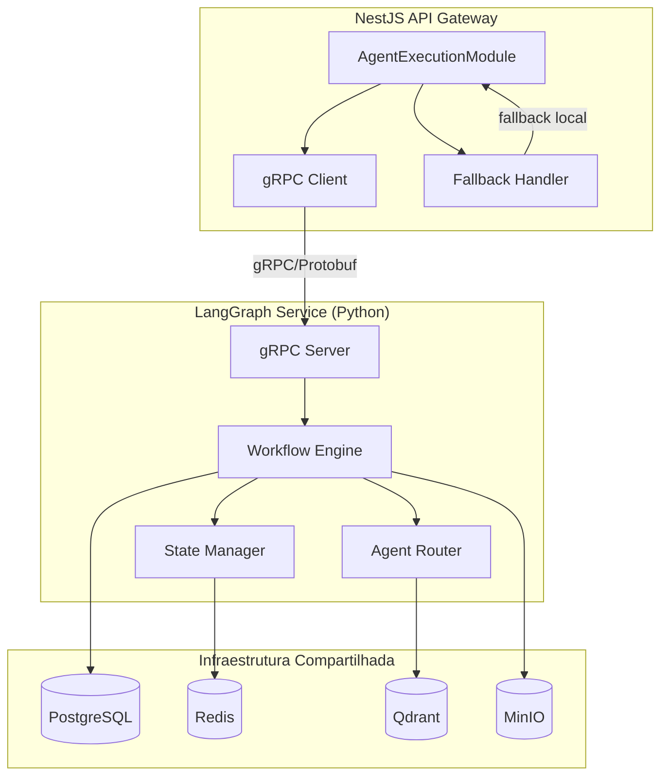
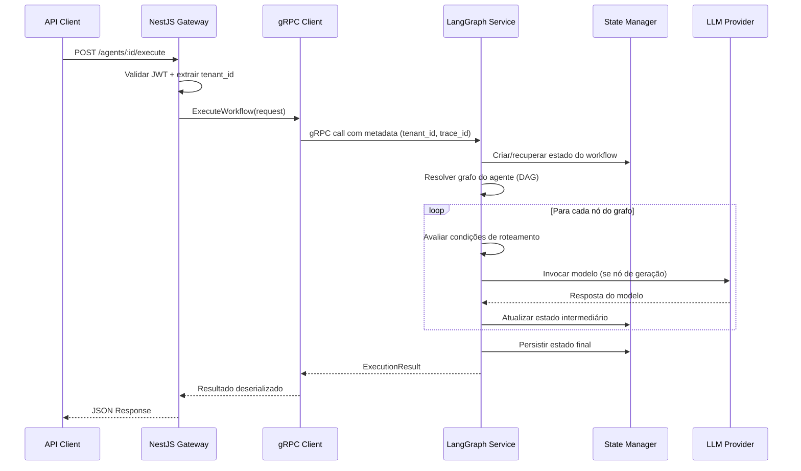
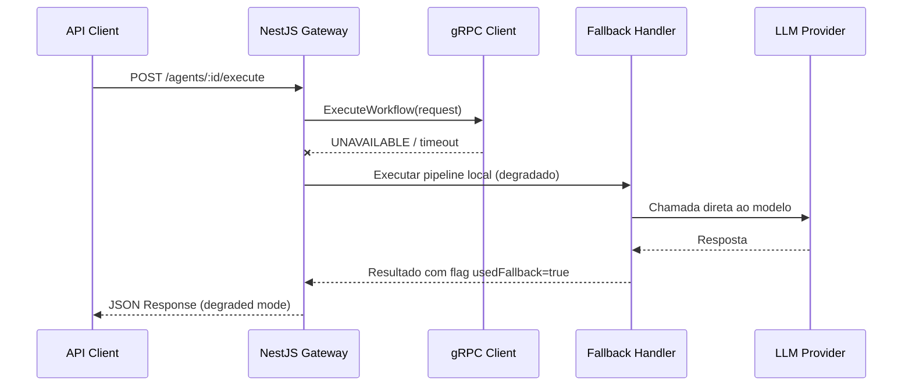
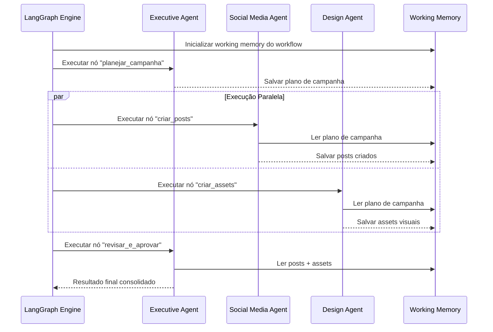

# Documento de Design: LangGraph Orchestration Layer

## Visão Geral

Esta feature implementa a camada de orquestração LangGraph como um microsserviço Python separado, conforme proposto na ADR-002. O serviço LangGraph será responsável pela execução de workflows de agentes baseados em grafos direcionados acíclicos (DAG), com gerenciamento de estado, roteamento condicional e suporte a multi-agentes.

O NestJS existente se torna API gateway + CRUD, delegando a execução de pipelines de IA para o serviço LangGraph via gRPC. A comunicação utiliza Protocol Buffers para tipagem forte e performance. O design mantém isolamento multi-tenant via propagação de `tenant_id` em todos os requests gRPC, e inclui fallback gracioso caso o serviço LangGraph esteja indisponível.

A arquitetura permite composição de agentes em workflows DAG, onde cada nó do grafo representa um passo de execução (agente, tool call, decisão condicional) e as arestas definem o fluxo de dados entre eles.

## Arquitetura



## Diagramas de Sequência

### Fluxo Principal: Execução de Agente via LangGraph



### Fluxo de Fallback: LangGraph Indisponível



### Fluxo Multi-Agente: Workflow DAG



## Componentes e Interfaces

### Componente 1: gRPC Service Definition (Protobuf)

**Propósito**: Define o contrato de comunicação entre NestJS e LangGraph Service.

```protobuf
syntax = "proto3";

package beautygrowth.orchestration.v1;

import "google/protobuf/struct.proto";
import "google/protobuf/timestamp.proto";

// Serviço principal de orquestração de agentes
service AgentOrchestrationService {
  // Executa um workflow de agente completo
  rpc ExecuteWorkflow(ExecuteWorkflowRequest) returns (ExecuteWorkflowResponse);
  
  // Executa um workflow com streaming de resultados parciais
  rpc ExecuteWorkflowStream(ExecuteWorkflowRequest) returns (stream WorkflowStreamEvent);
  
  // Consulta o estado de uma execução em andamento ou finalizada
  rpc GetExecutionState(GetExecutionStateRequest) returns (ExecutionState);
  
  // Cancela uma execução em andamento
  rpc CancelExecution(CancelExecutionRequest) returns (CancelExecutionResponse);
  
  // Health check do serviço
  rpc HealthCheck(HealthCheckRequest) returns (HealthCheckResponse);
}

// Request para execução de workflow
message ExecuteWorkflowRequest {
  string agent_id = 1;
  string tenant_id = 2;
  string user_input = 3;
  string user_id = 4;
  map<string, string> tenant_context = 5;
  string workflow_id = 6;  // Opcional: ID de workflow específico (para multi-agente)
  string conversation_id = 7;  // Para manter contexto conversacional
  ExecutionOptions options = 8;
}

message ExecutionOptions {
  int32 max_steps = 1;           // Limite de passos no grafo
  int32 timeout_ms = 2;          // Timeout da execução
  bool enable_streaming = 3;     // Habilitar eventos parciais
  map<string, string> metadata = 4;  // Metadata adicional para tracing
}

// Resposta da execução de workflow
message ExecuteWorkflowResponse {
  bool success = 1;
  string output = 2;
  string trace_id = 3;
  string model_id = 4;
  bool used_fallback = 5;
  TokenUsage tokens_used = 6;
  int64 duration_ms = 7;
  string blocked_reason = 8;
  repeated string guardrail_violations = 9;
  ExecutionState final_state = 10;
  repeated StepResult steps = 11;  // Detalhes de cada passo executado
}

message TokenUsage {
  int32 input_tokens = 1;
  int32 output_tokens = 2;
}

// Estado da execução (para consulta e persistência)
message ExecutionState {
  string execution_id = 1;
  string workflow_id = 2;
  string tenant_id = 3;
  ExecutionStatus status = 4;
  google.protobuf.Struct state_data = 5;  // Estado do LangGraph serializado
  string current_node = 6;
  repeated string completed_nodes = 7;
  google.protobuf.Timestamp created_at = 8;
  google.protobuf.Timestamp updated_at = 9;
}
```

```protobuf
enum ExecutionStatus {
  EXECUTION_STATUS_UNSPECIFIED = 0;
  EXECUTION_STATUS_PENDING = 1;
  EXECUTION_STATUS_RUNNING = 2;
  EXECUTION_STATUS_COMPLETED = 3;
  EXECUTION_STATUS_FAILED = 4;
  EXECUTION_STATUS_CANCELLED = 5;
  EXECUTION_STATUS_TIMEOUT = 6;
}

// Resultado de um passo individual do workflow
message StepResult {
  string node_id = 1;
  string node_type = 2;  // "agent", "tool", "condition", "parallel"
  string output = 3;
  int64 duration_ms = 4;
  TokenUsage tokens_used = 5;
  ExecutionStatus status = 6;
  string error_message = 7;
}

// Eventos de streaming durante execução
message WorkflowStreamEvent {
  oneof event {
    StepStarted step_started = 1;
    StepCompleted step_completed = 2;
    TokenGenerated token_generated = 3;
    WorkflowCompleted workflow_completed = 4;
    WorkflowError workflow_error = 5;
  }
}

message StepStarted {
  string node_id = 1;
  string node_type = 2;
}

message StepCompleted {
  StepResult result = 1;
}

message TokenGenerated {
  string token = 1;
  string node_id = 2;
}

message WorkflowCompleted {
  ExecuteWorkflowResponse response = 1;
}

message WorkflowError {
  string error_code = 1;
  string error_message = 2;
  string node_id = 3;
}

// Health check
message HealthCheckRequest {}

message HealthCheckResponse {
  ServiceStatus status = 1;
  string version = 2;
  map<string, string> details = 3;
}

enum ServiceStatus {
  SERVICE_STATUS_UNSPECIFIED = 0;
  SERVICE_STATUS_SERVING = 1;
  SERVICE_STATUS_NOT_SERVING = 2;
}

// Consulta de estado
message GetExecutionStateRequest {
  string execution_id = 1;
  string tenant_id = 2;
}

// Cancelamento
message CancelExecutionRequest {
  string execution_id = 1;
  string tenant_id = 2;
}

message CancelExecutionResponse {
  bool success = 1;
  string message = 2;
}
```

### Componente 2: NestJS gRPC Client (TypeScript)

**Propósito**: Cliente gRPC no NestJS que delega execução ao serviço LangGraph com circuit breaker e fallback.

```typescript
// interfaces/langgraph-client.interface.ts
export interface ILangGraphClient {
  executeWorkflow(request: ExecuteWorkflowRequest): Promise<ExecuteWorkflowResponse>;
  executeWorkflowStream(request: ExecuteWorkflowRequest): AsyncIterable<WorkflowStreamEvent>;
  getExecutionState(executionId: string, tenantId: string): Promise<ExecutionState>;
  cancelExecution(executionId: string, tenantId: string): Promise<CancelExecutionResponse>;
  healthCheck(): Promise<HealthCheckResponse>;
}

// interfaces/circuit-breaker.interface.ts
export interface ICircuitBreaker {
  execute<T>(fn: () => Promise<T>, fallback: () => Promise<T>): Promise<T>;
  getState(): CircuitBreakerState;
  reset(): void;
}

export type CircuitBreakerState = 'CLOSED' | 'OPEN' | 'HALF_OPEN';

export interface CircuitBreakerConfig {
  failureThreshold: number;      // Falhas antes de abrir (default: 5)
  successThreshold: number;      // Sucessos para fechar (default: 3)
  timeout: number;               // Timeout por request em ms (default: 30000)
  resetTimeout: number;          // Tempo para tentar half-open em ms (default: 60000)
}
```

**Responsabilidades**:
- Serializar/deserializar mensagens protobuf
- Propagar `tenant_id` e `trace_id` via gRPC metadata
- Implementar circuit breaker para fallback automático
- Gerenciar pool de conexões gRPC
- Retry com exponential backoff para erros transientes

### Componente 3: LangGraph Workflow Engine (Python)

**Propósito**: Motor de execução de workflows baseados em grafos usando a API do LangGraph.

```python
# core/workflow_engine.py
from typing import Protocol, Any
from langgraph.graph import StateGraph, END
from dataclasses import dataclass

class WorkflowEngine(Protocol):
    """Interface do motor de execução de workflows."""
    
    async def execute(
        self, 
        workflow_id: str, 
        initial_state: dict[str, Any],
        config: ExecutionConfig
    ) -> ExecutionResult: ...
    
    async def execute_stream(
        self, 
        workflow_id: str, 
        initial_state: dict[str, Any],
        config: ExecutionConfig
    ) -> AsyncIterator[WorkflowEvent]: ...
    
    def register_workflow(
        self, 
        workflow_id: str, 
        graph: StateGraph
    ) -> None: ...


@dataclass
class ExecutionConfig:
    """Configuração para uma execução de workflow."""
    tenant_id: str
    user_id: str
    trace_id: str
    max_steps: int = 50
    timeout_ms: int = 120_000
    metadata: dict[str, str] | None = None


@dataclass 
class ExecutionResult:
    """Resultado de uma execução de workflow."""
    success: bool
    output: str
    trace_id: str
    model_id: str
    used_fallback: bool
    tokens_used: TokenUsage
    duration_ms: int
    steps: list[StepResult]
    final_state: dict[str, Any]
    blocked_reason: str | None = None
    guardrail_violations: list[str] | None = None
```

### Componente 4: State Manager (Python)

**Propósito**: Gerencia o estado dos workflows usando Redis para estado em voo e PostgreSQL para persistência de longo prazo.

```python
# core/state_manager.py
from typing import Protocol, Any

class StateManager(Protocol):
    """Gerencia estado de workflows com isolamento multi-tenant."""
    
    async def create_state(
        self,
        execution_id: str,
        tenant_id: str,
        workflow_id: str,
        initial_state: dict[str, Any]
    ) -> None: ...
    
    async def get_state(
        self,
        execution_id: str,
        tenant_id: str
    ) -> dict[str, Any] | None: ...
    
    async def update_state(
        self,
        execution_id: str,
        tenant_id: str,
        state_update: dict[str, Any]
    ) -> None: ...
    
    async def persist_final_state(
        self,
        execution_id: str,
        tenant_id: str,
        final_state: dict[str, Any]
    ) -> None: ...
    
    async def get_conversation_history(
        self,
        conversation_id: str,
        tenant_id: str,
        limit: int = 50
    ) -> list[dict[str, Any]]: ...
```

**Responsabilidades**:
- Estado em voo armazenado no Redis com TTL (namespace: `tenant:{id}:exec:{exec_id}`)
- Estado final persistido no PostgreSQL (tabela `workflow_executions`)
- Isolamento por `tenant_id` em todas as operações
- Suporte a checkpointing para workflows longos (LangGraph checkpointer)
- Limpeza automática de estados expirados

### Componente 5: Agent Router (Python)

**Propósito**: Resolve qual grafo/workflow executar baseado na configuração do agente e roteamento condicional.

```python
# core/agent_router.py
from typing import Protocol

class AgentRouter(Protocol):
    """Roteia requests para o workflow correto baseado em configuração."""
    
    async def resolve_workflow(
        self,
        agent_id: str,
        tenant_id: str,
        context: dict[str, Any]
    ) -> ResolvedWorkflow: ...
    
    async def register_agent_workflow(
        self,
        agent_id: str,
        workflow_definition: WorkflowDefinition
    ) -> None: ...


@dataclass
class ResolvedWorkflow:
    """Workflow resolvido para execução."""
    workflow_id: str
    graph: StateGraph
    config: dict[str, Any]
    agent_type: str


@dataclass
class WorkflowDefinition:
    """Definição de um workflow de agente."""
    workflow_id: str
    agent_type: str
    nodes: list[NodeDefinition]
    edges: list[EdgeDefinition]
    entry_point: str
    
    
@dataclass
class NodeDefinition:
    """Definição de um nó no grafo."""
    node_id: str
    node_type: str  # "llm_call", "tool_call", "condition", "parallel"
    config: dict[str, Any]


@dataclass
class EdgeDefinition:
    """Definição de uma aresta no grafo."""
    source: str
    target: str
    condition: str | None = None  # Expressão de condição (opcional)
```

## Modelos de Dados

### Model 1: WorkflowExecution (PostgreSQL)

```sql
CREATE TABLE workflow_executions (
    id UUID PRIMARY KEY DEFAULT gen_random_uuid(),
    tenant_id UUID NOT NULL,
    workflow_id VARCHAR(255) NOT NULL,
    agent_id UUID NOT NULL,
    conversation_id UUID,
    user_id UUID,
    status VARCHAR(50) NOT NULL DEFAULT 'pending',
    input TEXT NOT NULL,
    output TEXT,
    state_data JSONB DEFAULT '{}',
    steps JSONB DEFAULT '[]',
    tokens_input INTEGER DEFAULT 0,
    tokens_output INTEGER DEFAULT 0,
    duration_ms INTEGER,
    model_id VARCHAR(255),
    used_fallback BOOLEAN DEFAULT false,
    error_message TEXT,
    blocked_reason TEXT,
    guardrail_violations TEXT[],
    metadata JSONB DEFAULT '{}',
    created_at TIMESTAMP WITH TIME ZONE DEFAULT NOW(),
    updated_at TIMESTAMP WITH TIME ZONE DEFAULT NOW(),
    completed_at TIMESTAMP WITH TIME ZONE
);

-- RLS Policy para isolamento multi-tenant
ALTER TABLE workflow_executions ENABLE ROW LEVEL SECURITY;

CREATE POLICY tenant_isolation ON workflow_executions
    USING (tenant_id = current_setting('app.current_tenant')::UUID);

-- Índices para consultas frequentes
CREATE INDEX idx_workflow_exec_tenant ON workflow_executions(tenant_id);
CREATE INDEX idx_workflow_exec_status ON workflow_executions(tenant_id, status);
CREATE INDEX idx_workflow_exec_conversation ON workflow_executions(conversation_id);
CREATE INDEX idx_workflow_exec_created ON workflow_executions(tenant_id, created_at DESC);
```

**Regras de Validação**:
- `status` deve ser um dos valores: pending, running, completed, failed, cancelled, timeout
- `tenant_id` é obrigatório e deve existir na tabela de tenants
- `tokens_input` e `tokens_output` devem ser >= 0
- `duration_ms` deve ser >= 0 quando preenchido

### Model 2: WorkflowDefinition (PostgreSQL)

```sql
CREATE TABLE workflow_definitions (
    id UUID PRIMARY KEY DEFAULT gen_random_uuid(),
    tenant_id UUID,  -- NULL = workflow global/sistema
    workflow_id VARCHAR(255) NOT NULL,
    agent_type VARCHAR(100) NOT NULL,
    name VARCHAR(255) NOT NULL,
    description TEXT,
    graph_definition JSONB NOT NULL,  -- DAG serializado
    version INTEGER NOT NULL DEFAULT 1,
    is_active BOOLEAN DEFAULT true,
    created_at TIMESTAMP WITH TIME ZONE DEFAULT NOW(),
    updated_at TIMESTAMP WITH TIME ZONE DEFAULT NOW(),
    UNIQUE(workflow_id, version)
);

ALTER TABLE workflow_definitions ENABLE ROW LEVEL SECURITY;

CREATE POLICY tenant_or_global ON workflow_definitions
    USING (tenant_id IS NULL OR tenant_id = current_setting('app.current_tenant')::UUID);
```

**Regras de Validação**:
- `graph_definition` deve ser um DAG válido (sem ciclos)
- `workflow_id` + `version` deve ser único
- `graph_definition` deve conter pelo menos um nó de entrada e uma aresta para END

### Model 3: Estado em Voo (Redis)

```
Key Pattern: tenant:{tenant_id}:exec:{execution_id}
TTL: 3600s (1 hora, configurável)
Value: JSON serializado do estado do LangGraph

Key Pattern: tenant:{tenant_id}:exec:{execution_id}:steps
Type: List
Value: StepResult serializado em JSON (append-only)

Key Pattern: tenant:{tenant_id}:workflow:{workflow_id}:lock
Type: String com TTL
Value: execution_id (distributed lock para evitar execuções duplicadas)
```

## Pseudocódigo Algorítmico

### Algoritmo Principal: Execução de Workflow

```python
async def execute_workflow(request: ExecuteWorkflowRequest) -> ExecuteWorkflowResponse:
    """
    Algoritmo principal de execução de um workflow de agente.
    
    Preconditions:
        - request.agent_id referencia um agente ativo
        - request.tenant_id é um tenant válido
        - request.user_input não é vazio
    
    Postconditions:
        - Retorna ExecuteWorkflowResponse com success=True se execução ok
        - Estado final persistido no Redis e PostgreSQL
        - Todas as métricas de tokens e duração são registradas
        - trace_id propagado para todos os sub-componentes
    """
    trace_id = generate_trace_id()
    execution_id = generate_execution_id()
    start_time = now()
    
    # 1. Resolver workflow para o agente
    resolved = await agent_router.resolve_workflow(
        agent_id=request.agent_id,
        tenant_id=request.tenant_id,
        context=request.tenant_context
    )
    
    # 2. Criar estado inicial
    initial_state = {
        "user_input": request.user_input,
        "tenant_id": request.tenant_id,
        "agent_id": request.agent_id,
        "conversation_id": request.conversation_id,
        "messages": [],
        "intermediate_results": {},
    }
    
    await state_manager.create_state(
        execution_id=execution_id,
        tenant_id=request.tenant_id,
        workflow_id=resolved.workflow_id,
        initial_state=initial_state
    )
    
    # 3. Configurar e executar o grafo LangGraph
    config = {
        "configurable": {
            "thread_id": execution_id,
            "tenant_id": request.tenant_id,
        },
        "recursion_limit": request.options.max_steps or 50,
    }
    
    try:
        # Executar o grafo com timeout
        result = await asyncio.wait_for(
            resolved.graph.ainvoke(initial_state, config=config),
            timeout=request.options.timeout_ms / 1000
        )
        
        # 4. Construir resposta de sucesso
        duration_ms = elapsed_ms(start_time)
        
        await state_manager.persist_final_state(
            execution_id=execution_id,
            tenant_id=request.tenant_id,
            final_state=result
        )
        
        return ExecuteWorkflowResponse(
            success=True,
            output=result["output"],
            trace_id=trace_id,
            model_id=result.get("model_id", ""),
            tokens_used=aggregate_tokens(result["steps"]),
            duration_ms=duration_ms,
            steps=result.get("steps", []),
            final_state=result
        )
        
    except asyncio.TimeoutError:
        return build_error_response(trace_id, "TIMEOUT", start_time)
    except GuardrailViolationError as e:
        return build_blocked_response(trace_id, e.violations, start_time)
    except Exception as e:
        return build_error_response(trace_id, str(e), start_time)
```

### Algoritmo: Construção de Grafo de Agente

```python
def build_agent_graph(definition: WorkflowDefinition) -> StateGraph:
    """
    Constrói um StateGraph do LangGraph a partir de uma definição de workflow.
    
    Preconditions:
        - definition.nodes não está vazio
        - definition.entry_point existe em definition.nodes
        - O grafo resultante é acíclico (DAG válido)
    
    Postconditions:
        - Retorna StateGraph compilado e pronto para execução
        - Todos os nós definidos estão presentes no grafo
        - Todas as arestas estão conectadas corretamente
    
    Loop Invariants:
        - A cada iteração do loop de nós, o grafo parcial permanece válido
        - A cada iteração do loop de arestas, nenhum ciclo é introduzido
    """
    from langgraph.graph import StateGraph, END
    
    # Definir o schema de estado
    class WorkflowState(TypedDict):
        user_input: str
        tenant_id: str
        agent_id: str
        messages: list[dict]
        intermediate_results: dict
        output: str
        steps: list[dict]
    
    graph = StateGraph(WorkflowState)
    
    # Registrar nós
    for node_def in definition.nodes:
        node_fn = resolve_node_function(node_def)
        graph.add_node(node_def.node_id, node_fn)
    
    # Registrar arestas
    for edge_def in definition.edges:
        if edge_def.condition:
            # Aresta condicional
            condition_fn = compile_condition(edge_def.condition)
            graph.add_conditional_edges(
                edge_def.source,
                condition_fn,
                {True: edge_def.target, False: END}
            )
        else:
            # Aresta direta
            target = END if edge_def.target == "__end__" else edge_def.target
            graph.add_edge(edge_def.source, target)
    
    # Definir ponto de entrada
    graph.set_entry_point(definition.entry_point)
    
    return graph.compile()


def resolve_node_function(node_def: NodeDefinition) -> Callable:
    """Resolve a função de execução para um tipo de nó."""
    match node_def.node_type:
        case "llm_call":
            return create_llm_node(node_def.config)
        case "tool_call":
            return create_tool_node(node_def.config)
        case "condition":
            return create_condition_node(node_def.config)
        case "guardrail":
            return create_guardrail_node(node_def.config)
        case _:
            raise ValueError(f"Unknown node type: {node_def.node_type}")
```

### Algoritmo: Circuit Breaker (NestJS)

```typescript
// services/circuit-breaker.service.ts

/**
 * Implementação de Circuit Breaker para proteção contra falhas do LangGraph Service.
 * 
 * Preconditions:
 *   - config.failureThreshold > 0
 *   - config.successThreshold > 0
 *   - config.resetTimeout > 0
 * 
 * Postconditions:
 *   - Se estado CLOSED: executa fn() normalmente
 *   - Se estado OPEN: executa fallback() imediatamente
 *   - Se estado HALF_OPEN: tenta fn(), volta para CLOSED em sucesso ou OPEN em falha
 * 
 * State Transitions:
 *   CLOSED → OPEN: quando failureCount >= failureThreshold
 *   OPEN → HALF_OPEN: após resetTimeout expirar
 *   HALF_OPEN → CLOSED: quando successCount >= successThreshold
 *   HALF_OPEN → OPEN: em qualquer falha
 */
export class CircuitBreakerService implements ICircuitBreaker {
  private state: CircuitBreakerState = 'CLOSED';
  private failureCount = 0;
  private successCount = 0;
  private lastFailureTime: number | null = null;

  constructor(private readonly config: CircuitBreakerConfig) {}

  async execute<T>(fn: () => Promise<T>, fallback: () => Promise<T>): Promise<T> {
    if (this.state === 'OPEN') {
      if (this.shouldAttemptReset()) {
        this.state = 'HALF_OPEN';
      } else {
        return fallback();
      }
    }

    try {
      const result = await fn();
      this.onSuccess();
      return result;
    } catch (error) {
      this.onFailure();
      if (this.state === 'OPEN') {
        return fallback();
      }
      throw error;
    }
  }

  private onSuccess(): void {
    if (this.state === 'HALF_OPEN') {
      this.successCount++;
      if (this.successCount >= this.config.successThreshold) {
        this.state = 'CLOSED';
        this.failureCount = 0;
        this.successCount = 0;
      }
    } else {
      this.failureCount = 0;
    }
  }

  private onFailure(): void {
    this.failureCount++;
    this.lastFailureTime = Date.now();
    if (this.failureCount >= this.config.failureThreshold) {
      this.state = 'OPEN';
      this.successCount = 0;
    }
  }

  private shouldAttemptReset(): boolean {
    if (!this.lastFailureTime) return false;
    return Date.now() - this.lastFailureTime >= this.config.resetTimeout;
  }
}
```

## Funções Chave com Especificações Formais

### Função 1: `LangGraphClientService.executeWorkflow()`

```typescript
async executeWorkflow(request: AgentExecutionRequest): Promise<AgentExecutionResult>
```

**Precondições:**
- `request.agentId` é um UUID válido de agente ativo
- `request.tenantId` é um UUID válido
- `request.userInput` é string não-vazia
- Conexão gRPC está configurada (canal pode estar indisponível)

**Pós-condições:**
- Se LangGraph disponível: retorna resultado do workflow com `success=true` ou `success=false`
- Se LangGraph indisponível E circuit breaker OPEN: executa fallback local
- `traceId` é sempre gerado e retornado, independente do path
- `durationMs` reflete o tempo total incluindo fallback

**Invariantes de Loop:** N/A

### Função 2: `WorkflowEngine.execute()`

```python
async def execute(self, workflow_id: str, initial_state: dict, config: ExecutionConfig) -> ExecutionResult
```

**Precondições:**
- `workflow_id` referencia um workflow registrado e ativo
- `initial_state` contém campos obrigatórios: `user_input`, `tenant_id`, `agent_id`
- `config.tenant_id` corresponde ao `initial_state["tenant_id"]`
- `config.max_steps` > 0

**Pós-condições:**
- Se sucesso: `result.success == True` e `result.output` é não-vazio
- Se falha: `result.success == False` e `result.blocked_reason` ou erro propagado
- Estado final persistido no StateManager
- Tokens consumidos registrados em `result.tokens_used`
- Cada nó visitado registrado em `result.steps`

**Invariantes de Loop:**
- A cada passo do grafo, o estado acumulado é consistente
- O número de passos nunca excede `config.max_steps`

### Função 3: `StateManager.update_state()`

```python
async def update_state(self, execution_id: str, tenant_id: str, state_update: dict) -> None
```

**Precondições:**
- Estado para `execution_id` + `tenant_id` já existe no Redis
- `state_update` é um dicionário não-vazio com campos válidos

**Pós-condições:**
- Estado no Redis atualizado com merge do `state_update`
- TTL do key resetado
- Nenhum campo existente é removido (somente adição/atualização)
- Operação é atômica (via Redis MULTI/EXEC)

**Invariantes de Loop:** N/A

## Exemplo de Uso

### Exemplo 1: Execução simples de agente via NestJS

```typescript
// controller que recebe request HTTP e delega para LangGraph
@Post(':agentId/execute')
async executeAgent(
  @Param('agentId') agentId: string,
  @CurrentTenant() tenantId: string,
  @CurrentUser() userId: string,
  @Body() body: ExecuteAgentDto,
): Promise<AgentExecutionResult> {
  const request: AgentExecutionRequest = {
    agentId,
    tenantId,
    userInput: body.userInput,
    userId,
    tenantContext: body.context,
  };

  // AgentExecutionService agora delega para LangGraph via gRPC
  return this.agentExecutionService.execute(request);
}
```

### Exemplo 2: Definição de workflow multi-agente em Python

```python
from langgraph.graph import StateGraph, END

# Definir grafo para campanha de marketing
workflow = StateGraph(CampaignState)

# Nós do workflow
workflow.add_node("planejar", executive_agent.plan_campaign)
workflow.add_node("criar_conteudo", content_agent.create_posts)
workflow.add_node("criar_visual", design_agent.create_assets)
workflow.add_node("revisar", executive_agent.review_and_approve)

# Arestas (fluxo do DAG)
workflow.set_entry_point("planejar")
workflow.add_edge("planejar", "criar_conteudo")
workflow.add_edge("planejar", "criar_visual")
workflow.add_edge("criar_conteudo", "revisar")
workflow.add_edge("criar_visual", "revisar")
workflow.add_conditional_edges(
    "revisar",
    should_approve,
    {True: END, False: "planejar"}  # Loop de revisão
)

compiled = workflow.compile()
```

### Exemplo 3: gRPC call com propagação de tenant

```typescript
// services/langgraph-client.service.ts
async executeWorkflow(request: AgentExecutionRequest): Promise<AgentExecutionResult> {
  const grpcRequest: ExecuteWorkflowRequest = {
    agentId: request.agentId,
    tenantId: request.tenantId,
    userInput: request.userInput,
    userId: request.userId || '',
    tenantContext: request.tenantContext || {},
    conversationId: request.conversationId || '',
    options: {
      maxSteps: 50,
      timeoutMs: 120_000,
      enableStreaming: false,
      metadata: {},
    },
  };

  // Metadata gRPC para propagação de contexto
  const metadata = new Metadata();
  metadata.set('x-tenant-id', request.tenantId);
  metadata.set('x-trace-id', this.observability.generateTraceId());
  metadata.set('x-user-id', request.userId || '');

  return this.circuitBreaker.execute(
    () => this.grpcClient.executeWorkflow(grpcRequest, metadata),
    () => this.fallbackHandler.execute(request),
  );
}
```

## Error Handling

### Cenário 1: LangGraph Service Indisponível

**Condição**: Serviço LangGraph não responde ou retorna gRPC status UNAVAILABLE
**Resposta**: Circuit breaker ativa fallback local (pipeline simplificado inline)
**Recuperação**: 
- Circuit breaker em HALF_OPEN tenta reconectar após `resetTimeout`
- Alertas enviados para observabilidade
- Métricas de fallback registradas para dashboards

### Cenário 2: Timeout na Execução do Workflow

**Condição**: Execução excede `timeout_ms` configurado
**Resposta**: 
- LangGraph: `asyncio.TimeoutError` capturado, estado parcial persistido
- NestJS: gRPC deadline exceeded, resposta com status TIMEOUT
**Recuperação**:
- Estado parcial pode ser consultado via `GetExecutionState`
- Client pode re-submeter o request (idempotência via `conversation_id`)

### Cenário 3: Violação de Guardrails

**Condição**: Output de um nó do grafo viola regras de guardrails
**Resposta**: 
- Nó de guardrail no grafo intercepta e sinaliza violação
- Workflow pode tentar regeneração (via aresta condicional de retry)
- Após max tentativas: retorna `blocked_reason` com detalhes
**Recuperação**: Execução marcada como `FAILED`, violations registradas

### Cenário 4: Erro de Isolamento de Tenant

**Condição**: Request tenta acessar dados de outro tenant
**Resposta**: RLS no PostgreSQL bloqueia; Redis verifica prefixo de tenant
**Recuperação**: Erro logado com trace_id, request rejeitado com PERMISSION_DENIED

### Cenário 5: Grafo com Ciclo Detectado

**Condição**: `recursion_limit` atingido durante execução do grafo
**Resposta**: LangGraph lança `GraphRecursionError`
**Recuperação**: Execução marcada como FAILED, estado parcial salvo para debug

## Estratégia de Testes

### Testes Unitários

- Circuit breaker: transições de estado (CLOSED→OPEN→HALF_OPEN→CLOSED)
- State manager: CRUD de estado com isolamento de tenant
- Agent router: resolução de workflow por agent_id
- Protobuf serialization/deserialization round-trip
- Workflow engine: execução de grafos simples (linear, condicional, paralelo)

### Testes Property-Based

**Biblioteca**: `hypothesis` (Python) + `fast-check` (TypeScript)

- Round-trip de serialização protobuf
- Isolamento de tenant em todas as operações de estado
- DAG validation (grafos gerados aleatoriamente devem ser acíclicos)
- Circuit breaker: propriedades de transição de estado

### Testes de Integração

- NestJS → gRPC → LangGraph: execução end-to-end
- Fallback: simular indisponibilidade do LangGraph
- Multi-tenant: execuções paralelas de tenants diferentes
- Health checks e readiness probes

## Considerações de Performance

- **gRPC vs HTTP**: gRPC com HTTP/2 para multiplexação de streams e menor overhead de serialização
- **Connection pooling**: Pool de conexões gRPC reutilizáveis no NestJS (evitar handshake por request)
- **Redis para estado em voo**: Acesso sub-millisecond para leitura/escrita de estado intermediário
- **Streaming**: Para workflows longos, streaming de eventos parciais evita timeout do client
- **Paralelismo**: LangGraph suporta execução paralela de nós independentes no grafo
- **Timeout escalonado**: timeout do gRPC client < timeout do workflow engine < timeout do LLM provider
- **Batch processing**: Múltiplos requests do mesmo tenant podem compartilhar contexto de memória

## Considerações de Segurança

- **Propagação de tenant_id**: Sempre via gRPC metadata, validado em ambos os lados
- **mTLS**: Comunicação gRPC entre NestJS e LangGraph protegida com mutual TLS em produção
- **Input sanitization**: Validação de input no NestJS ANTES de enviar para LangGraph
- **Resource limits**: `max_steps` e `timeout_ms` previnem execução infinita/abuse
- **Secrets**: API keys de LLM providers armazenadas apenas no serviço LangGraph (não expostas ao NestJS)
- **RLS**: Todas as queries do LangGraph ao PostgreSQL passam pelo RLS com `tenant_id`
- **Rate limiting**: Implementado no NestJS (API gateway layer) antes de delegar ao LangGraph
- **Audit**: Toda execução registrada com `trace_id` para rastreabilidade completa

## Dependências

### Serviço LangGraph (Python)

| Dependência | Versão | Propósito |
|-------------|--------|-----------|
| langgraph | >=0.2.0 | Motor de execução de grafos de agentes |
| langchain-core | >=0.3.0 | Abstrações base para LLM/tools |
| grpcio | >=1.60.0 | Servidor gRPC |
| grpcio-tools | >=1.60.0 | Compilação de protobuf |
| redis[hiredis] | >=5.0.0 | State manager (async) |
| asyncpg | >=0.29.0 | PostgreSQL async driver |
| opentelemetry-sdk | >=1.20.0 | Tracing distribuído |
| langfuse | >=2.0.0 | Observabilidade LLM |
| pydantic | >=2.0.0 | Validação de dados |

### NestJS Additions (TypeScript)

| Dependência | Versão | Propósito |
|-------------|--------|-----------|
| @grpc/grpc-js | >=1.9.0 | gRPC client |
| @grpc/proto-loader | >=0.7.0 | Carregamento de .proto |
| google-protobuf | >=3.21.0 | Runtime protobuf |
| ts-proto | >=1.160.0 | Geração de tipos TypeScript a partir de .proto |

### Infraestrutura

| Componente | Propósito |
|------------|-----------|
| Docker | Container para o serviço LangGraph |
| Redis 7+ | Estado em voo, locks distribuídos |
| PostgreSQL 16+ | Persistência de execuções e definições |
| Protobuf Compiler (protoc) | Compilação de schemas .proto |

## Correctness Properties

*Uma propriedade é uma característica ou comportamento que deve ser verdadeiro em todas as execuções válidas de um sistema — essencialmente, uma declaração formal sobre o que o sistema deve fazer.*

### Property 1: Round-trip de Serialização Protobuf

*Para qualquer* `ExecuteWorkflowRequest` ou `ExecuteWorkflowResponse` válido, serializar para protobuf e depois deserializar deve produzir um objeto equivalente ao original.

**Validates: Requirements 1.4**

### Property 2: Isolamento de Tenant no State Manager

*Para qualquer* par de tenants distintos (A, B), operações de estado do tenant A nunca retornam dados do tenant B, e vice-versa — tanto no Redis (prefixo `tenant:{id}:`) quanto no PostgreSQL (via RLS).

**Validates: Requirements 5.1, 5.3, 5.4, 4.4**

### Property 3: Circuit Breaker - Transições Válidas

*Para qualquer* sequência de chamadas (sucesso/falha), o circuit breaker só transiciona entre estados válidos: CLOSED→OPEN (threshold atingido), OPEN→HALF_OPEN (timeout expirado), HALF_OPEN→CLOSED (sucessos suficientes), HALF_OPEN→OPEN (qualquer falha).

**Validates: Requirements 2.1, 2.3, 2.4, 2.5, 2.7**

### Property 4: DAG Válido - Sem Ciclos

*Para qualquer* `WorkflowDefinition` aceita pelo sistema, o grafo resultante compilado pelo LangGraph é acíclico (não conta arestas condicionais de retry explícitas limitadas por `recursion_limit`).

**Validates: Requirements 3.5**

### Property 5: Completude de Execução

*Para qualquer* workflow executado com sucesso (status=COMPLETED), todos os nós no caminho de execução foram visitados e registrados em `steps`, e o `output` final é não-vazio.

**Validates: Requirements 3.6**

### Property 6: Idempotência de Fallback

*Para qualquer* request quando o circuit breaker está OPEN, o fallback local sempre retorna um resultado válido com `usedFallback=true`, sem efeitos colaterais no LangGraph Service e sem tentar contatar o serviço.

**Validates: Requirements 2.2, 2.6**

### Property 7: Consistência de Tokens

*Para qualquer* execução completa, a soma de `tokens_used` (input + output) nos `StepResult` individuais é igual ao `tokens_used` total reportado na `ExecuteWorkflowResponse`.

**Validates: Requirements 11.1, 11.2**

### Property 8: Preservação de Estado no Merge

*Para qualquer* estado existente e qualquer `state_update` parcial, ao aplicar o update, todos os campos do estado original que não estão no `state_update` devem permanecer inalterados.

**Validates: Requirements 4.5**

### Property 9: Priorização de Workflow por Tenant

*Para qualquer* agente que possui tanto um workflow global quanto um workflow específico de tenant, o Agent_Router deve retornar o workflow específico do tenant.

**Validates: Requirements 9.2**
